# AI / 深度学习通用基础：把模型、张量与训练讲成一条链

这份讲义补的是“项目之外也成立”的基础。DoorDog、视觉 Student 只用来帮你把抽象概念落地；除非明确标注为项目事实，否则例子**不表示该网络、数据集或训练步骤已经在当前分支实现**。项目中 PPO、LSTM 的专门推导见 [`PPO_LSTM_DEEP_DIVE.md`](./PPO_LSTM_DEEP_DIVE.md)。

面试时最有用的一条总链是：

```text
数据 / 环境 -> tensor batch -> 前向计算 -> prediction
                              |              |
                          parameters       loss / objective
                              ^              |
                              |      backward: gradients
                              +---- optimizer-
```

无论是图像分类、视觉 Student 模仿 Teacher，还是 PPO 的 actor/critic，差别主要在数据从哪里来、loss 怎么定义；“张量前向计算 + 反向梯度 + 参数更新”这条骨架不变。

---

## 1. AI、ML、DL、RL：不要把它们当作并列名词

```text
AI（让系统表现出智能行为）
├─ 规则、搜索、规划、优化等非学习方法
└─ ML（从数据或经验中学习规律）
   ├─ supervised / unsupervised / self-supervised 等学习范式
   ├─ RL（从交互回报中学习决策）
   └─ DL（用多层神经网络做函数逼近与表示学习）

Deep RL = RL 问题 + deep network 函数逼近器
```

- **AI** 是大伞：规则规划、搜索、优化、机器学习都可以属于 AI。
- **Machine Learning**：不用人工把每条规则写死，而是以数据拟合函数 `f_θ`。
- **Deep Learning**：`f_θ` 是包含多层可学习参数的神经网络，尤其擅长图像、语音、语言、控制中的高维输入。它是一组模型与训练方法，不是一种只能服务某个学习范式的任务。
- **Reinforcement Learning**：没有逐条“正确动作”标签；agent 行动后得到 reward，通过长期累计回报学习策略。RL 可以是 tabular，也可以用深度网络；后者才叫 deep RL。

DoorDog 的 privileged Teacher PPO 是 RL；视觉 Student 在 Teacher label 上学习时则更像监督式 **imitation learning**。二者都可能使用 LSTM、CNN 或 Transformer；网络结构和学习范式是两个不同维度。

### 高频面试问答

**问：DL 和 RL 的关系是什么？**  
答：DL 是表示/函数逼近工具，RL 是从交互回报学习决策的目标与数据生成方式。深度 RL 就是用深网参数化 policy/value；并不是所有 DL 都是 RL，也不是 RL 必须用深网。

---

## 2. 五种学习范式：监督信号到底来自哪里

| 范式 | 一条样本的形态 | 学什么 | DoorDog 类比 |
|---|---|---|---|
| Supervised learning | `(x, y)` | 从输入预测人工/已有标签 | 图像 -> 把手位置；观测 -> Teacher action |
| Unsupervised learning | `x` | 数据本身的结构、聚类、低维表示 | 把未标注相机帧按视觉相似性组织 |
| Self-supervised learning | `x`，但从 `x` 自造目标 | 表示，使模型补全/对齐/区分数据 | 遮住图像块预测其内容，或让两种增强后的同帧表征接近 |
| Imitation learning | `(o, a^E)` | 模仿 expert/Teacher 的动作 | Student 用视觉和本体感受预测 Teacher action |
| Reinforcement learning | `(s_t/a_t/r_t/s_{t+1})` 交互序列 | 最大化长期 reward | policy 在门环境执行，再由环境给 reward/done |

监督学习里的 `y` 是外部给定的目标；RL 的 reward 不是每一步“正确动作”的标签。模仿学习能把 RL Teacher 生成的 `(observation, action)` 当作监督数据，但 Student 一旦自己闭环执行，访问到的状态分布会变化，这就是为什么 DAgger 会混入 Student rollout 再请求 Teacher 标注。

### 高频面试问答

**问：self-supervised 和 unsupervised 有什么区别？**  
答：self-supervised 通常被归在广义无监督中，但它刻意从原始数据构造预测目标，能直接用 gradient 训练网络，例如 masked-image prediction；“unsupervised”更宽泛，也包括没有明确预测目标的聚类或密度估计。

---

## 3. Dataset、feature、label 与数据切分

一个监督数据集可写为：

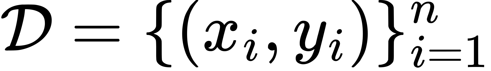

- **feature / input `x`**：模型可见的输入。如一张 `C×H×W` 图像、关节位置速度、或二者拼成的 observation。
- **label / target `y`**：希望模型预测的量。如类别编号、连续位姿、Teacher 的动作均值。
- **sample**：一条样本；**batch**：一次并行送入网络的多条样本。

通常把数据按样本或按更严格的 group 分为：

| 划分 | 用途 | 什么时候看它 |
|---|---|---|
| train | 算梯度，更新参数 | 每次 optimizer step |
| validation | 选模型、调超参数、early stopping | 训练过程中反复查看 |
| test | 最后一次独立泛化报告 | 所有选择完成后 |

若同一段 robot trajectory 的相邻帧随机分到 train 和 test，测试集会泄漏近乎重复的画面，分数虚高。对视觉 Student，更合理的切法可能按 episode、门资产、相机条件或场景 seed 分组，具体选择取决于要证明哪一种泛化。

### 高频面试问答

**问：为什么不能用 test set 反复调学习率？**  
答：你虽然没有把 test 样本送进反向传播，但反复根据 test 分数选方案，等于把关于 test 的信息泄漏到设计决策里。最后分数不再是独立估计；应使用 validation 做选择，test 留给最后报告。

---

## 4. Tensor：所有网络计算的共同语言

Tensor 是带 shape、dtype、device 的 n 维数组。它不是神秘对象；矩阵、向量、标量都只是不同阶数的 tensor。

```text
scalar:          []          一个 loss
vector:          [D]         一条 D 维 observation
matrix:          [B, D]      B 条 observation 的 batch
image batch:     [B, C, H, W]
sequence batch:  [B, T, D]   B 条长度 T 的序列
```

### 4.1 Linear layer 的 shape 和计算

对 batch 输入 `X ∈ R^{B×D_in}`，线性层参数为 `W ∈ R^{D_out×D_in}`、`b ∈ R^{D_out}`：

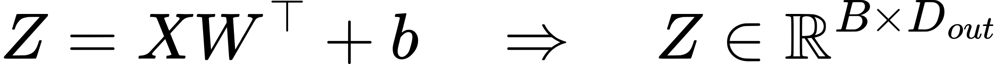

按元素展开：

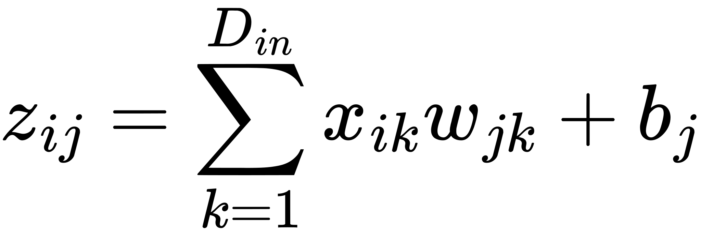

`b` 原本形状是 `[D_out]`，在 batch 维上 broadcast 成 `[B, D_out]`；它不是为每个 sample 单独学习一套 bias。若视觉 Student 把每帧的 81D proprio 输入给 `81 -> 256` 层，则一批 32 帧的 tensor 从 `[32,81]` 变为 `[32,256]`。

### 4.2 常见操作会改变什么

| 操作 | 例子 | 语义 / 常见坑 |
|---|---|---|
| `reshape/view` | `[B,T,D] -> [B*T,D]` | 只重解释元素布局，元素总数不变；要确认 memory layout 与维度语义 |
| `transpose/permute` | `[B,C,H,W] -> [B,H,W,C]` | 调换轴；shape 对了不代表后续算子期待的 layout 对了 |
| `concat` | `[B,12]` 与 `[B,5] -> [B,17]` | 沿指定维拼特征；拼前其他维必须匹配 |
| reduction | `mean(loss_per_sample)` | 消去一个维；要分清 mean/sum 对梯度规模的影响 |
| elementwise | `a*b`, `relu(x)` | 对对应元素计算，遵守 broadcast 规则 |
| matrix multiply | `[B,D] @ [D,H]` | 沿内维 `D` 做求和，得到 `[B,H]` |

最实用的排错习惯：看到一行 tensor 代码，先说出“每一维代表谁”，再检查计算是否保留了那个语义。仅凭两个 shape 能相乘，不能证明 joint order、时间轴或 batch 轴正确。

### 4.3 Autograd 是什么

框架在前向中记录由可微操作组成的 computation graph。调用 `loss.backward()` 时，它依据链式法则为每个 parameter 累积 `∂loss/∂θ`。没有 `requires_grad` 的数据 tensor 也会参与前向，但不会作为待优化参数更新。

### 高频面试问答

**问：`[B,T,D]` 展平成 `[B*T,D]` 什么时候安全？**  
答：当后续层对每个时间点独立、没有读相邻时刻的语义时，例如逐 token 的 linear layer。若后续是 LSTM、temporal convolution 或 attention，直接展平会丢失序列边界与时间顺序。

---

## 5. 从 prediction 到 loss：objective、loss、metric 不同

模型前向计算：

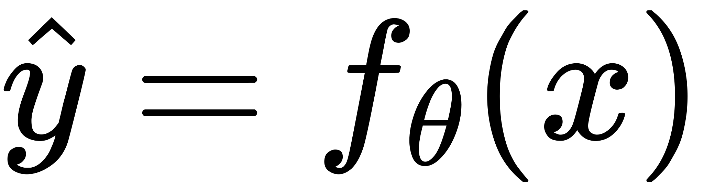

- **objective**：最终想优化的总体数学目标，可能由多个 loss 和正则项组成。
- **loss**：一次 batch 可微的训练代价，例如 cross-entropy、MSE、PPO policy loss。
- **metric**：用来解释效果的统计量，如 accuracy、success rate、MAE；不一定可微，也不一定直接优化。

例如视觉 Student 预测连续动作时，可用 MSE：

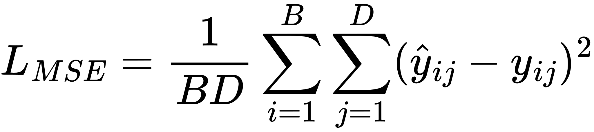

这会更重地惩罚大的误差。若目标是分类的类别概率，MSE 通常不是首选，cross-entropy 更贴合分类分布。更重要的是：低 action MSE 只说明离线标签拟合；不能自动推出 robot 闭环成功，因为小误差会经状态转移累积。

### 高频面试问答

**问：为什么训练 loss 降了，业务/机器人指标未必提升？**  
答：loss 只是为目标设计的替代量。它可能与最终任务不完全对齐、在训练分布上过拟合，或被数据不平衡主导。应单独报告与任务一致的 evaluation metric 和场景切分。

---

## 6. MLP、activation 与前向传播

最基本的 neuron 做 affine transform 后过非线性：

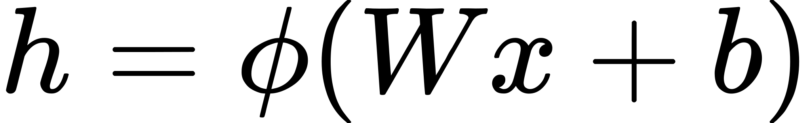

多层感知机（MLP）反复叠加：

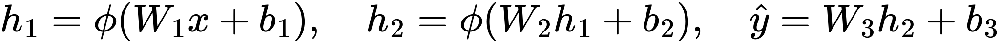

若每层都没有 activation，任意多层 linear 的乘积仍等价于一层 linear，无法表示弯曲的决策边界。常用 activation：

- `ReLU(x)=max(0,x)`：快、常见，但负区可能不传梯度。
- GELU / SiLU：平滑，Transformer 和现代网络常见。
- `tanh`：输出受限于 `[-1,1]`，在 recurrent/state/action 场景常见；过饱和时梯度会变小。
- sigmoid：输出 `[0,1]`，适合 probability 或 gate；深层隐藏层较少单独用它，因为易饱和。

视觉 Student 的一个概念模型可以是：CNN 将图像压成视觉特征，MLP 编码 proprio，再 concat 后交给 LSTM/Transformer 融合，最后线性 head 输出动作分布的参数。这里的 concat 是“拼特征”，不是让模型天然理解两种模态的物理含义；语义来自数据、结构和训练目标。

### 高频面试问答

**问：为什么最后一层常不接 ReLU？**  
答：输出空间决定。回归可能需要正负值，分类通常输出 logits 再交给 cross-entropy，Gaussian policy 可能输出均值和 scale 参数；盲目 ReLU 会把合法负值截掉。

---

## 7. Backpropagation：链式法则如何把责任传回去

以一层 `z=Wx+b`、`h=ReLU(z)`、`L=L(h)` 为例。反向传播不是“猜每个参数该怎么改”，而是系统地计算偏导：

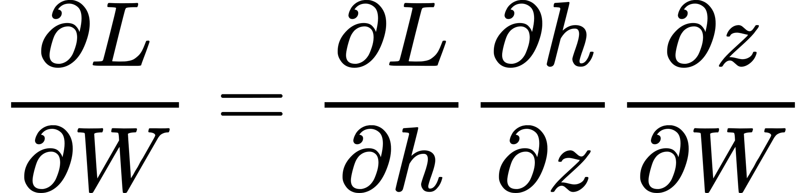

链式法则的直觉：一个参数先改变 `z`，再改变 `h`，最终改变 loss；把每一段的局部敏感度相乘，就得到该参数对最终 loss 的责任。backprop 只是以反向 traversal 高效复用中间结果，避免逐参数数值试探。

例如 `ReLU` 在 `z>0` 的导数为 1、在 `z<0` 为 0。因此一个一直落在负区的单元，对这条样本收不到经 ReLU 传回的梯度。这解释了 activation、initialization、normalization 会影响可训练性。

### 高频面试问答

**问：gradient 为正意味着参数一定应该变小吗？**  
答：若目标是最小化这个 loss，普通 gradient descent 确实做 `θ <- θ - η∇θL`，正 gradient 使该维减小。但不能孤立解释一个维度：Adam、weight decay、梯度裁剪和其他 batch 样本都会共同影响实际更新。

---

## 8. Gradient descent、SGD、Adam 与训练单位

理想的经验风险最小化：

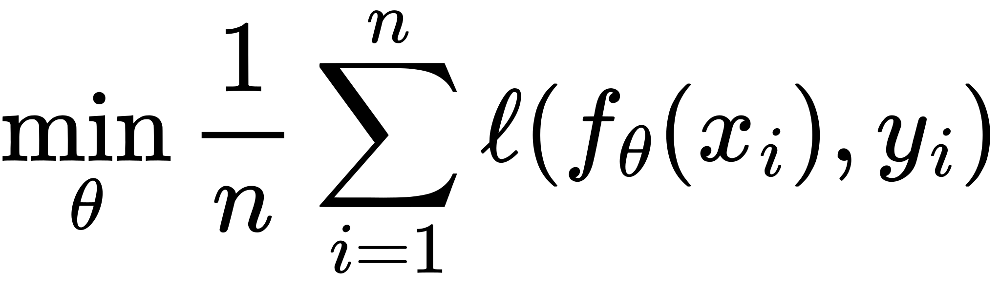

全量 gradient descent 每步使用全数据梯度，代价大。mini-batch SGD 用 batch `𝓑` 估计：

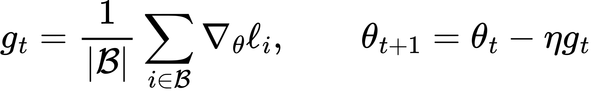

- **batch size**：一次更新有多少 sample；大 batch 梯度噪声较低但更占显存。
- **step / iteration**：一次 forward + backward + optimizer update。
- **epoch**：训练集被完整遍历一次；在线 RL 的 rollout 数据持续更新，epoch 的含义与固定离线数据集不同。
- **learning rate `η`**：步长。过大可能震荡/发散，过小则学习很慢。

Adam 为每个参数维维护一阶动量 `m` 与二阶矩 `v`：

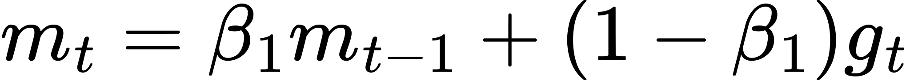
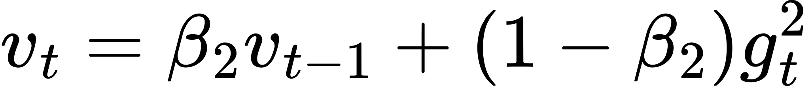
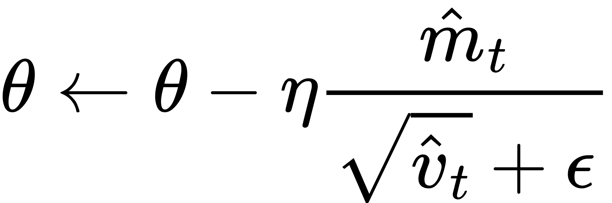

直觉上，动量平滑持续方向，二阶矩让经常梯度很大的维度走得相对谨慎。Adam 不是“不需要调 learning rate”，也不保证在所有任务上优于 SGD。

### 高频面试问答

**问：batch size 翻倍后，学习率该不该翻倍？**  
答：没有机械必然。常见 linear scaling rule 是经验起点，不是定理；还要看 optimizer、模型、数据增强、batch norm、训练步数和 warmup。验证曲线比口诀可靠。

---

## 9. Normalization、initialization 与数值尺度

### 9.1 为什么先处理尺度

若某一 feature 的量级是 1000，另一维是 0.001，同一个学习率对它们的有效步幅非常不同。常见标准化：

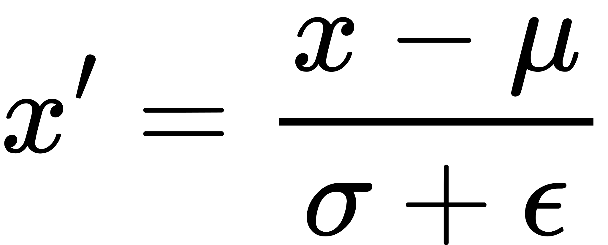

训练集统计的 `μ, σ` 应在 deployment/eval 固定使用；不能把每个 test batch 的统计重新混进去，否则 evaluation 定义会变。图像常按通道 normalize；robot proprio/action target 往往也需要明确尺度合同。

区别三种常被混淆的东西：

- **input normalization**：处理外部 feature 的尺度。
- **BatchNorm**：网络内部使用 batch 统计量，train/eval 行为不同。
- **LayerNorm**：对单个样本的 feature 维归一化，Transformer 常用，train/eval 行为通常一致。

### 9.2 Initialization

若所有权重初始化为 0，同层神经元会得到完全相同的梯度，无法分工；要随机打破对称。Xavier/Glorot、He initialization 让各层 activation/gradient 的方差在初始阶段尽量不爆炸也不消失。它们是合理默认值，不是替代观察训练曲线的万能开关。

### 高频面试问答

**问：normalization 是否等于把数据限制到 `[0,1]`？**  
答：不是。min-max scaling 是一种缩放；standardization 是零均值、单位方差；不同模型还可能需要按物理范围、图像通道或统计分布处理。关键是训练与部署使用同一明确定义的变换。

---

## 10. 欠拟合、过拟合、正则化与泛化

**泛化** 是在未参与参数更新的新数据上仍有效，而不是把 train loss 做到最低。

| 现象 | train 表现 | validation 表现 | 常见解释 |
|---|---|---|---|
| underfitting | 差 | 差 | 模型/训练不足、feature 信息不够、优化没收敛 |
| healthy fit | 好 | 接近 train | 可接受的泛化 gap |
| overfitting | 很好 | 明显更差 | 记住训练数据细节，未学到可迁移规律 |

常见正则化手段：

- **weight decay**：惩罚大权重，通常写为 `L_total=L_data+λ||θ||²`；AdamW 将它以解耦形式实现。
- **dropout**：训练时随机置零部分 activation，eval 时关闭并做匹配缩放。
- **data augmentation**：保持标签语义下改变图像，例如合理裁剪、光照扰动；若增强改变了任务语义，就是错误标签。
- **early stopping**：依据 validation 表现停止，不把继续压低 train loss 当唯一目的。
- **更多/更多样的数据**：常常比复杂技巧更根本。

视觉 Student 若只在一种光照、一扇门、一个相机外参上拟合良好，面对新光照或新背景失败，通常是 domain shift/coverage 问题；不能靠把 train accuracy 再提高 0.1% 自动解决。

### 高频面试问答

**问：训练 loss 上升一定代表训练坏了吗？**  
答：不一定。mini-batch 随机性、数据增强、learning-rate schedule 都能让单点波动。应看平滑趋势、validation、梯度/数值是否异常和最终指标；但持续上升或 NaN 是需要定位的信号。

---

## 11. CNN 与 ResNet：为什么图像不能只粗暴展平

图像 `[C,H,W]` 有局部相关与平移结构。卷积层用一个小 kernel 在空间位置共享参数：

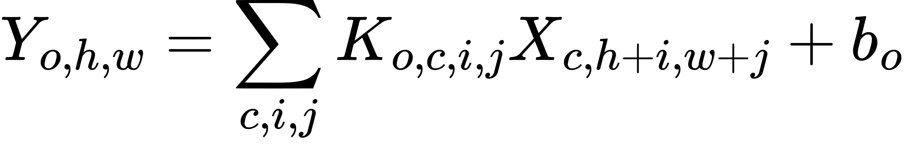

相比将 `H×W×C` 全连接展平，CNN 具有局部 receptive field、weight sharing 和逐层组合边缘到部件再到物体的归纳偏置。stride/pooling 会降低空间分辨率、扩大感受野，但也会丢失细粒度位置。

深层网络难训的一项原因是梯度要经过很多变换。ResNet 引入 residual connection：

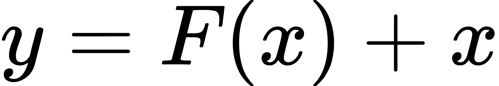

如果新层暂时学不到有益变换，可以让 `F(x)` 接近 0，信息仍沿 identity path 传播。残差连接不是“跳过学习”，而是把学习目标变成对已有表示的增量修正。

视觉 Student 中，CNN/ResNet 可以将相机帧编码为 compact visual embedding。它是否保留了把手、门缝、接触等关键线索，取决于输入分辨率、预训练、数据分布和训练 objective，不能由“用了 ResNet”保证。

### 高频面试问答

**问：卷积为什么参数少？**  
答：同一个 kernel 在所有空间位置复用，而不是每个像素位置各自一套全连接权重。代价是它假设局部模式在不同位置可能有相似意义，这正是图像常见的归纳偏置。

---

## 12. RNN、LSTM、Transformer：处理序列的三种思路

序列输入可以是 token、视频帧、传感器或 control history。三类模型的核心差异是“当前时刻如何访问过去”。

| 模型 | 核心计算 | 优点 | 典型限制 |
|---|---|---|---|
| RNN | `h_t=f(x_t,h_{t-1})` | 状态小、天然逐步执行 | 长程梯度易消失/爆炸，信息瓶颈在 `h_t` |
| LSTM/GRU | 用 gates 控制记忆读写 | 更容易保留长期信息 | 仍按时间顺序递推，训练并行度有限 |
| Transformer | attention 直接加权多个 token | 长程依赖、训练可并行 | self-attention 对长度通常是二次成本；需位置编码 |

LSTM 的 cell state 可概念化为：

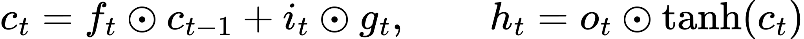

forget/input/output gates 决定旧信息保留多少、写什么、露出什么。它们不是人工指定的语义模块；只有通过 loss 训练才可能学到“此时该记住接触历史”。

对视觉 Student，单帧可能分不清“门刚被推开后停住”还是“尚未接触但画面相似”；历史关节速度、先前图像和动作有助于消歧。LSTM 是一种 learnable memory，而堆叠固定长度的过去帧是显式 history；两者都不等于获得 simulator 完整 state。

### 高频面试问答

**问：Transformer 是否必然比 LSTM 好？**  
答：不必然。要考虑序列长度、在线控制延迟、数据规模、显存、部署预算和是否确实需要远距离依赖。小型实时 control policy 可能更适合 LSTM；大规模视觉语言序列常从 Transformer 受益。

---

## 13. Embedding 与 Attention：把“内容”变成可比较的向量

**embedding** 是把离散对象或高维对象映射到连续向量。例如一个 word id 经 lookup 得到 `[D]` 向量；CNN 把图像变为 `[D]` visual embedding。embedding 的每一维通常没有人类预先指定的独立含义，意义体现在向量关系与下游任务中。

scaled dot-product attention：

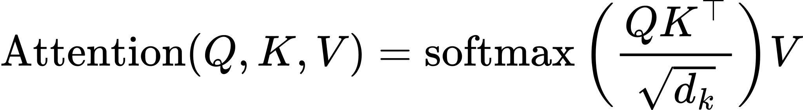

一个 query 对所有 key 算相似度，经 softmax 得权重，再对 value 加权求和。self-attention 中 Q/K/V 都来自同一序列；cross-attention 中 query 和 memory 来自不同来源。

视觉-本体融合的一种概念设计是：当前 proprio embedding 产生 query，图像 patch/time-step embedding 提供 key/value，让控制网络按任务学习“此刻看哪些视觉证据”。attention 权重高不自动构成可解释或因果证明，它只是该模型的中间计算。

### 高频面试问答

**问：为什么 attention 要除以 `sqrt(d_k)`？**  
答：维度增大时，dot product 的方差会变大，softmax 容易饱和到过尖的分布，梯度变差。缩放让 logits 的尺度更稳定。

---

## 14. Distribution、likelihood、cross-entropy、MSE：输出不是一个数字那么简单

模型常输出的是**分布参数**，而非唯一答案。例如分类 logits `z` 经 softmax 成概率：

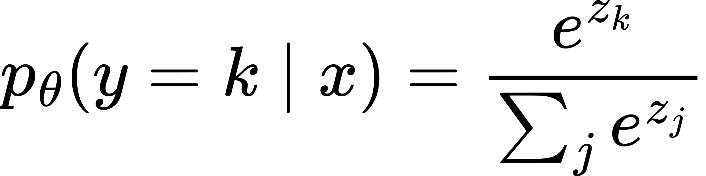

观测到真实类别 `y` 后，其 **likelihood** 是模型给这个真实事件的概率 `p_θ(y|x)`。最大似然等价于最小化 negative log-likelihood：

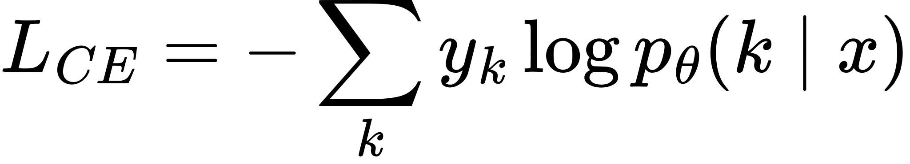

其中 one-hot `y_k` 只在真类为 1。cross-entropy 强烈惩罚“对真类极度自信却错了”的预测。

若连续目标假设为固定方差 Gaussian：

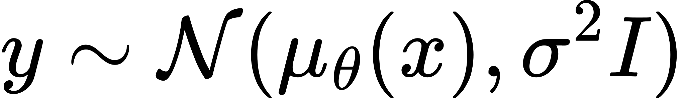

最大化 likelihood（忽略常数）等价于最小化 MSE：

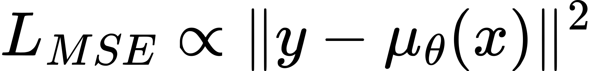

所以 MSE 不是随意的距离公式，它对应一种噪声分布假设。MAE 对应 Laplace 型噪声，较不怕极端值但在 0 点不可微（实践中可用 subgradient）。

在 stochastic policy 中，网络可能输出 Gaussian 的 `μ` 与 `σ`，而训练使用被采样 action 的 `log probability`；这与“Student 直接回归 Teacher action 的 MSE”是不同目标。不要把 probability、logit、likelihood、loss 说成同一个东西。

### 高频面试问答

**问：softmax 输出之后为什么常不再手写 `log` 再算 cross-entropy？**  
答：主流框架提供的 logits + cross-entropy 融合算子通常数值更稳定，会避免先算非常小的概率再取 log 的下溢。网络最后输出 logits，不表示 logits 本身是概率。

---

## 15. train mode、eval mode、checkpoint：模型状态不仅是权重

`model.train()` 与 `model.eval()` 不是“是否允许反向传播”的总开关，而是切换特定层的行为：

- Dropout：train 时随机屏蔽，eval 时关闭随机性。
- BatchNorm：train 时更新/使用 batch 统计，eval 时使用累计 running statistics。

推理通常还应放在 `no_grad` / inference mode，避免构建 autograd graph，降低显存与开销；但这和 `eval()` 是两件不同的事。一个严谨 evaluation 要同时明确：模型处于 eval、预处理与训练一致、随机种子/动作采样策略符合定义、没有 optimizer step。

一个可恢复的训练 checkpoint 往往至少包括：

```text
model parameters
optimizer state (例如 Adam 的 moments)
training step / scheduler state
normalization statistics
必要时的 RNG state 与 algorithm-specific buffer
```

只保存 `model.state_dict()` 足以部署一个确定的模型前向（若还有所需预处理），但未必足以无缝继续训练；丢失 optimizer moments 或 scheduler 会改变恢复后的优化轨迹。

### 高频面试问答

**问：`eval()` 会自动关闭梯度吗？**  
答：不会。它只改变依赖 training flag 的模块行为。关闭梯度要用 `torch.no_grad()` 或 inference mode；反过来 no-grad 也不会把 BatchNorm/Dropout 切到 eval 行为。

---

## 16. Generalization 与 domain shift：为什么离线高分也会失效

训练常隐含假设：

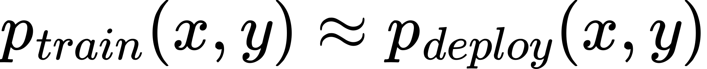

一旦部署分布不同，就是 **distribution shift / domain shift**。常见形式：

- **covariate shift**：`p(x)` 变了，例如相机光照、背景、镜头噪声不同。
- **label/target shift**：`p(y)` 或类别比例变了。
- **concept shift**：`p(y|x)` 变了，例如相同视觉 cue 在新机构中对应不同动力学后果。
- **closed-loop shift**：policy 自己犯的小错把系统带到训练数据没有覆盖的状态；模仿学习尤其典型。

DoorDog 的 sim-to-real 或 sim-to-sim 讨论中，画面、相机时序、joint order、控制频率、摩擦和执行器都可能改变输入分布或动力学。domain randomization、真实/目标域数据、合适 augmentation、系统辨识、DAgger 等是不同层面的缓解手段；任何单一技巧都不是对泛化或安全的证明。

### 高频面试问答

**问：DAgger 为什么能缓解普通行为克隆的 covariate shift？**  
答：普通 BC 只在 expert 轨迹状态上训练；Student 一旦偏离，进入未见状态，误差继续累积。DAgger 让 Student 执行并在它实际到达的状态请求 expert/Teacher label，再把这些数据加入训练，因此覆盖的是 Student 自己的闭环分布。

---

## 17. 一分钟白板收束：从一帧数据到可信结论

你可以按下面顺序口述任何一个学习系统：

1. **定义输入和输出**：tensor shape、单位、时间轴、哪些是可见 feature，目标/回报从哪里来。
2. **定义函数**：CNN/MLP/LSTM/Transformer 如何把输入映射为 logits、动作、value 或 embedding。
3. **定义训练目标**：CE、MSE、likelihood、imitation loss 或 RL objective；它优化的是什么，没优化的是什么。
4. **定义优化过程**：forward -> loss -> backward -> optimizer；batch、learning rate、schedule、normalization。
5. **定义评估**：train/validation/test 怎样切分，metric 是否真正回答任务问题，train/eval mode 是否正确。
6. **定义边界**：部署分布是否变了；离线拟合、simulation success 和 hardware performance 分别需要什么证据。

最后提醒：能写出公式不等于理解。真正的理解是你能在每一处指出 tensor 的语义、目标信号的来源、梯度能改变什么，以及这个指标尚不能证明什么。
