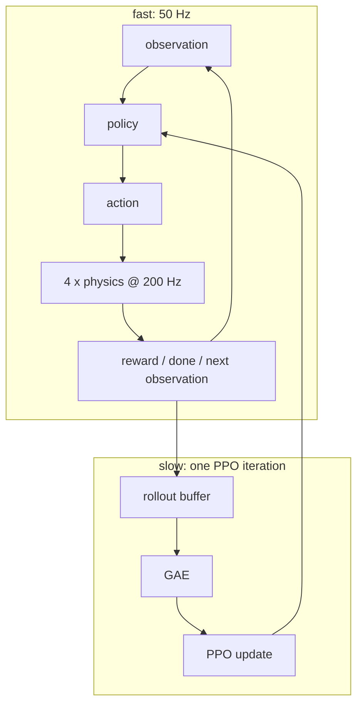
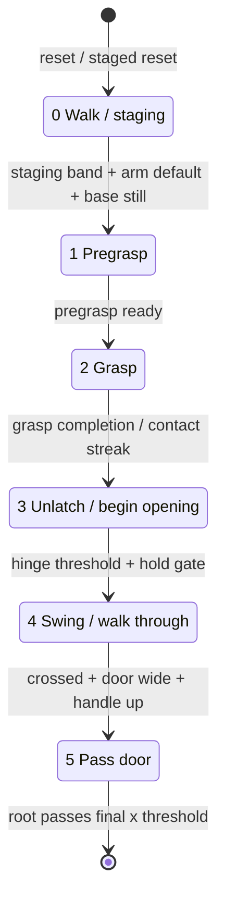

# 从 RL 新人到能讲清 DoorDog

## 1. 先把项目看成两个嵌套闭环

DoorDog 同时有一个快闭环和一个慢闭环。

快闭环是 robot control：policy 看 observation，给 action，Isaac 推进物理，环境计算 reward/done，再返回下一 observation。当前一次 control step 是 `0.02 s`；其中执行 4 个 `0.005 s` 的 physics substeps。

慢闭环是 policy optimization：先用当前 policy 收集 `4096 × 64 = 262,144` 个 transitions，再计算 returns/advantages，用同一批数据做 5 个 PPO epochs、每个 epoch 4 个 minibatches 的更新。



面试时先画这两个闭环，后面的 MDP、PPO、IsaacLab、network、reward 都有了落点。

## 2. MDP / POMDP：policy 到底在解决什么

### 2.1 五个基本对象

MDP 可以写成：


- `s_t`：完整环境状态，例如所有刚体 pose/velocity、关节、接触、门状态。
- `a_t`：agent 的动作。
- `P(s_{t+1}|s_t,a_t)`：动力学；在这里主要由 Isaac/PhysX 和控制器决定。
- `r_t`：环境给这一步的标量学习信号。
- `γ`：未来 reward 的折扣。

策略优化的目标：


但 policy 通常看不到完整 `s_t`，只看到 `o_t = O(s_t)`。Teacher 的 `actor_obs` 已经包含 simulator-only 的 door metadata、stage、handle transform 等 privileged state；视觉 Student 只能看 proprioception 与 camera，所以 Student 问题更接近 POMDP。

LSTM 的作用不是“把 POMDP 变回完全可观测”。它只是把历史线索压到 hidden state：


遮挡、异步相机、接触状态和速度都可能让单帧不足；LSTM 提供一种可学习的 belief/memory 近似。

### 2.2 Markov 性和 history

如果 observation 已经足以预测下一状态和 reward，那么它近似满足 Markov property。A2_Base 仍使用 `30 × 54` history，原因不是“RL 都要堆帧”，而是低层控制需要从有限本体观测中获得运动趋势、步态相位和控制历史。

关键区分：

- Teacher 的 recurrent hidden state 属于可学习记忆；
- A2_Base 的 30-frame history 是显式观测合同；
- simulator 的真实 state 不等于任一 policy 实际可见输入。

## 3. Policy、Value、Actor–Critic

### 3.1 Actor 是动作分布，不只是一个向量

当前 Teacher actor 输出 Gaussian mean `μ_θ(o)`，并持有可学习的 standard deviation `σ`：


训练 rollout 采样动作带来探索；evaluation 通常取 mean，得到 deterministic action。PPO 用 log probability 而不是直接比较 action 数值，是因为优化对象是“当前策略给已采样动作的概率”。

### 3.2 Critic 是预报员

Value function：


critic 不直接决定动作，它提供 baseline，降低 policy gradient 的方差。

当前 Teacher：

- actor input `133D`，输出 `12D` mean；
- critic input `138D`，输出 scalar value；
- actor 与 critic 各自有 `RunningMeanStd`、2-layer LSTM（hidden 256）和 MLP `[512, 256, 128]`；
- 两者不是一个共享 backbone 的双 head。

critic 比 actor 多看到 `transition`、`complete`、`time_in_stage`、`actual_time_in_stage`、`total_time` 五个标量。这是 asymmetric actor–critic：训练时让 critic 有更充分信息降低方差，但部署 actor 不依赖这五项。

### 3.3 Advantage 是“比预期好多少”


- `A_t > 0`：这个动作带来的结果比 critic 原先预期更好，应提高概率。
- `A_t < 0`：比预期差，应降低概率。

不能把 advantage 解释为 reward。一个当下 reward 较小的动作，若带来后续成功，advantage 仍可能为正。

## 4. GAE：从后往前分配信用

### 4.1 TD residual


它表示“critic 对这一步之后的总回报预测，出现了多大意外”。真正 terminal 时 `d_t=1`，不能从下一 episode bootstrap。

### 4.2 Generalized Advantage Estimation


从 rollout 末端反向算：越远的 TD residual 被 `(γλ)^k` 衰减。

- `γ` 决定任务有多重视远期 reward；
- `λ` 在低方差、有偏的一步 TD 与高方差、低偏的长回报之间折中；
- `λ` 不是学习率，也不是 entropy coefficient。

当前 LSTM experiment overlay：`γ = 0.9975`、`λ = 0.985`。由于 control 是 50 Hz，高 `γ` 对长时程开门任务是有语义的；但不能脱离 timebase 只比较数字大小。

### 4.3 timeout 与 terminal

任务失败、真正成功、跌倒等 terminal 表示未来 return 应被截断。单纯达到 time limit 是 truncation：环境并不是物理终态，只是采样窗口到期，因此通常用 critic value 做 bootstrap。

项目用独立的 `time_outs` buffer 做 time-limit bootstrap，再进入 GAE。面试时应说清语义；不需要把它误说成“timeout 也当成功”。

## 5. PPO：为什么可以对同一 rollout 做几次更新

PPO 是 on-policy 算法。数据来自旧策略 `π_old`，更新中的新策略为 `π_θ`。重要性比率：


clipped surrogate objective：


代码把它写成需要最小化的负号形式：


当前 `ε=0.2`，即 ratio 的有效改进区间大致是 `[0.8, 1.2]`。

### 5.1 A 正和 A 负时 clip 分别在防什么

- `A>0`：提高动作概率是好事，但 `r>1.2` 后不再奖励更激进的提升。
- `A<0`：降低动作概率是好事，但 `r<0.8` 后不再奖励更激进的压低。

因此 clip 不是简单“把 ratio 数值截断再乘 advantage”；`min/max` 与 advantage 符号共同定义保守边界。

### 5.2 总 loss

项目实际组合：


- policy loss：上面的 clipped objective；
- value loss：新 value 和 old value 附近的 clipped value prediction，取较大 squared error；
- entropy loss：代码中是负 entropy，乘正系数后鼓励更高 entropy / 探索；
- Gaussian closed-form KL 用于监测并自适应调整 learning rate；
- gradient norm 会被裁剪。

当前 overlay：5 epochs、4 minibatches、entropy coefficient `0.01`、actor/critic learning rate `1e-4`、desired KL `0.005`。

### 5.3 为什么仍叫 on-policy

同一 rollout 被复用 5 epochs，但只在有限范围内更新，ratio/clip/KL 都在约束 policy 不要离产生数据的 `π_old` 太远。它不是 replay buffer 中跨很多版本无限复用的 off-policy 数据。

## 6. Recurrent PPO 最容易踩的坑

rollout storage 最初是 time-major `[T,N,...]`；训练前常转成 env-major `[N,T,...]`。LSTM 训练不能像 MLP 那样随意打散所有 time steps。

项目做了几件关键事：

1. rollout 时保存 actor/critic hidden states；
2. `done` 后只把对应 env 的 hidden state 置零；
3. 训练前按 `done` 切 trajectory；
4. 不等长轨迹 padding，并用 mask 排除无效位置；
5. 恢复每条 trajectory 起点的 hidden state；
6. rollout 结束 detach hidden state，执行 truncated backpropagation through time。

如果跨 episode 继续用 hidden state，会把上一扇门的历史泄漏进新 episode；如果把 time steps 任意 shuffle，会破坏 observation 与 hidden state 的对应关系。

## 7. 当前项目并不是“纯 ManagerBasedRLEnv”

IsaacLab 提供 scene、articulation、sensor 和 simulation API，但 DoorDog 当前运行结构是自定义 Gym-style task + 自定义 IsaacSim adapter：

```text
Hydra compose
  -> train_agent_trl.py
  -> DoorPregrasp custom env
  -> StagedTaskBase / A2Base / LeggedRobotBase / BaseTask
  -> IsaacSim adapter
  -> IsaacLab scene, articulations, sensors
```

面试时说“基于 IsaacLab 构建”是对的；直接说“这是标准 ManagerBasedRLEnv 的 observation/reward/action managers”则不准确。

### 7.1 一次 control step

```mermaid
sequenceDiagram
  participant T as PPO trainer
  participant A as Actor + A2_Base
  participant E as DoorPregrasp env
  participant I as IsaacSim/IsaacLab scene
  T->>A: actor_obs [N,133], a2_base_obs [N,1620]
  A-->>T: high 12D + leg 12D = 24D
  T->>E: env.step(actor_state)
  E->>E: decode base/arm/gripper; map names
  loop 4 physics substeps
    E->>I: write targets, sim.step, scene.update(0.005)
  end
  I-->>E: q, qdot, body state, contacts, door joints, sensors
  E->>E: termination -> reward -> selective reset -> next obs
  E-->>T: obs, reward, done, infos(time_outs)
```

returned observation 对已经 `done` 的 env 通常是 reset 之后的新 episode 首帧；`done` 仍描述刚刚结束的 transition。这种 batched selective reset 是并行 RL 环境的常见语义。

## 8. 分层 action contract：这个项目最值得讲的设计

### 8.1 Learned high-level 12D

```text
0:5    base raw command = vx, vy, yaw, pitch, roll
5:11   Piper arm_j1..j6 action / delta surface
11     gripper primitive
```

### 8.2 Frozen A2_Base 12D

一帧 54D：

```text
projected gravity          3
leg joint position delta  12
scaled leg joint velocity 12
previous leg action       12
base command               5
arm command placeholder    6
base roll/pitch            2
gait sin/cos               2
-----------------------------
total                     54
```

30 帧历史展平为 `1620D`，冻结 TorchScript locomotion policy 输出 `12D` 腿动作。

### 8.3 24D 到 20DOF

trainer 组成：

```text
[high-level 12D | leg 12D] = env-facing 24D
```

env 解析成：

```text
logical applied surface = leg 12 + effective arm 6 + gripper primitive 1 = 19D
simulator joint target   = leg 12 + arm 6 + two gripper joints              = 20D
```

夹爪 primitive 用 1 个语义动作控制两个方向相反的 finger joints。`primitive > 0` 对应 open targets `[0.035, -0.035]`，否则 close `[0, 0]`。

base command 不直接占 20DOF joint target 的槽位，而是进入 A2_Base observation，间接决定腿动作。这正是层次控制：高层决定“往哪里走、身体姿态和如何操作”，低层负责稳定步态。

### 8.4 为什么不能只按数组位置搬到另一个 simulator

当前 simulator robot joint order 与 A2_Base policy leg order不同。必须按 joint name 建立 mapping。顺序错误不是“噪声变大”，而是把一条腿的控制送到另一条腿。

## 9. Observation：不要只背总维数

Teacher actor `133D`：

| block | dim | 作用 |
|---|---:|---|
| `dof_pos`, `dof_vel` | 20 + 20 | 全部 A2+Piper 关节状态 |
| `relative_to_door` | 9 | base 与 door 的相对关系 |
| `actions` | 19 | 上一步 logical applied action |
| projected gravity | 3 | 身体朝向的重力投影 |
| door joints | 2 | hinge + handle |
| base linear/angular velocity | 3 + 3 | 本体运动 |
| gripper force | 6 | 两个 finger body 的 3D force |
| stage | 6 | 6-stage one-hot |
| privileged door info | 8 | 尺寸、质量、左右/内外开等 simulator metadata |
| arm delta | 6 | 机械臂 delta accumulator |
| handle + pregrasp transform | 18 | 两个 target 的 position + 6D rotation |
| raw + processed base command | 5 + 5 | 高层命令及物理语义 echo |

critic 再加 5 个 transition/complete/time 标量得到 `138D`。

三类 normalization 不要混：

1. 手工物理 scale，例如 velocity `×0.05`、force `×0.01`；
2. network input 的 `RunningMeanStd`；
3. PPO batch 中 advantage 标准化。

## 10. Stage、reward、termination 是三套机制

### 10.1 六阶段任务



stage predicate 定义“什么时候进入下一阶段”。reward 定义“怎样给梯度”。termination 定义“什么时候结束轨迹”。

### 10.2 quickTEST 的关键教训

历史 bug 曾把“任意 stage complete”当作 episode terminal，导致中间 stage 的接触尖峰可能提前结束完整 6-stage episode。修正后只有 last-stage completion 才是整任务完成；stage2 抓取还加入连续 control-step contact history gate，避免单帧 collision spike 冒充稳定 grasp。

这回答了一个经典面试题：reward hacking 不一定是 reward formula 单项写错，也可能是 success/termination predicate 和真实目标不一致。

### 10.3 staged reset 是 curriculum，不是自然起点成功证据

从后续 stage 的快照开始训练，可以缩短长时程 credit assignment，帮助 policy 学会开门后段。但它只证明条件状态下的能力。正式评价仍要单独报告 natural-start full-chain success。

## 11. Phase2：Teacher–Student 蒸馏与 DAgger

### 11.1 为什么需要 Student

Teacher 依赖 simulator privileged state，不能直接部署。Student 的任务是用可部署输入重建 Teacher 的高层行为：

```text
Teacher: privileged 133D -----------------> 12D label

Student: proprio 81D + camera(s) -> vision encoder -> LSTM -> 12D prediction

Frozen A2_Base: 1620D -------------------------------------> leg 12D
```

BC loss 比较的是 Teacher 与 Student 共用的 `12D high-level`，不是最终 `24D`。腿动作来自冻结 A2_Base，不属于 Student 的学习目标。

### 11.2 普通 BC 的 covariate shift

只在 Teacher 控制产生的状态上训练：


Student 一旦犯小错，会进入 Teacher 数据没有覆盖的新状态，误差可能滚雪球。

DAgger 让 Student 控制一部分环境，在 Student 实际访问的状态上再次查询 Teacher label：

```text
mixed rollout state
  -> Teacher labels every current state
  -> some envs execute Teacher action
  -> some envs execute Student action
  -> Student learns Teacher action on both distributions
```

teacher rollout ratio 退火到 0，表示逐步让 Student 承担闭环；这仍属于 Phase2，不是 Phase3。

### 11.3 多相机与异步观测

蒸馏分支的部署路线包含左右 D435、Head camera 和 `camera_meta`。不同相机频率低于 50 Hz policy frequency，因此一个 policy step 可能复用旧帧。age + valid flag 告诉 LSTM “这张图有多旧、是否有效”。

这说明 sensor timing 是 policy input contract 的一部分，不只是工程外围设置。

### 11.4 object prediction 的诚实边界

代码库有 object prediction module，但 A2 路线配置显式关闭。没有经过验证的 target/frame contract 时，不能在面试中说“我们的 A2 Student 用 object prediction”。

## 12. Phase3 / GRPO：计划与受限实验不能冒充完整实现

完整 Student bootstrapping 的动机：DAgger 仍主要复制 Teacher action，而 Student 面临视觉部分可观测性与自己的 closed-loop recovery 问题。Phase3 应让 Student 在自身分布上直接以任务 success/return 优化。

GRPO 的核心直觉是用同条件的一组 rollouts 做组内相对 baseline，而不是训练 learned value function：


再使用 PPO-style ratio/clipping 更新 actor。

当前项目原有 framework 没有完整 Phase3 trainer/config/workflow。蒸馏分支做过受限 actor-only edge experiment，但不能把它包装成完整 Phase3 已交付。

## 13. sim2sim：真正要搬的是 contract，不只是 robot asset

从 Isaac 到 MuJoCo，至少要对齐：

- joint name/order 和 q/qdot 定义；
- quaternion/frame convention；
- observation block、scale、history order；
- action warp、arm delta、gripper primitive；
- frozen A2_Base 输入输出；
- policy/physics decimation；
- camera resolution、频率、age/valid、normalization；
- door hinge/handle、摩擦、latch 与 metric semantics；
- recurrent hidden-state reset；
- checkpoint 与 resolved config。

### 13.1 200 Hz paired trace 为什么重要

policy 每 4 个 physics steps 才更新一次。如果只按 50 Hz policy tick 比较，会吞掉 contact、force、hinge 事件在 substep 内的偏差。因此 shadow trace 按 physics row 记录 `policy_step`、`substep`、actions、targets、q/qdot/effort、door、camera、done。

### 13.2 外部 PD 与 MuJoCo native position actuator 不等价

外部 PD 是 Python 每步显式计算 torque 再 clip；native position actuator 把控制融入 implicit solver。sim2sim 分支因为数值稳定性采用 native position route，这是已声明的 control semantic deviation，不能用“都是 position control”抹掉。

### 13.3 r7 的因果隔离思路

如果 MuJoCo 使用 replayed Isaac camera frames 能恢复关键行为，而使用 live MuJoCo RGB 失败，那么 evidence 支持“视觉输入域差是当前 blocker”，而不是笼统说所有 physics/action 都错。这个结论只对已登记 checkpoint、scene 和干预成立。

正式 Isaac↔MuJoCo paired parity 曾因缺少同 checkpoint、同 scene、同 case 的 Isaac trace 而 blocked。因此正确表述是：大量 contract/module 已有运行证据，视觉域差有隔离证据，但不能宣称完整 paired parity 已通过。

## 14. sim2real：再多一层现实世界证据

即使 sim2sim 完全对齐，hardware 仍新增：

- actuator dynamics、delay、backlash、thermal/effort limits；
- camera calibration、exposure、motion blur、vibration、clock synchronization；
- door friction/latch diversity；
- state estimation drift；
- workspace isolation、emergency stop、hardware safety limits。

simulation force、nominal effort limit 和 MuJoCo/Isaac success 都不是 hardware safety evidence。

## 15. 一分钟串讲模板

> DoorDog 是一个分层、recurrent、staged 的开门 RL 系统。当前 Teacher PPO 看 133 维 privileged observation，经独立的两层 LSTM 和 MLP 输出 12 维高层动作；critic 看 138 维训练信息估计 value。冻结的 A2_Base 用 30×54 的本体历史输出 12 维腿动作，trainer 组成 24 维环境动作，环境再映射到 20 个关节目标。控制是 50 Hz，底层 physics 是 200 Hz。每次 PPO iteration 从 4096 个环境各采 64 步，用 GAE 算 advantage，再做 5 epochs clipped PPO。开门被拆成 walk、pregrasp、grasp、unlatch/open、swing-through、pass 六阶段，但 reward、stage transition 和 terminal 是分开的。Phase2 用视觉 Student 在 DAgger mixed rollout 中模仿 Teacher 的 12 维高层动作，腿仍由 A2_Base 控制。sim2sim 不是把 URDF 转成 MJCF 就结束，而是要锁定 joint order、observation/action、timebase、camera 和 recurrent state；当前有模块和因果隔离证据，但我不会把它说成完整 paired parity 或实机通过。
