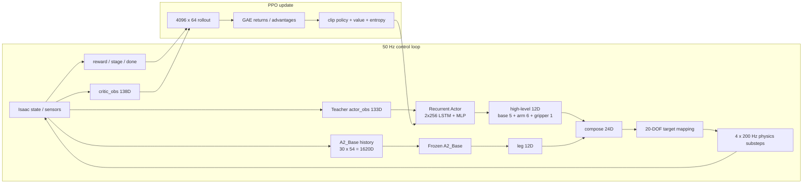

# DoorDog / A2 + PiPER 面试知识复盘

这套材料现在分成两层：先补齐数学、Tensor、深度学习和通用 RL，再沿着 DoorDog 的一次真实 control tick，把 PPO、LSTM、IsaacLab、蒸馏和 sim2sim 串成一条能在面试白板上讲清楚的链路。

在 Codex 编辑器里点 [`index.html`](./index.html) 会看到 HTML 源码，这是编辑器按代码文件打开它，并不是页面渲染失败。当前对话中的交互图使用 Codex 内嵌渲染；仓库里的 `index.html` 保留为普通浏览器离线版。公式、数值推导、源码锚点和闭卷题都以 Markdown 分册为准。

这些 Markdown 分册的数学公式已预渲染为仓库内的相对 SVG 图片，避免依赖当前预览入口是否启用 TeX 数学扩展。SVG 使用透明背景并随明暗主题切换文字颜色；原始 TeX 保存在每张 SVG 的 `<desc>` 中，预览不再依赖 KaTeX、MathJax 或网络资源。

## 从零补课的主路线

按依赖关系学习，不要一上来硬背 PPO 公式：

```text
数学语言
  └─ scalar / vector / matrix / probability / gradient
       ↓
Tensor 与 PyTorch
  └─ axis / shape / broadcast / matmul / autograd / mask
       ↓
AI 与深度学习
  └─ model / loss / backprop / optimizer / CNN / RNN / attention
       ↓
通用 RL
  └─ MDP / return / value / Bellman / MC / TD / policy gradient
       ↓
PPO + LSTM 深挖
  └─ hidden state / TD residual / GAE / ratio / clip / recurrent batch
       ↓
DoorDog 项目
  └─ Isaac lifecycle / 133→12 / 1620→12 / reward / DAgger / sim2sim
```

对应材料：

1. [`MATH_FOR_AI_RL.md`](./MATH_FOR_AI_RL.md)：只补面试和看代码真正会用到的数学。
2. [`TENSOR_PYTORCH_DEEP_DIVE.md`](./TENSOR_PYTORCH_DEEP_DIVE.md)：把每个 axis、shape 变化、broadcast、autograd 和 recurrent batch 算明白。
3. [`AI_DEEP_LEARNING_FOUNDATIONS.md`](./AI_DEEP_LEARNING_FOUNDATIONS.md)：从 AI/ML/DL 到网络、loss、反向传播、优化器、CNN/RNN/Transformer。
4. [`RL_FOUNDATIONS_DEEP_DIVE.md`](./RL_FOUNDATIONS_DEEP_DIVE.md)：从 MDP、Bellman、MC/TD 到 policy gradient、PPO、DAgger 和评估。
5. [`PPO_LSTM_DEEP_DIVE.md`](./PPO_LSTM_DEEP_DIVE.md)：专门逐步计算 LSTM、TD residual、GAE、PPO ratio 和 clipping。
6. [`FOUNDATIONS.md`](./FOUNDATIONS.md)：把以上基础接回 DoorDog、IsaacLab、蒸馏和 sim2sim。

## 建议学习顺序

### 面试前只剩 30 分钟

1. 先用当前对话中的三张交互图回忆知识依赖、Tensor 计算和 PPO/LSTM。
2. 阅读 [`INTERVIEW_CHEATSHEET.md`](./INTERVIEW_CHEATSHEET.md) 的“90 秒项目介绍”“PPO 五连问”“最容易说错的十句话”。
3. 能不看材料画出下面两条链：

```text
Teacher 133D -> LSTM -> MLP -> high-level 12D
                                   +
A2_Base 30 x 54 = 1620D -> frozen policy -> leg 12D
                                   |
                            env receives 24D
                                   |
                  logical 19D / simulator 20 DOF target
```

```text
4096 envs x 64 control steps
        -> rollout storage
        -> V(s), reward, done, timeout
        -> backward GAE
        -> 5 PPO epochs x 4 minibatches
        -> clipped policy loss + clipped value loss - entropy bonus
```

### 有 2 小时

先读 [`TENSOR_PYTORCH_DEEP_DIVE.md`](./TENSOR_PYTORCH_DEEP_DIVE.md) 的 0–8 节、[`RL_FOUNDATIONS_DEEP_DIVE.md`](./RL_FOUNDATIONS_DEEP_DIVE.md) 的 MDP/TD/policy-gradient 部分和整份 [`PPO_LSTM_DEEP_DIVE.md`](./PPO_LSTM_DEEP_DIVE.md)，再通读 [`FOUNDATIONS.md`](./FOUNDATIONS.md)：

1. MDP / POMDP 与 actor–critic；
2. 一次 Isaac control tick；
3. action contract 与层次控制；
4. rollout、GAE、PPO update；
5. stage、reward、termination、curriculum；
6. Teacher、Student、DAgger；
7. sim2sim 与证据边界。

最后用 [`INTERVIEW_CHEATSHEET.md`](./INTERVIEW_CHEATSHEET.md) 做闭卷口述。

### 有半天

严格按“从零补课的主路线”通读六份材料，再逐项打开 [`SOURCE_MAP.md`](./SOURCE_MAP.md) 的源码位置，并回答每章的白板追问。目标不是记文件名，而是能证明：

- 你知道每个 tensor 为什么有这个 shape；
- 你知道 policy dt 和 physics dt 为什么不能混；
- 你知道 learned、frozen、simulator-owned 三种控制边界；
- 你知道 reward、stage advance、episode terminal 是三个不同概念；
- 你知道一条实验结论能说到哪里、不能说到哪里。

## 一张项目总图



## 你应该能说出的项目定位

> 我们没有让一个网络直接控制 A2 + PiPER 的全部 20 个关节。Teacher PPO 学的是 12 维任务层动作：5 维 base command、6 维机械臂动作和 1 维夹爪 primitive；冻结的 A2_Base locomotion policy 根据 30 帧、每帧 54 维的本体历史输出 12 维腿动作。trainer 把两者组成 24 维环境输入，环境再按关节名和夹爪语义映射到 20 个关节目标。训练采用 4096 个并行环境、每次 64 个 50 Hz control steps 的 recurrent PPO rollout；物理仿真是 200 Hz。之后的蒸馏分支让只看 proprioception 和多相机图像的 Student 模仿 privileged-state Teacher，并通过 mixed rollout / DAgger 减轻 Student 自己闭环状态分布上的累积误差。sim2sim 分支把同一 observation、action、timebase 和 joint-order contract 搬到 MuJoCo 做 shadow evaluation，但我们明确区分合同复现、模块运行、paired parity 和 hardware evidence，不能把局部通过说成 sim2real 已完成。

## 三条分支各回答什么问题

| 路线 | 核心问题 | 你在面试中应该强调什么 |
|---|---|---|
| 当前 `A2_Piper` | privileged Teacher 如何在 Isaac 中训练开门 | PPO、LSTM actor/critic、分层 action、stage/reward/termination、batched reset |
| `codex/a2-v13-student-distillation-20260717_2103` | 视觉 Student 如何继承 Teacher 能力 | 81D proprio + 多相机、DAgger、teacher label、frozen A2_Base、strict deployment contract |
| `sim2sim/a2-mujoco-shadow-evaluator-20260817` | 同一策略合同搬到 MuJoCo 后，差异来自哪里 | joint/order/frame/timebase/camera/control 对齐、paired trace、视觉域差、证据边界 |

## 证据标签

材料中的结论会使用以下标签：

- `INSPECTED`：本次从 source/config/branch object 读到；没有因此自动获得运行结论。
- `RUNTIME`：某个明确模块或流程真实运行过，只证明登记的问题。
- `EXPERIMENT`：指定配置、checkpoint、case 与统计口径下的实验结果。
- `PLANNED / NOT IMPLEMENTED`：设计存在，但完整实现不存在。
- `BLOCKED / NOT RUN`：缺少必要输入或没有执行，不能补成“应该没问题”。
- `NOT HARDWARE`：仿真和 sim2sim 证据都不能当作实机安全或能力证明。

## 最容易混淆的六组概念

| 不要混为一谈 | 区别 |
|---|---|
| state vs observation | state 是物理世界完整账本；observation 是 policy 实际看到的投影。Student 的单帧视觉尤其是部分可观测的。 |
| reward vs success | reward 是优化信号；success 是任务判据。回报高不等于真正开门。 |
| stage advance vs episode done | 中间 stage complete 只推进状态机；只有最终完成或 failure/timeout 才结束 episode。 |
| policy step vs physics step | 当前 policy/control 是 50 Hz；每个动作保持 4 个 200 Hz physics substeps。 |
| Teacher action vs simulator action | Teacher 学 12D 高层动作；加 frozen leg 得 24D 环境动作；环境再映射到 20 DOF。 |
| sim2sim module pass vs parity | 单模块 finite/golden replay 通过，不等于 Isaac 与 MuJoCo 的同 case paired trajectory 已等价。 |

## 配套材料

- [`MATH_FOR_AI_RL.md`](./MATH_FOR_AI_RL.md)：线性代数、微积分、概率、优化和 RL 数学直觉。
- [`TENSOR_PYTORCH_DEEP_DIVE.md`](./TENSOR_PYTORCH_DEEP_DIVE.md)：Tensor shape、broadcast、matmul、indexing、autograd、mask 与项目 action contract。
- [`AI_DEEP_LEARNING_FOUNDATIONS.md`](./AI_DEEP_LEARNING_FOUNDATIONS.md)：AI/ML/DL、训练链路、网络家族、泛化与 domain shift。
- [`RL_FOUNDATIONS_DEEP_DIVE.md`](./RL_FOUNDATIONS_DEEP_DIVE.md)：通用 RL 全景、价值估计、策略优化、模仿学习与评估。
- [`PPO_LSTM_DEEP_DIVE.md`](./PPO_LSTM_DEEP_DIVE.md)：LSTM、TD residual、GAE、PPO ratio 与 clipped objective，包含项目参数下的逐步数值例子。
- [`FOUNDATIONS.md`](./FOUNDATIONS.md)：从 MDP 到 PPO、Isaac lifecycle、网络、蒸馏、sim2sim 的系统讲义。
- [`INTERVIEW_CHEATSHEET.md`](./INTERVIEW_CHEATSHEET.md)：短答、追问、陷阱和白板练习。
- [`SOURCE_MAP.md`](./SOURCE_MAP.md)：当前分支、蒸馏分支和 sim2sim 分支的真实 source/config 入口与证据等级。
- [`index.html`](./index.html)：交互式可视化入口，可直接在浏览器离线打开。

## 本次材料的事实快照

这套 recap 以 2026-08-25 的三个本地分支为事实快照。当前 worktree 正在进行 v26 相关施工；材料没有修改、整理或重新解释那些未提交实验改动。配置数值应理解为这里明确指向的 experiment overlay，而不是所有历史实验的永久默认值。
