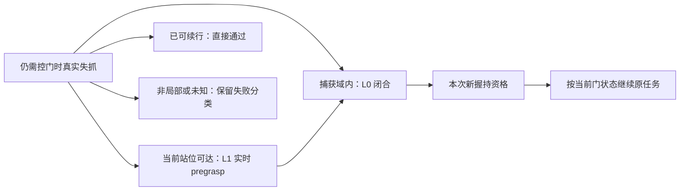

# N01 最小设计：局部失抓恢复与 Teacher→Student 传递

2026-09-20 HKT；作者：Codex N01 planner。状态：**推荐方案，待 Owner 裁定；未授权实施或实验**。证据等级：**INSPECTED**。本轮请求见[Owner 原话](../conversations/20260920_codex_n01_planner_request.md)。

**后续Owner决定已进入[v29 N01当前plan](../../v29/a2_piper_v29_n01_plan.md)**：L0＋L1、D023不变及Teacher/Student共享stage-blind接口已采纳；首轮扰动改为末端真实外力、逐physics step施加有限脉冲，取代本文开爪command pulse起步方案。本文保留为先前提案及设计依据，不再作为当前待决清单；planner仅制定plan，不承担具体实现或训练监督。[Owner原话](../conversations/20260920_codex_n01_plan_decisions.md)。

主底座为完整 `v29-c002-baseline`，保留 B05；`codex/v29-n01-pro-20260920` 只是审阅分支。依据是[Pro 回包及既有定向核对](../../pro_reviews/v29/20260920_153418__N01_recovery_transfer/README.md)、当前问题相关源码及少量一手文献。本轮没有重审整个 C002，没有读取运行任务的新进度，没有实施、测试、训练/评估、GPU 占用、预算分配、Git 提交或外部发布。

## 1. 推荐结论与独立取舍

**首轮研究正常释放前、仍需控门的局部真实失抓：原地闭合 L0 或当前 base 下的实时 pregrasp L1 → 新的有效握持 → 同一 episode 继续原任务。单一 recurrent actor；恢复目标只组织 Teacher 训练、奖励与事件解释，Student 不运行真值恢复调度器。**

L1 应进入首轮。只做 L0，结果很容易由把手尚在夹爪内、脉冲结束自然合拢解释。L1 要求把手确实离开局部捕获域，再由策略根据反馈重新接近，才有更明确的恢复行为。L0 仍有实际价值，但应单列“原地重闭合”，不能独自支撑主动重定位或通用恢复结论。

L2 base 重定位和 L3 重观察目前都**不是已经证明的前置条件**。首轮不冻结 base 物理状态，也不改变 C002 门域；只是把新恢复能力的目标限制在现有站位可达、已有输入有可用线索的局部事件。域内超出该范围的失败继续计入总体结果，明确列为未覆盖。若有效失抓几乎总要移动 base 才能再接近，L2 才成为这个门域内不可省的能力；若固定部署视路没有足够线索区分所需动作，L3/视路调整才成为 Student 能力演示的前提。

与 Pro 的主要差别：

| 问题 | 本轮推荐 | 理由与代价 |
|---|---|---|
| 执行与标签 | 名义续训 Teacher、恢复 Teacher、所有 Student 共享 stage-blind 增量接口；Teacher 适应该接口后冻结，直接提供同语义 12D 标签 | 不先构造旧 Teacher 意图到 effective-increment 的解释层；需要承认共同接口适应的训练成本和名义行为代价 |
| 首轮控制权 | 受扰 Teacher 示范启动；随后独立采集阶段全部由 Student 执行，Teacher shadow 标注 | 先用现有全 Teacher/全 Student 开关走通；不先建设按 episode 分层混合调度或自动退火 |
| 首轮记忆 | 在线 hidden 连续、现有短展开；事件身份与最终结果跨 rollout 连续 | 不把 8 tick 当作失忆，也不把完整 prefix 重放当作栈故障修复 |
| 数据工程 | 先在线监督；复用、长时梯度或 sampler 比较需要什么，再保存相应序列 | 不先建完整 episode/snapshot 库；同数据 sampler 对照届时确实需要冻结一份可重放序列数据 |
| 恢复图 | 只定义局部获取/闭合与返回操门的目标关系 | 首轮不比较全部图结构；单 actor 学会动作不证明“图”贡献或 novelty |

以上均是推荐，未成为 Owner 的实现合同。完整 prefix、多技能网络、Student RL、扰动比例、训练规模均未被接受。

## 2. 先固定执行、动作历史和监督合同

### 2.1 同一动作语义

Student 输出维持 `base5 + arm_delta6 + gripper1 = 12D`。选出本步真正执行的高层命令后，冻结 A2_Base 产生 `leg12`，组成环境入口的 24D。arm 沿现有 delta/action scale 与既有目标限位积分；不新增无依据限幅。gripper 仍按符号全开/全关，幅度不是连续扰动剂量。

**拟采用的 stage-blind 合同**：每步只由当前命令、公开的累计目标、原控制尺度/限位更新执行目标。stage/contact/门真值可以进入 Teacher 观测、训练奖励和计分，不能在 Student 输出之外清累计目标、强制闭爪、改 base 命令或提供实时 G 导航。真实 episode reset 才初始化动作状态；恢复和控制权交接均保留它。

当前 Stage0 覆盖的是命令目标，不能称作关节瞬移。删除这项覆盖仍是实质控制变化：旧 Teacher 在 Stage0 输出的 arm 动作过去可能被忽略，直接移除覆盖后不保证仍能正常接近。推荐让两个 Teacher 比较臂共同适应新接口，之后再冻结用于蒸馏。这里的“接口适应”不等于已经需要 A2D 式的部分可观测专家适应。

备选才是保留旧 Teacher，并把其目标转换为 Student 可执行的增量。Student 已偏离默认目标时，有限增量一般不能复现旧接口的一拍归位；这会新增专家规则和动态差异。当前没有理由同时维护两套监督解释，故首轮不选此路。

### 2.2 三种动作字段不能混用

| 字段 | 本轮保持的含义 | 使用约定 |
|---|---|---|
| actor 输出/BC 标签 12D | 高层 base5、arm 增量6、gripper primitive1 | 使用冻结且已适应共享接口的 Teacher 未受扰意图；不是实际注入动作 |
| 81D 内 `actions` 19D | 腿动作12、arm 累计目标坐标6、gripper1 | 记录实际公开发出命令形成的历史；累计目标不是实测关节位置，也不是高层12D |
| 81D 内 `delta_actions` 6D | 积分前的 arm 增量 | 与本步真正发出的 arm 命令一致；首轮开爪脉冲不改此字段 |
| 81D 内 q/qdot 各20D | 按配置顺序的腿、arm 和夹爪关节读数 | 可为开合/跟踪提供线索，但不等于接触力或可靠失抓判据 |

已知开爪 command pulse 发生在命令链中，公开 issued history 应反映它；Teacher/Student 下一拍都观察同一真实执行历史。BC 标签保留 Teacher 想执行的动作，不把被强制的开爪当作正确答案。计划注入 flag、剩余 pulse tick、真值失抓类别不进入 Student 输入。

若以后增加隐藏执行器故障，公开 history 应仍是控制器实际发出的命令，物理内部覆盖目标只能作诊断。该分离不是首轮已实现能力；当前先采用已知命令扰动，报告范围也限于此及实际观察到的自然失败。

### 2.3 最小配方选择

建议从 C002 composition 加 Student 观察/网络/trainer/相机，保持 `81D+RGB`、Teacher133D、训练 critic138D、同一 12D 输出、现有 ResNet18＋2×256 LSTM。所有 Student 比较共享接口、输入和相机时序。

C002 common 明确关闭 side canonicalization；首轮保持关闭，不启用依赖 `door_open_lr` 真值的额外映射。新 resolved 配方还需明确 Stage3 delta rebase、`zero_vel/zero_finger` 等执行覆盖为关闭。只删除一个 Stage0 函数不足以概括所有可选路径；也没有必要为未启用的 canonical 历史路径做兼容改造。

相机暂以单路 `216×384 RGB` 为设计候选，**不是已对齐 v29 的配置事实**。必须对应现有 rig 的实际可用视路，记录送入 actor 的分辨率、新帧周期与到达时延；不能直接沿用旧 trunk 外参，或把高分辨率录像当作 actor 输入。物理 H180/F45 rig 与最终光学决定不由本设计重选。这个未知需在授权后的实际配方和一段输入中解决，不要求 Owner 现在预选新网络或多相机系统。

## 3. 哪些失败恢复，退到什么物理条件

### 3.1 事件分类先于动作

| 实际情况 | 判别所需证据与分类 | 首轮处理 |
|---|---|---|
| 从未形成握持的空抓/抓偏 | 没有本次有效握持记录；闭合/接触与把手几何不相容 | 记 `capture_failure`，可共享 L1 再接近行为；不纳入“失而复得”分母，不先另造捕获失败课程 |
| 接触短闪断或仍握持 | 缺单帧 contact，但把手仍受夹爪约束；有连续相对几何/挤压证据 | 继续当前操门，保留 `retained/uncertain`，不因一个布尔值立即开爪 |
| 真实失抓 | 先有合格握持，随后持续缺少有效挤压，并有开口或相对滑出/脱离证据；非正常释放 | 根据仍需控门、局部捕获与实时可达条件选 L0/L1 |
| 正常释放 | 当前通过条件允许放手，策略的未受扰命令有释放意图，实际握持随之解除 | 继续名义通过；过去正常释放不会因后续回关被追溯改成失抓 |
| 失抓后已经能继续通过 | loss 确实发生，但当前开口、门运动和剩余身体通路支持继续原后缀 | 允许直接通过，记 `loss_then_pass`；不计作重抓，不为恢复计数强制返回 |
| 超出局部范围或证据不足 | arm 不可达、必须重站位、关键视觉缺失、时间耗尽等 | 单列未覆盖/未知/超时；不删除总体分母，不用真值恢复脚本帮助 Student |

**本次定向源码事实**：`a2_update_stage4_release_and_root_latches` 只把 Stage4 达到 hinge 阈值的条件 OR-latch；`_a2_release_event_valid` 随该 gate 建立，不要求当时真的开爪或失去接触。因此它是历史释放资格线索，不能直接命名为实际正常释放。首轮计划注入可保守选在该资格尚未出现、root 尚未越门平面的已握持窗口；资格已出现但仍握持的 loss 应记为未覆盖事件，不能自动判正常释放。

握持建立沿用 C002 的 5 control tick 挤压资格作为起点，再要求把手/夹爪几何相容。新的 hold 必须重新累计，不能复用失抓前 streak。失抓确认的短持续窗口与捕获几何裕量需要在首个真实片段读回确定；当前未校准，不能把某个 contact 阈值宣称为力闭合或通用真值。真值监测器只负责课程/目标/计分；Student 的动作仍由自身历史产生。

### 3.2 两个落点与原任务后缀

| 落点 | 可执行条件 | 策略需要做到的事 |
|---|---|---|
| **L0 原地再闭合** | 把手仍在捕获体积中，夹爪朝向允许闭合；相对运动在实际闭合时间内不会将目标带走；base 可维持稳定 | 减少无关 arm/base 运动、闭合，形成新握持。若目标已逃出捕获域，转向 L1，不持续对空气闭爪 |
| **L1 实时 pregrasp** | 当前 base 下，存在关节范围内、接近方向可行且不穿门的局部 arm 路径；门运动后仍能及时到达 | 适度卸载/撤离错误接触、打开夹爪、跟随当前 G 的 pregrasp，再进入闭合；目标与门持续更新 |

实时 G 已经存在，不新增“刷新 G 修复”。静态目标落在 arm 工作空间只是候选：必须把图像年龄、动作响应时间、门当前运动和剩余任务时间计入可达判断。首轮用现有几何/关节余量及真实 Teacher 后缀证明局部可行，不先造完整 IK 搜索、动力学估计器或路径规划器。不能把 Teacher 一次失败反推为物理不可恢复。

新握持后，根据当前物理状态继续任务：门重新近闭且 latch 需要操作时再压柄；已经打开且不需重新解锁时继续操门/通过。不能把“曾经解锁”当作永久状态，也不能无条件再压至旧角度。原 C002 完整完成条件保留；重新接触、重新握持、恢复操门与最终完成分别记录。

图中的真值选择只用于 Teacher 训练和解释；没有一个节点通过仿真目标直接替 Student 执行动作。正常 release 后强回弹、重新伸臂重抓把手继续按 Owner D023 归 N02；这里没有采纳 Pro 的 P→A 改分工建议。N02 在线适应或方向力建模不是本轮依赖。

## 4. 恢复连续性、时间和奖励

**在线恢复不调用 reset/restore，不改变门/机器人 root、q、qdot，不清门速度、arm accumulator、底层腿历史或两套 RNN。** 只清除当前失效握持的资格；曾经握持、释放资格、任务进展和原始历史保留。

推荐最小语义分离如下，尽量复用现有高水位和计时字段，不建立第二套通用任务框架：

- `goal_stage` 表示当前目标，可在局部恢复中回到 pregrasp/close，再回到操作上下文；不回 Stage0。
- 已达到的物理里程碑/`budget_stage` 单调。目标标签变化不等于重新取得进展，也不自动取得新阶段信用。
- `total_time_buf/episode_length_buf` 持续计时。恢复前剩余阶段信用继续被消耗；局部 residence timer 仅用于诊断。

保留 C002 `[525,150,150,150,150,300]` 与 30 s 上限。现有 nominal advance tick 会结转旧阶段余额且不额外递增 `time_in_stage_buf`，超时比较是 `>=`。拟议规则是：**首次真实前进复用这套记账；回退、重抓和重到旧阶段都按普通 tick 消耗时间，不再结转余额，也不再获得免费 advance tick。** 时间索引使用单调 budget stage，不能随目标回到 Stage1 就改用 Stage1 的预算。无需 Pro 的额外补偿常数或完整 shadow 执行器。真实 staged reset 属于训练起点，不冒充在线恢复；第一条功能链不依赖失败 snapshot。

奖励只处理已选路径的矛盾：

| 当前机制/问题 | 最小推荐变化 |
|---|---|
| L1 需要重新接近 live pregrasp、L0 需要重新闭合 | 复用对应距离、朝向、开合、当前挤压奖励；按当前恢复目标生效，保留原碰撞/姿态/关节代价 |
| Stage1 通用 reward condition 还调用 Stage0 站位和 arm-default 条件 | 恢复获取条件不再要求 arm 回默认位姿；使用当前 pregrasp 几何与稳定 base 条件，避免“伸臂同时要求默认 arm” |
| Stage1/2 forward-creep 不是纯速度惩罚，而是 root 相对实时 G 的位置代价 | L1 期间不沿用关门接近的站位带惩罚；即使 base 原地不动，门移动也会改变该代价。局部恢复保留停稳/接触代价；不据此奖励 base 重定位 |
| Stage4 arm-default 已在 C002 release-gated | 不预设它在所有正常释放前事件都冲突。L1/L0 目标上下文不发通行收臂奖励；恢复回操门/通过后恢复原语义。首轮不重做 Stage5 或 post-release assistance |
| Stage4/5 `dont_push_door_handle` 与重新压柄冲突 | 只有当前确实需要重新压柄时使用操作目标上下文；不能一边要求压柄、一边奖励回升 |
| 反复经过旧阶段/旧压柄进度 | 保留 handle creation 高水位；如果启用 transition，只在首次里程碑支付；无固定 regrasp 奖金 |
| `stage` 实际是逐 tick 条件奖励，不是一次性过关奖 | 不机械把全部 stage reward 改成一次性。恢复回访低阶段时屏蔽这项通用收入，局部 dense reward 仍保留；名义前向路径保持原义 |
| 终局/节时 | 使用原任务完成和实际总耗时；目标切换不能重发完成、重置时间或生成额外 success-save-time 收入 |

这些是新 N01 共同任务适配，不是已经发现 C002 名义路径有故障。名义续训 Teacher 与失败课程 Teacher 必须共享它们。首轮不增加新的 potential shaping；已有局部目标若无足够学习信号，再根据真实失败讨论一个具体项。有限时间和无重复奖金也不能提前证明整套 reward 无投机。

## 5. Teacher：失败暴露与标签资格分开解决

**现在没有可直接指定为“成熟恢复专家”的 C002 Teacher。** 既存实现验收与训练里程碑不证明新接口上的名义能力，更不证明其能从 Student 的错误历史继续完成。后续实施需绑定一个具体 checkpoint 及其输入/归一化资料；本轮不选择运行中的产物，不接管原监督任务。

拟议课程：在完整 C002+B05 中保留名义与自然失败，从真实建立的新握持、正常释放资格尚未出现的局部窗口，随机时刻施加一次短开爪命令。第一次功能演示只需这一种注入。持续时间按实际开口、挤压消失、把手相对位移读回；Pro 的 3/6/12 tick 和 70/30 仅为候选，未成为参数或预算。不要通过增大二值 primitive 的正数幅度假装逐级增强扰动。

pulse 后完全由 Teacher 当前策略恢复；门继续运动。没有实际 loss 的样本记保持握持；大多不可达时调整干预时机/实效，不能删除这些样本后宣称恢复率很高。第一轮每 episode 至多一次计划脉冲用于解释课程，真实自然失败和策略重试不被这个采样限制改写。

Teacher 训练仍用新鲜 PPO rollout；旧示范不直接混作 on-policy PPO 数据。若复用 C002 staged training，标签与统计区分 natural/staged，注入须等待 reset 后新形成的真实握持。Teacher 的名义续训与失败课程使用同起点、同共享接口、同额外训练量；这样才能测课程收益及名义代价。

标签资格不采用“finite 就可信”或新建大型 reliability classifier：

| 区域/现象 | 标签使用与下一步 |
|---|---|
| 当前 Teacher 在相近局部物理条件和实际历史中，已有新握持并完成后缀的证据 | 可作为有范围限定的专家监督；成功也不证明每拍最优或全部 Student 状态都可靠 |
| 只有接触重建，没有原任务后缀 | 只能支持局部接触行为，不声称具备完整恢复 Teacher 资格 |
| Student 出现未覆盖的错位/动作历史，Teacher 能力未知 | 保存事件与动作查询结果；未获支持的恢复标签不作为高置信主监督，必要时按区域/片段作 BC mask，未知事件仍计入结果 |
| Teacher 在这些新状态也续接失败 | 把该失败类型/真实前缀暴露纳入下一轮 Teacher 课程，再冻结新版本；不先怪 Student 网络 |
| Teacher 能成功，但利用 Student 历史看不到的真值要求相反动作 | 先解决视野/时延或让 Teacher 展示可观测的行为；此时才考虑 observability-aware Teacher adaptation |

核对少量代表性后缀可用真实 Student 前缀后让 Teacher 连续接手，保留其一直 shadow 推进的 hidden。它生成自己的新后缀，单列 assisted；不需要先做完整 state clone，也不能把 Teacher 分支第二拍后的动作贴回 Student 的另一条未来轨迹。首轮不要求逐 tick 搜索/接管。主 Student episode 在 loss 后继续 Student 控制。

## 6. Student：真实执行、可实现监督与足够的记忆

### 6.1 最小采集顺序

1. 用已适应共同接口、在局部区域有证据的 Teacher 受扰轨迹做启动示范；Student 处理同一真实 81D+RGB 历史。
2. 独立的后续采集阶段设 `enforce_teacher_rollout=false`，实际高层命令全来自 Student；Teacher 每拍只在这个 env 的当前观测上 shadow 查询。阶段切换在新 run/真实 episode 起点完成，不在首轮建设混合 cohort 调度。
3. 失抓后继续由 Student 动作到真实 done。所有事件连接最终任务结果。若将来混合 Teacher/Student，才需要按 episode 分配并避免固定 env 前缀与左右/七族耦合。
4. Student 尚到不了交互窗口时，可单列“Teacher 真实前缀→Student 接手→再扰动”的局部诊断。Student 从 reset 起一直观察；交接不清 hidden/target。它只能证明接手后的局部自主尝试。

### 6.2 首轮循环合同

本拍顺序为：取得实际 `oS_t/RGB_t/oT_t` → 两个 actor 各消费一次，各自推进 hidden → 保存未受扰 Teacher12D 标签与 Student proposal → 选择/注入已知命令 → 派生匹配腿动作并执行 → 记录物理结果/done。Teacher 历史跟随真实 Student 动作；不维护假想 Teacher 执行世界。

恢复、目标变化、8 tick seam、接管/交回均不清 hidden；真实 done 才分别 reset。Student 和 Teacher hidden 不能互复制。新恢复目标须在相应观测构建前确定；不在 Teacher 消费一帧后为其标签悄悄换目标上下文。现有 forward-stage callback 有自己的时序，实施时只明确新恢复生效 tick，不先重构整个生命周期。终端结果在 auto-reset 覆盖前保存，下一集观察不能连成上一集后缀。

首轮保留现有 8 tick rollout/update 和其保存的边界 hidden。它限制梯度展开长度，不是在线记忆长度。参数更新后沿用旧 hidden 是已知训练近似；本方案接受其作为起点，**不宣称当前权重精确重算了整段历史，也没有证据说它已造成 N01 失败**。同轮比较共享这种近似。

必须跨 rollout 连续的是轻量事件结果：episode/event 身份、物理 loss/新握持时刻、执行者、Teacher 前缀/失败后接管标记，以及最终完成/失败。它不要求立即保存所有 RGB 供 replay。一次恢复经过几个 rollout，其每拍仍可由现有在线 BC 训练。

### 6.3 何时才加更多数据与记忆

| 已出现的具体需要 | 最小升级 | 不能顺带推断 |
|---|---|---|
| 有效恢复很少、其监督反复被名义 tick 淹没 | 先在当前连续数据中按事件加权；若需要多次复用，再保留有界序列 | 加权有效不证明长历史 replay 必需 |
| 有可用线索和可信标签，但学习依赖跨过8 tick的纠正联系 | 先延长连续 rollout/unroll；保持 done 切分 | 不直接上完整 episode prefix 或换网络 |
| 要比较同等数据下 uniform 与 event sampling | 固定一份有事件身份、输入、标签、边界 hidden/done 的有限连续数据；两臂用同样时序重建协议 | 这是该比较的需要，不是第一条功能链的前提 |
| 跨版本重放很旧的数据，或边界 hidden 与当前权重重建产生会改变动作的偏差 | 引入 burn-in；需要精确当前权重状态时，从真实 reset 重放 prefix，并计入计算代价 | burn-in只是近似，不能保证消除全部陈旧状态；不能凭论文名字定长度 |
| 决定离线换 Teacher 重标注 | 保存/重建 Teacher 输入前缀；新 Teacher 从其自身 reset 重建 hidden | 旧 Teacher hidden 不能直接给新 Teacher 使用 |
| 相同可得历史仍对应冲突动作 | 获取信息或适配 Teacher 的可实现行为 | 更长 replay、更大 LSTM 无法恢复不存在的信息 |

全 prefix 重放若被采用，只重放记录输入，不推进物理、不重复消费当前帧、不清 active episode。若要同时更新在线 Student hidden，也必须按真实未结束 episode 的 prefix 做；否则明确保留上述近似。首轮不以缺双历史的旧 snapshot 建恢复起点库。

## 7. 能分清原因的最小比较

以下是未来比较设计，不是已批准实验清单。先完成一条功能链，之后 Owner 再决定需要回答哪项以及运行量。

| 要回答的问题 | 对照 | 必须共享/单列的条件 |
|---|---|---|
| Teacher 失败课程是否有效 | 同起点的 `T_nom` 名义续训 vs `T_fail` 失败课程 | 共享新动作/奖励/计时接口、C002+B05、训练量；报告无扰动完成率/耗时/姿态接触代价和受扰总体完成 |
| 共同接口本身的代价 | 原 C002 checkpoint 的名义参考；新接口适应前后另列 | 原策略直接迁移结果只解释接口成本，不能与额外训练后的 T_fail 作唯一课程对照；原 C002 未合格时只做范围有限的比较 |
| Student 亲自执行的数据收益 | 固定同一 Teacher，受扰 Teacher 控制示范 `S_T` vs Student 控制在线标注 `S_C` | 网络、相机、接口、采集/query 与优化量、时序协议相同；实际失败数量/状态分布作为结果报告，不能强说相同 |
| 同数据事件采样收益 | 同一冻结 `S_C` 数据，uniform vs event sampling | 同初始化、可用序列、标签 mask、unroll/history重建、有效监督帧数和优化量；先不让各模型另采不同数据 |
| Student 自主能力 | 自然起点全 Student；Teacher 前缀后 Student；失败后 Teacher 接管分别报告 | `teacher_ever_in_episode` 与 `teacher_after_failure` 分开；后者为真不能计自主恢复，前者为真不能计自然起点自主整任务 |

主要报告不需要几十个指标：全部分配 episode 的原任务完成；实际进入交互/注入的数量；真实 loss 数；loss 后新握持及完整完成；无须重抓的续行；名义代价；Teacher 前缀/接管。未到交互、未失抓、未知和超时都保留其分母。以每 episode 首个真实 loss 为主可避免重复尝试把事件数刷大，另记重试数量。

L0 若是主要成功来源，用少量相同真实前缀下“保持原 target、恢复名义闭合”的诊断判断被动重合拢是否已解释结果；不是另开大训练组。只有 command pulse 的证据时，结论限于 command-visible 干扰；自然滑脱/闭合命令下失约束另有证据后才扩大结论。

## 8. 定向 source/config 入口与未来功能演示

### 8.1 本轮追踪的未决接口

下面是设计落点，不是 WRITE_SET，也不表示这些文件已改。已有13份文件与审阅分支一致的核对沿用原记录，本轮未重复内容比对。

| 入口 | 本轮相关事实/未来落点 |
|---|---|
| [base_v29_common.yaml](../../../gr00t/rl/config/ablation/wbmanip/base_v29_common.yaml)、[base_v29_baseline.yaml](../../../gr00t/rl/config/ablation/wbmanip/base_v29_baseline.yaml) | 完整域、budget、control-streak、release-gated arm return、canonicalization=false、PhysX velocity iterations=2；以此组合 Student，不能覆盖回旧 DAgger defaults |
| [door env](../../../gr00t/rl/envs/door/door_open_a2_base.py) `2241/15706` | 释放资格 latch 及其 telemetry；需要和实际正常 release 区分 |
| 同文件 `8827/8869`，及 [DeltaActionBase](../../../gr00t/rl/envs/base_task/delta_action_base.py) `58` | 动作入口与 Stage0 target override；共同 stage-blind 接口落点。可选 Stage3 rebase 在 `15196`；canonical helper 在其启用路径也有 Stage0 覆盖，首轮保持该路径关闭 |
| 同文件 `14333/14371/14415` | 事件生命周期、旧 pulse 与旧固定退2参考；旧恢复未在 C002 启用，不直接开启其 time reset/bank 行为 |
| 同文件 `18558/18636/18701/18747/28586/28615` | 接触/挤压、readiness、completion、实时 G/pregrasp；几何筛选不是已证实的可恢复性 |
| 同文件 `15964/15977/17393/17591/17930/29783` 附近 | arm return、handle creation/重复收入、handle回升、基于位置的creep、Stage1条件；只按第4节局部目标处理冲突 |
| [StagedTaskBase](../../../gr00t/rl/envs/base_task/staged_task_base.py) `164/245/302` | stage advance、budget/termination、逐tick stage reward；目标与单调时间信用分开 |
| [A2 distill trainer](../../../gr00t/rl/trl/trainer/distill_trainer_a2_base_api.py) `353/437` | 同状态Teacher query、选择执行命令、12D BC；全Student采集、动作来源与局部标签mask落点 |
| [PPO trainer](../../../gr00t/rl/trl/trainer/ppo_trainer.py) `719/1003`、[recurrent actor](../../../gr00t/rl/trl/modules/actor_critic_modules_recurrent.py) `145` | rollout storage清除、保存边界hidden、detach语义；先保留，序列工程按第6节触发 |
| [Student obs](../../../gr00t/rl/config/obs/wbmanip/door_open_a2_base_dagger.yaml)、[旧Student配方](../../../gr00t/rl/config/exp/wbmanip/door_open_a2_base_dagger-lstm.yaml)、door env `28539` | 81D顺序含20关节读数；旧camera/robot/reward不能直接当C002 resolved；网络仅候选复用 |
| [train入口](../../../gr00t/rl/train_agent_trl.py)、[eval入口](../../../gr00t/rl/eval_agent_trl.py) | 未来仍走现有Isaac/TRL加载路径；N01组合和具体产物尚未建立，不提供伪装成已可运行的命令 |

本机 IsaacLab `articulation.py:1079` 与[官方 API 实现](https://isaac-sim.github.io/IsaacLab/main/_modules/isaaclab/assets/articulation/articulation.html#Articulation.set_joint_position_target)一致：position target 写内部 buffer，随后由模拟写出/步进生效，不是直接重写关节物理状态。这里只核对 target/state 区别，不引入新 Isaac API。

### 8.2 授权实施后的最小操作路径与可见结果

1. **落实一个共同接口组合。** 从 C002 创建独立 N01 overlay，明确共享执行/恢复目标/时间奖励差异；选择 Teacher checkpoint 及完整加载资料，resolve Student81D+实际 RGB。原审阅分支不冒充方法分支。此时才制定具体 WRITE_SET。
2. **走一个真实局部失败。** 由候选 Teacher 从真实起点到新握持；在选定窗口施加一次已知开爪脉冲，读回实际开口与失约束。若无法到达窗口，报告该阻断；不造状态或伪造恢复 Teacher。
3. **展示恢复操作。** L0 是闭合后新资格，L1 是把手已经离开捕获域后，arm 实际去 live pregrasp、再握持并尝试后缀。可见门持续运动、物理状态连续、原时间继续减少。若当前权重做不到，显示失败；接口跑通不等于学会恢复。
4. **展示 Student 这条链。** 有 Teacher 前缀时明确标注；交给 Student 后再扰动，Teacher只shadow。捕捉一个跨 rollout 的事件及最终结果，沿现有短展开完成一次有效监督更新。新的全 Student run/episode 展示真实执行来源。一次更新不要求也不证明能力已经提高。
5. **Owner 看到的最小产物。** 一段实际 actor RGB 与外部全景并列的短片段；一张按 tick 的表，含 executor、Teacher label/Student proposal/issued gripper、累计 arm target/实测 q、loss/新握持、当前目标/进展/剩余时间、真实 done 和最终结果。图像真值标注只作解释，不参与 Student 输入。

该路径可证明“失败确实发生、Student确实执行、同语义标签与历史可用于学习、时间不被刷新”。Teacher恢复、Student自主完成、课程/采样收益分别需要后续受控证据。没有恢复权重时，不能承诺功能演示必然呈现成功视频。实施和任何训练/仿真/评估仍需 Owner 后续明确授权；本轮没有设定运行量或资源。

## 9. 需要 Owner 裁定的两个选择与本地未知

| 选择 | 推荐 | 另一选择的实际代价 |
|---|---|---|
| 首轮覆盖范围 | 正常释放前局部 L0＋L1；L2/L3按明确阻断再扩；D023不变 | 若要求第一轮即覆盖base不可达/视觉丢失，需要追加对应行为、奖励和感知合同，不能只多画两条边 |
| 共同控制接口 | Teacher两臂与Student共享stage-blind接口，Teacher适应后直接12D监督 | 若必须保持旧Teacher执行语义，就需单独设计/验证effective-increment专家转换，并说明名义代价与标签变化 |

选择设计路线不等于授权实施或训练。其余先作为本地待消除未知：可用 Teacher 及局部后缀能力、v29 Student resolved/实际视野和帧时序、loss与可恢复人口、既有短展开是否足够。这些不能由历史 novelty、Pro 的数值建议或旧 DAgger 默认值替代，也不要求 Owner 现在批准库大小、网络更换或GPU预算。

## 10. 文献、推断与效果边界

本轮只核对下列一手摘要/官方说明，不宣称完成全文或新颖性审查：

- [DAgger，Ross等，2011](https://proceedings.mlr.press/v15/ross11a.html)：学习者诱导的状态分布是模仿学习的重要问题。它支持研究 Student 实际执行的数据，不能担保本项目的 Teacher 标签或部分可观测恢复。
- [A2D，Warrington等，2021](https://proceedings.mlr.press/v139/warrington21a.html)：特权专家不知道学习者看不到什么，可能提供不适合其信息条件的动作。它支持单独判断标签可实现性，不证明本轮必须先做联合专家适应。
- [R2D2 作者摘要](https://willdabney.com/publication/r2d2/)：参数滞后、表征漂移与 recurrent state staleness 是 replay 的实际问题；不推出 DoorDog 必須从第一版就做全 prefix 重放，也不给本项目 burn-in 长度。
- [RecoveryChaining](https://arxiv.org/abs/2410.13979)：条件恢复与接回名义技能已有研究先例；本轮的局部物理落点选择不能仅凭命名宣称新颖。

其余文献保留[Pro 原 SOURCES](../../pro_reviews/v29/20260920_153418__N01_recovery_transfer/original/SOURCES.md)的归属与核对限制，不升级为本地结果。L1首轮必要、共享动作接口优于双语义转换、暂缓L2/L3与全prefix，都是本 planner 的设计判断。相机能否观察、Teacher能否恢复、Student能否自主继续与novelty均为**本地未知/未证明**。

当前交付完成的是可讨论设计和文档路由。既有 GPU0/GPU1 任务仍由原监督任务按原合同及持久化等待处理；本任务未轮询、接管或新增运行资源。只读 Student 接口子任务已返回结论，无遗留子任务工作。
