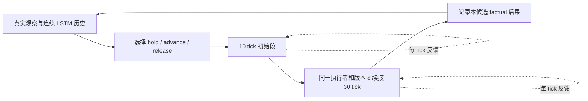

# N02 最小设计：保持握持、有限推进与释放通行

**2026-09-21 20:12 HKT更新：方法以 [v29 N02 plan v1.0 FINAL](../../v29/a2_piper_v29_n02_plan.md)为准。** 本文保留最初研究推导；本轮定稿明确单一条件执行器、独立离散selector、临时skill奖励与mode-free任务回报分离，以及固定c标签/更新协议。特别是下文按HOLD/RELEASE叙述的回臂/闭爪奖励，不能实现为selector选择mode即可更改通用得分，须按最终plan的实际物理状态触发。B08公共修复已同步，不再是N02待实现项；GPU4已授权。本轮未重做B08或启动运行。

2026-09-20 HKT；作者：Codex N02 planner。更新于2026-09-21：**§8的首段范围与通过任务合同已由 Owner 接受；其他技术细节仍为建议，未实施、未运行实验。** 当前实施规划入口为 [v29 N02 plan](../../v29/a2_piper_v29_n02_plan.md)，[裁定原话](../conversations/20260921_codex_n02_owner_decisions.md)已保存。证据等级仍为 **INSPECTED**；原[研究请求](../conversations/20260920_codex_n02_planner_request.md)及本次计划请求均未授权运行。

独立 worktree：`/home/baoquanc/workspace/DoorDog-A2_Piper_v29_n02`；分支 `codex/v29-n02`，从完整 `v29-c002-baseline` 建立，保留 B05。`codex/v29-n02-pro-20260920` 是既有审阅分支。原任务的 GPU0/GPU1 训练及持久化等待由原任务负责；本轮没有读取其新状态、接管、改合同或取得资源预算。

本分支保留 baseline 源码；此前未提交到 baseline 的研究材料继续从[主工作目录的 N02 回包入口](/home/baoquanc/workspace/DoorDog-A2_Piper/scriptsFORhuman/pro_reviews/v29/20260920_162527__N02_online_adaptation/README.md)读取，不复制附件或改动原件。历史 novelty、Pro 与此前 Main 建议都作为参考。已接受的范围限于§8两项；时窗、网络、奖励数值和运行预算不因这次裁定自动成为合同。

## 1. 首个场景与独立取舍

**先做 push 门已解锁、已有真实握持、身体尚未完全通过时的三种选择：持握并通过、有限推进并通过、释放并通过。** 目标是根据真实交互与预计后果改变选择；普通门近中性、arm 操门，base 可以平移/转向。强回关时首先验证能否持续握持并完成身体通过，避免只学会站着扶门。

首个功能片段可从真实握持后的局部窗口开始，完整 C002 的左右门、B05 和门动力学分布保持。局部片段不是自然起点整任务成绩；未到交互窗口、空抓、短轨迹及后续失败仍保留在总体人口中。第一段演示不必同时涵盖每一门型，但结论只覆盖实际执行的条件。

首段范围已于2026-09-21由 Owner 采纳，以下保留其设计边界：

- 首段以近中性姿态和 base 重定位为主，暂不增加 roll/pitch 搜索。倾斜仍是 N02 后续能力，只有在中性候选的可达/跟踪或后果不足、替代姿态确有收益时加入；不按质量或 policy 失败触发。
- 首段验证持续握持与首次释放，不承诺释放后重抓。强回弹后重抓把手仍按 D023 属于 N02，作为紧接的下一行为增量；不转回 N01、不调用未实施恢复图。首次释放后的重抓需求记为未覆盖结果，不能从分母删除。

**先问 oracle 后果是否可能改变选择，再学预测器。** 下表是待验证的机制假设，不是已观察到的 C002 结果：

| 相近当前开度/站位下的区别 | 有用后果信息可能改变的选择 | 若没有差异，应先查什么 |
|---|---|---|
| 门会较快进入身体路径，但可靠 hold 仍可达 | 选持握通行，延后释放 | hold 是否真能随 base 移动维持接触；相关后段是否有训练暴露 |
| 已有适量开向速度，释放与撤臂后能完成清离 | 选释放通行；不必一直抓到 arm 极限 | release 与身体路径是否真正执行，而非只改 gripper 比特 |
| 当前净空不足，小幅推进可以增加可通过空间 | 选有限推进，再重新判断 hold/release | 推进是否被目标限位、抓握或实际跟踪限制吞掉 |
| 有效抓握不成立，或 hold 的 arm 跟踪已明显恶化 | 减少推进承诺、重定位；必要时承认局部能力不足 | 信息、行为可达性、有效历史分别缺什么；不能统称“门太重” |

对这一后段场景，推荐把**身体通过进展**放在后果目标中，门角增量先作解释量。继续把门开大不一定有用；静止门角下身体前进的 quiet hold 应有价值。controlled swing 由有限推进建立开向运动、随后选择释放形成，不以撞 hinge 上限止门，也不直接打开旧 `controlled_fling` 奖励来冒充完整行为。

## 2. 三个候选与同一个执行合同

候选 `A=(mode, body_path, initial_command, duration)` 是在决策时已经确定的短反馈程序描述，不是事后读到的未来动作序列。初版每个 mode 只提供一条身体路径，不做动作/姿态笛卡尔积搜索。

| 候选 | 最初一段 A | 固定续接控制器 c 的职责 |
|---|---|---|
| `HOLD_TRAVERSE` | 保持有效握持，抑制多余开向运动；允许 base 小幅平移/转向以留出 arm 工作空间 | 根据每拍真实响应调整 arm 与 base，继续身体通过；不把 arm 增量置零当作世界 TCP 固定 |
| `ADVANCE_TRAVERSE` | 闭爪下作一次有限开向推进，身体使用同一通行目标 | 初始推进结束后转为 hold/traverse；不持续累加推进到关节或门限位 |
| `RELEASE_TRAVERSE` | 发出开爪并开始撤臂、沿选定身体路径通过 | 持续撤臂/通过，清离后收纳并回近中性；首段无重抓转移 |

三者最终都走真实高层 **12D = base5 + arm_delta6 + gripper1**，再由冻结 A2_Base 生成 leg12、组成环境入口 24D。base5 是速度/姿态命令，不是自由 wrench。gripper 仍按符号开/关，放大正数不增加“释放力度”。若用绝对关节目标描述动作，先用已有 `a2_hold_absolute_target_to_cumulative_action` 转成增量，再经过原累计/限位链，不能直接写 q。

### 2.1 推荐的最小时序

以下 **10 + 30 control tick** 是使协议可讨论的工程提案，不是批准的阈值或执行预算。当前配置 `fps=200, control_decimation=4` 对应 20 ms/control tick；授权实施时以新配方的实际时基为准。

1. t 时两套 actor 各消费本拍真实观察一次。决策器选择一个 A，记录控制器版本、执行者、内部 mode/phase 和当时可见输入。
2. t 至 t+10 tick 执行初始段；后续 30 tick 由**同一执行者、同一冻结版本、与 A 对应的 c**继续。整个 40 tick 窗口承诺该程序，不能第 11 拍又换为一个未记录的新选择器。
3. 每个 tick 都更新观察、各自 hidden 和连续 12D 动作。承诺的是行为程序，绝非把关节命令开环保持 0.8 s。HOLD 可减速/重定位，ADVANCE 的续接是 hold，RELEASE 的续接是撤臂与通过。
4. 到窗口末尾才重新比较候选。首次释放前可多次 HOLD/ADVANCE；选中 RELEASE 后本首段只继续退出，不隐式转入重抓。真实 done 可以提前结束；碰撞/失抓等真实失败保留。若实施中必须提前换 mode，则记录实际中断和新协议，不能把改道后的完整未来贴成原承诺的标签。

**首个后果模型只预测这个固定合同。** 若未来要每 0.2 s 重规划、却预测 0.8 s，必须把后续重规划器及版本纳入 c 并重新取得对应标签；不能沿用本文标签后直接宣称原来的风险含义不变。0.8 s 不足以覆盖释放到清离时，窗口内无碰撞不足以支持安全释放；先缩小可论证的释放窗口/场景，或在新的明确合同下延长后果窗，不用一个“安全”布尔值外推。

### 2.2 c 的内容与最小学习顺序

c 包含连续动作解码、归一化参数、LSTM/视觉权重、内部 mode/phase 约定、目标累计与冻结腿控制接口。c 不在窗口内读取尚待学习的新后果头，避免训练头的同时改变自己的标签含义。

先让沿用原 LSTM 的行为基线学会这三个程序。mode 与经过 tick 是控制器自己的指令/时钟，不是门真值；可在动作解码处条件化，不让每个候选重复推进 RNN。若加入这个条件接口和选择读出，它属于**各比较组共有的行为支持**，必须单独承认接口适应成本。“原 LSTM”指保留骨干及传感信息，不是声称原 checkpoint 无需适应即可执行新程序。

随后冻结 c（含产生 h 的编码器），再用相同 h 学少量读出，后果仅在窗口边界影响候选选择。这是首个小头方案：不先联合更新 backbone，也不先增加独立 encoder。冻结 h 让跨 8-tick rollout 的标签有确定版本，可缓存当时 h，无须先建完整 prefix 库。若冻结特征确实缺少有用历史，再讨论联合训练；届时重新定义版本、历史重算与标签采集，不能把旧 c 的标签当成新 c 的准确后果。

Teacher 与 Student 分别有 `c_T`、`c_S`；版本不是一个随意增加的网络输入。首轮每份后果数据只绑定一个已冻结 c，Student 不能使用 Teacher 续接的未来来声称预测自己的独立控制结果。窗口内不混合 Teacher/Student，初版也不建设逐 tick 混合调度。

## 3. 目标、真实输入与监督

### 3.1 推荐输出

| 输出组 | 操作定义与标签 | 控制用途及限制 |
|---|---|---|
| 当前 `p_useful_grasp` | 当前/已发生短前缀中的 handle-filtered 接触、相对滑移/脱离、闭合几何与交互连续性。无接触为负，证据矛盾为 unknown；有效静止 hold 不能因 qdot≈0 被标负 | 辅助判断持续握持/推进是否有根据；不是力的大小，也不把双指接触冒称严格 force closure。首轮先保留监测标签，小头仅在它能改变选择时加入 |
| `Q(h,A,c)` | 第一版建议三个量：身体通过进展 `Δs_body,H`（m）、H 内非授权门/框接触概率、H 内 `fully_clear` 概率。门角 `Δθ`、实际最小包络距离、失抓原因作诊断记录 | 避免“hold 安全但身体一直不前进”或“门开得更多但更易碰撞”胜出。fully-clear 输出用来区分已经覆盖退出过程与仅观测了危险前半段；不先同时回归所有门参数/距离分位数 |

`s_body` 用闭门平面开向法线上的身体尾部包络推进量定义：包括 trunk、腿/足、后部与安装结构，不把仍连门的操作臂当作身体尾部。它是训练/计分量；`fully_clear` 则还包含整条 arm 和手部。门侧和参考系依当前 push 几何变换，不能把右门有利方向照搬左门。距离与概率分开，不混成无单位“力分数”。

选择首先比较接触风险与能够实现的通过，再偏好较小姿态/无效操作代价；p_useful 不单独否决无接触后的正常退出。第一条功能链无需靠新增安全阈值表运行。若多个候选都不可行/未知，明确记录未覆盖状态和实际结果，不能默认 hold 或零 base 速度就是安全方案。

### 3.2 输入边界

| 路径 | 当前传感事实 | 本设计允许进入决策的内容 |
|---|---|---|
| Teacher | 133D，含 stage、门几何/质量/角度、交互等特权信息 | 保持这一信息条件，额外 closer/真实未来仅作诊断或监督，不暗加进主对照 |
| Student | 81D + RGB；没有显式 stage、接触力、门角/位姿/质量、base linear velocity | 仅自身输入、历史和自己发出的 mode/phase/候选描述；部署选择器与候选生成器也遵守这一界限 |
| 可直接计算部分 | 已有 q、gravity、关节目标、机器人几何/配置 | 关节限位和目标误差、机器人自身 FK/局部 IK。依赖门几何的部分需 Student 自身视觉/历史估计；未知外载不能用名义重力计算冒充已知 PD/支撑余量 |

81D 的 `actions` 为 **19D 腿动作/累计 arm target/gripper**，另有 `delta_actions` 6D；不是高层12D，也不是实际关节运动。保存提议高层命令、真正执行的高层命令、累计目标、q/qdot、实际 base/门响应的对应关系；sim effort 与接触只在标签/诊断侧。新记录用 `(N,12)` 浮点命令、`(N,6)` arm 增量、`(N,3)` 后果/有效性 mask，mask 为 bool；沿用环境 device/dtype，不通过额外真值补齐 Student 输入。

现有 dagger 配方写有 trunk 相机 `216×384`，不能据此断言 v29 rig 的实际 actor 视路已就绪。后续只核对新配方实际送入的帧、时间戳/延迟和遮挡；不预选新 camera/backbone，不把 render 视频当 actor RGB。相同 Teacher 输入可区分而 Student 全部可得历史仍不可区分时，先承认信息不足或增加可执行观察动作；更长 LSTM 不是凭空补信息。

### 3.3 factual 标签与完整人口

每窗只监督**实际执行的 A 与 c**。决策时的 A 描述可作输入，事后执行的整段命令只能用于核对/标签，不能作为预测时已知特征。首批用随机分配的候选取得覆盖，条件/分配概率留存；一条 hold 轨迹不能给 release 补反事实标签。

无需先做精确模拟快照。随机 factual 对比能说明同一类条件下动作后果是否不同；它不给每个状态的三个精确 oracle 值。若以后使用特权状态拟合的“oracle 后果模型”，仍应称估计上界。只有确实要回答同一前缀的动作因果差异时，再独立论证可用的公共前缀/分支恢复。

保留自然/受控起点、Teacher/Student、短/失败/无接触及所有 assigned episode。因碰撞提前终止：碰撞标签已知为正；未来通过进展不补零伪装完整。超时/记录截止的未完成未来为 censored，逐目标 mask，保留人口和已观察结果；真实成功清离后的 terminal 可以形成已完成事件，不跨 auto-reset 拼接下一集。按门实例/episode 切分，镜像/同门不同策略不跨训练与评价集；主结果不只报长成功窗。

## 4. assistance、clearance、奖励与完成

### 4.1 几何与任务语义

建议新增三个**模拟任务/标签**概念，而不是三个 Student 真值输入：

- `body_clear`：身体保护包络已通过所选截面，并脱离门回关扫掠区域；此处可以不包含仍握柄的操作臂。只用 root>0 或瞬时没有接触不成立。
- `fully_clear`：身体、全部 arm、手部及附属结构都已离开门/框与允许回关扫掠区域；授权指–柄接触可以从“碰撞处罚”排除，但不能让仍抓着门的手满足 fully-clear。使用少量 link 外包络与 door slab/关节允许扫掠区，不先建精密碰撞引擎。它是几何近似，需要在后续实际片段说明余量，当前没有已校准阈值。
- `need_door_assistance`：当前仍有保护部位/计划撤离路径暴露于回关区域；fully-clear 时为 false，否则为任务上的辅助需求，不是“此刻必须闭爪”的动作标签。它不读取未来 factual 轨迹，也不被历史 release gate 永久清除。

release 可以先于 fully-clear：body-clear 后可通过“释放→撤臂”完成退出；body 尚未 clear 时，也允许有证据支持的 controlled release + traversal。是否值得释放由动作条件后果决定，不由这个几何需求位一票否决。fully-clear 是停止控门的充分退出条件；不是所有 release 的前置条件。

C002 没有现成的全身清离函数；v22 clearance 记录主要是 root crossing/hinge/contact telemetry。接触 helper 可复用来计分，不能替代未来几何扫掠。Teacher/reward 可用真值包络，Student 对其估计的不确定性必须留在 Student 结果里，不能用真值选择器隐藏掉。

### 4.2 必须一起处理的最小改动

| 现有相关机制 | 推荐 N02 共同任务支持 |
|---|---|
| Stage3/4 hold income 受旧 release gate 限制；C002 `a2_stage5_hold_income_continuity_enabled=false` | 真正有效握持且仍有通行用途时，Stage4/5 都允许 hold。收入联系身体通过/有效维持所需净空，不单独奖励“持握越久越好”；不靠只翻转旧开关完成设计 |
| Stage4 回臂 −0.5 在 release gate 且非双指接触时生效；Stage5 回臂 −5 无接触豁免 | HOLD/ADVANCE 且仍需辅助时不要求 arm 回默认；RELEASE 的撤臂与 fully-clear 后收纳有明确目标。接触瞬间闪断不能立即奖励大幅回臂 |
| Stage4/5 回柄偏好 | 已解锁且不再需要压柄时允许 handle 回升，同时继续握柄；只有再次进入 latch 并确需解锁的后续扩展才重开压柄目标。首段不能用“取消回柄”掩盖无限压柄 |
| Stage5 `pregrasp_gripper_dof_pos_l1` 偏好闭爪收纳 | 释放/撤臂过程中允许开爪；清离后的 stow 再恢复闭爪目标。必须区分闭爪命令与实际仍握柄 |
| Stage4→5 和 Stage5 收入都依赖 root、hinge 阈值、handle 回升 | 将 Stage5 明确定为“身体通过”阶段：root 跨过原截面即可进入，允许仍在握柄；不让 handle/hinge 决定是否取得通过阶段的目标。Stage5 **逐 tick**收入条件改为当前通路可用并有通过作用，或当前 fully-clear；不转成一次性奖金，不用过去 clear 的 latch 代替当前条件 |
| 最终完成目前独立为 root 相对 env 原点 x>1.5，且有 50 tick delayed reset | 保留 root 终点，再要求当前 fully-clear、已经脱离把手以及完成所需撤臂；收纳用现有 shaping，不额外发明精确 q 阈值。fully-clear 后门正常回关不再影响 stage income/完成。保留既有完成延迟及节时机制，门角不再成为清离后的条件 |
| 近中性/姿态代价、碰撞、时间 | 相关操作/通过阶段都给实际 roll/pitch 的软代价，允许以后有益倾斜。保留碰撞、过力、动作速率、30 s 与原阶段预算；不奖励姿态角本身、不因 mode 变化重置任何时钟/阶段信用 |

Stage5 的“当前通路可用”需要几何门通道与身体包络；“有通过作用”可用实际身体向终点的正进展或减少阻挡来限定。原地无必要保持不能持续领新的辅助收入；短暂必要重定位仍保留目标/净空改善信号。权重和小量死区需在第一段动作兑现后再定，本文不把某个公式声称为已排除 reward exploitation。

完成有三个不同事实：到达新完成条件、延迟结束的真正 done、期间是否发生非授权接触。当前 `current_completed_task_buf` 会 latch，`_reward_complete` 在首次完成后的延迟期间持续给收入，并非一次性；本设计不将它误写成奖金。后续报告以完整 terminal 及全程接触为准，不能只用历史 goal latch 证明无碰撞通行。新增几何条件按当前状态重算，完成计时仍只启动一次，不靠 mode 切换反复领取。

以上是新行为共同底座的改动，必须同时给无辅助头组。它会改变旧阶段指标的定义，旧 C002 stage reach/income 数值不能与新组直接混算；原物理 root/hinge/handle 事件可单独保留作可比诊断。

## 5. Teacher、Student、历史和额外收益

**先行为，后信息连接；Teacher 与 Student 各自成立。** 当前没有可直接绑定为新三程序成熟专家的 checkpoint；原 C002 实现验收或训练中间产物不证明这一资格。本轮不从运行任务挑 checkpoint。

1. Teacher 在共同动作/奖励支持和完整 C002+B05 下，以原 LSTM 取得后段暴露。受控 late-stage 起点只补局部能力，需真实建立握持；不能将 reset 的门/手位置重合作为已成功抓握。
2. Student 可先看合格 Teacher 的启动示范，随后单独采集阶段全程由 Student 执行，Teacher 仅沿同一真实轨迹 shadow 给标签。使用现有全 Teacher/全 Student 开关即可，先不做比例课程。默认 Teacher 执行比例1.0、固定 env 前缀不能充当 Student 暴露。
3. 如果采用内部 mode 指令，Teacher 查询必须针对当前实际 mode 提供同语义12D；不能让 Student 在 hold 中模仿 Teacher 另一种 release 目标。Teacher 有效性按有依据的局部区域说明，unknown/失败数据保留模拟监督与人口；不以 oracle 接管或筛选后的 episode 算 Student 成绩。
4. Teacher/Student 各自沿真实观察每 tick 更新 hidden；8 tick 是数据/梯度窗口，不是记忆清零。mode 切换、rollout seam、控制权交接均不 reset，真实 done 才 reset；绝不复制 Teacher hidden 给 Student。
5. 若进入小头阶段，冻结各自 c，持续跨 rollout 保存待结算窗口身份、当时 h/A、执行者、版本与末端结果；每拍可形成新标签，但只有合同边界实际选择的 A 用于该候选监督。当前固定版本缓存不需要完整快照。以后 replay/relabel 或更新 backbone 时，再保存真实前缀并重建相应 hidden；历史不足的短 episode 从真实 reset 起保留，不设任意最短长度排除。

**Student 自主整任务的执行器也必须 stage-blind。** 当前 Stage0 用真值 stage 覆盖 arm 累计目标；这不是关节瞬移，但属于部署隐藏真值。首个后段局部片段可以明确限定其不经过该覆盖；正式独立 Student 任务前，建议在 N02 分支独立采用与 N01 提案一致的共享 stage-blind 增量接口，并让 Teacher 适应后再监督。不能假设 N01 已经实现它。`zero_vel/zero_finger`、Stage3 rebase 等仅核对新配方实际启用的路径，不重审全部历史选项。

最小收益归因只需回答以下问题，运行量等下一阶段授权，不形成当前实验矩阵：

| 对比/证据 | 可以归因什么 |
|---|---|
| 原 C002 → 共同新行为支持＋相应暴露的原 LSTM | 行为/执行接口/奖励/暴露的组合收益；不能归因预测头 |
| 同一冻结 c、相同候选/输入/数据预算；普通 LSTM 选择读出 vs p/Q 参与选择 | 辅助监督与后果控制连接的额外收益。冻结 c 内部不读新 Q，避免偷偷改变续接行为 |
| 同一版本上的头误差/校准、有限同人口输出替换对动作影响、实际任务结果 | 分别证明预测、信息使用和行为收益；三者不可互相替代 |
| Teacher 与 Student；Teacher 轨迹与 Student 自身轨迹；局部起点与自然起点 | 各信息/执行分布下的能力。最终 Student 需全程无接管、无真值选择器完成 |

只需保留少数直接可见结果：全部分配 episode 的完成/耗时、未到窗口与未覆盖数；候选实际执行及身体进展；非授权门/框接触和全身清离；握持中断/释放时机；普通门姿态代价。p/Q 校准按短/失败/无接触分组。若 oracle 可知的后果也不改变选择，先修行为/目标；若原 LSTM 已足够，N02 可停在行为/暴露方案，不为 novelty 加网络。

## 6. source/config 落点与未来最小操作路径

本轮只补查未决的执行续接、Stage4/5/完成、夹爪目标与可复用几何接口，没有重复全 C002 审计。以下是未来落点，不是已修改源码：

| 落点 | 作用 |
|---|---|
| [base_v29_common.yaml](../../../gr00t/rl/config/ablation/wbmanip/base_v29_common.yaml)、[base_v29_baseline.yaml](../../../gr00t/rl/config/ablation/wbmanip/base_v29_baseline.yaml) | 完整 C002 组合入口；将来新 N02 overlay 继承它，不修改运行中 baseline，不以 GPU1 −B05 替代 |
| [door_open_a2_base.py](../../../gr00t/rl/envs/door/door_open_a2_base.py) | `a2_hold_absolute_target_to_cumulative_action` :3935；Stage0 override :8870；hold mask :15168/:18369；Stage4/5 回臂 :15963；夹爪 :16031；hold_and_drive :17068；回柄 :17590；门接触 helpers :18315/:18432；Stage4→5/收入/完成 :29920。新增 body/fully-clear 与相关 reward 使用统一几何语义 |
| [staged_task_base.py](../../../gr00t/rl/envs/base_task/staged_task_base.py) | :164 单调阶段与计时，:246 完成/delayed reset，:302 逐 tick stage income，:332 complete income；复用生命周期，不为三个动作建另一套任务框架 |
| [delta_action_base.py](../../../gr00t/rl/envs/base_task/delta_action_base.py)、[a2_base.py](../../../gr00t/rl/envs/base_task/a2_base.py) | :59 增量累计/限位；:1140 起12D与腿组合/命令缩放。选择高层动作后再生成匹配腿动作，不能复用另一候选的 leg 输出 |
| [ppo_trainer_a2_base_api.py](../../../gr00t/rl/trl/trainer/ppo_trainer_a2_base_api.py)、[distill_trainer_a2_base_api.py](../../../gr00t/rl/trl/trainer/distill_trainer_a2_base_api.py) | :6082 与 :349 为实际 rollout 入口；在这里明确候选/执行者/真实轨迹标签。Student 当前拒绝独立 auxiliary policy models，候选小头应在 actor 内定义，不能假称已有通用辅助模型插槽可直接用 |
| [RecurrentActor](../../../gr00t/rl/trl/modules/actor_critic_modules_recurrent.py)、[VisionRecurrentActor](../../../gr00t/rl/trl/modules/vision_actor_critic_modules_recurrent.py) | 原 LSTM、Student 视觉融合与 reset 复用；先共同程序执行与选择，之后才加冻结特征读出 |
| [Teacher 观察](../../../gr00t/rl/config/obs/wbmanip/door_open_a2_base.yaml)、[Student 观察](../../../gr00t/rl/config/obs/wbmanip/door_open_a2_base_dagger.yaml)、[DAgger 配方](../../../gr00t/rl/config/exp/wbmanip/door_open_a2_base_dagger-lstm.yaml) | 133D/81D+RGB、历史字段、实际视路与 Teacher 执行开关；未来另建 N02 Student 组合，不把旧 trunk 外参当作 v29 实际证据 |

现有 hold oracle 的 :22818、:24929 使用模拟实时 G/世界姿态与 Jacobian，可借用其动作转换方法作**模拟功能演示**；不能原样移入 Student 候选生成器。位置 target 只设置控制目标，并非实现该位置；这一点同时核对了本机 IsaacLab `articulation.py:1079` 与[官方 Articulation API](https://isaac-sim.github.io/IsaacLab/main/source/api/lab/isaaclab.assets.html#isaaclab.assets.Articulation.set_joint_position_target)。

Owner 明确要求下一阶段后，按以下顺序使每一层可见：

1. **先兑现动作。** 在独立 N02 配方中接通三个程序、统一通过/奖励语义；用一段真实形成握持的门交互，经12D链分别执行。可见结果是命令与实际 base/arm/门响应、保持握持时身体通过、释放撤臂及清离后门正常回关。若用模拟真值 IK，标为 oracle 行为演示。此时不训练后果头，不宣称 Student 能力。
2. **再走原 LSTM。** 在相同支持上获得普通/回关条件的真实暴露，区分行为不会、根本没经历、历史线索不足。可见结果是策略自己选 hold/advance/release，及失败的具体落点；已有原 LSTM 足够时停止扩展。
3. **有选择价值才接小头。** 冻结具体 c，随机 factual 采集并跨 rollout 结算，预测接入窗口边界选择。可见结果是相同条件下后果差异、选择改变及真实通过结果，而非仅 loss 下降。
4. **单独走 Student。** 确认真实 RGB/共享 stage-blind 接口，Student 自身执行、两套 hidden 连续，最后自然起点全 Student 完成或失败；局部接手结果另列。重抓和姿态扩展在此后按已观察瓶颈讨论，不假装已经完成。

目前没有 N02 launcher 或可执行的新配方，故不提供虚构的“可直接运行”命令。实施、必要功能观察/验证及训练预算需按 Owner 下一阶段指令确定；本轮没有测试工程、模型重算或运行。

## 7. 模型证据与 N01 接口边界

[Pro 动力学报告](/home/baoquanc/workspace/DoorDog-A2_Piper/scriptsFORhuman/pro_reviews/v29/20260920_162527__N02_online_adaptation/original/DYNAMICS_AND_FORCE_ANALYSIS.md)的42姿态、26解出、104方向和PD补算是 Pro 的 CPU 离线执行材料，本机仅检查。匹配固定世界 TCP 完整位姿、base 位置和脚位后重解关节角，不是只换坐标。中位 roll+8°：arm 界 +16.30%，足地/腿界 +0.292%；低位压柄含 PD：pitch+8° −6.245%，pitch−8° +14.042%。它们支持条件性姿态，不证明冻结腿策略/真实抓握能兑现。

必须连同[本地更正](/home/baoquanc/workspace/DoorDog-A2_Piper/scriptsFORhuman/pro_reviews/v29/20260920_162527__N02_online_adaptation/LOCAL_RECONCILIATION.md)使用：双指模型遗漏 `F|d·n|≤Nmax`，156条 press_down 的90N/36.4N不能作为完整方向容量；更紧必要界45N/18.2N仍是条件假设。水平情景及arm/足地/PD主表不受影响；原件未改，修正模型未跑。arm100N·m、finger45N为仿真配置，18.2N来自假设指位/增益；都不是硬件持续能力或实际接触读数。瞬时惯性不证明动态甩门，旧 v27 shadow、UniFP/SixthSense不证明 C002 在线适应或 Student 收益。

[N01 最小设计](/home/baoquanc/workspace/DoorDog-A2_Piper/scriptsFORhuman/novelty/documents/20260920_n01_minimal_recovery_transfer_design.md)尚未实施。2026-09-21同步：其 [N01 plan](/home/baoquanc/workspace/DoorDog-A2_Piper_v29_n01/scriptsFORhuman/v29/a2_piper_v29_n01_plan.md)的N01-D003已接受该分支共享stage-blind接口，但共同baseline B08仍OPEN，N02不能假设已有修复代码。真实握持/释放事件及时间语义仍需在实际共享实现时对齐；N01处理正常释放前局部失抓，N02负责持续调节与D023的释放后强回弹重抓。几何/奖励helper按实际需要共用，不预付跨分支框架，也不以N01决定代替N02实现授权。

## 8. 两项 Owner 裁定（2026-09-21已接受）

下表两项已按[Owner原话](../conversations/20260921_codex_n02_owner_decisions.md)登记为 [v29 N02 plan](../../v29/a2_piper_v29_n02_plan.md) 的 N02-D001/N02-D002，不再等待重复确认。

| 选择 | 推荐 | 实际代价/边界 |
|---|---|---|
| 首个行为范围 | 先完成已握柄 push 后段三候选；倾斜搜索与释放后重抓作为随后增量 | 首段不覆盖所有困难门，也不关闭 D023；可先分清动作与信息是否真有用 |
| 通过任务合同 | 接受 Stage5 进入/逐 tick 收入按身体通过重定义，完成要求 root 终点＋真实释放＋全身清离，并共同支持握持/撤臂/回柄 | 会改变旧阶段统计和 Teacher 学习目标，需共同接口适应；不能把这部分收益算成辅助头收益 |

动作续接与冻结 c 是本设计的推荐技术选择；10/40 tick、几何余量、奖励权重无需 Owner 现在拍成硬门槛。Owner 确认设计也不自动授权模型重算、GPU、训练/评估、Git 提交或外部发布。
