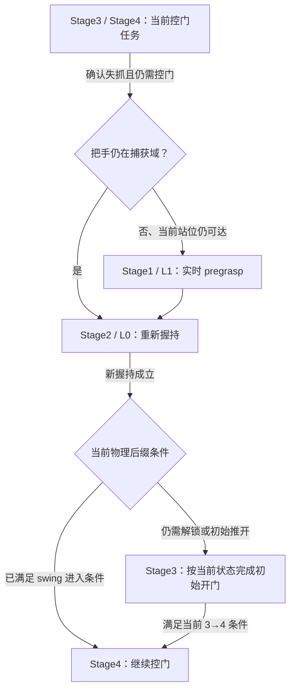

# N01：Stage 重入与 recovery bank 的独立判断及 Pro 打包方案

2026-09-21 HKT。状态：**讨论与选材方案；未生成/上传输入包，未发布审阅分支**。依据[Owner三项concern与本轮范围](../conversations/20260921_codex_n01_stage_reentry_bank_concerns.md)。本文不取代[plan v1.2](../../v29/a2_piper_v29_n01_plan.md)，也不把新增bank建议当作已批准的训练合同。

## 1. 恢复图应改变真实任务目标路由

我的判断是：恢复图必须落实为可回退、可条件重入的目标状态机，只有失抓分类不够。v1.2 §5.1已经要求：在捕获域内回Stage2/L0；离开捕获域回实时pregrasp的Stage1/L1，再到Stage2；新握持后根据当前门状态选择后缀。这些仍是设计，尚未在当前N01代码中实现。

当前`StagedTaskBase._post_compute_observations_callback`仍逐stage求前进条件，再执行`stage_buf += 1`。C002固定resolved config不含`a2_v27_recovery_*`，旧恢复逻辑未启用。上轮v28 quick test保留原生stage行为，只证明外力施加与抓持变化，没有证明N01回退、重入或恢复学习。

建议的最小流程是：

已经满足正常通过条件且不再需要扶门的loss，另走原Stage4/5通过后缀，不为计数强制重抓；正常释放后的强回弹仍按D023/N02边界处理。

回退改变当前目标、相关reward和进入条件；不倒退预算高水位、不返还已用时间、不重获进展收入。在线恢复仍是同一个episode，物理状态、arm累计target、已执行动作历史和RNN保持连续。Teacher可以看到训练目标stage；Student继续只有既定81D＋RGB，执行器不能利用真值stage替它闭爪或移动手臂。

Pro需要判断：最小改动能否用现有stage框架实现这些边，哪些callback应在重入时执行，哪些一次性进展/参考状态不应重建；不要只交一张分类图。

## 2. 半开门担忧成立，但“回Stage3必然重复压柄/卡死”不是当前源码事实

本轮核读当前源码与固定C002训练config得到：

| 当前事实 | 对判断的影响 |
|---|---|
| Stage3→4检查门铰链角`>0.25 rad`和合格握持；当前要求5 control tick，streak highwater=false | 切换条件没有要求“重新发生一次压柄事件”。门已半开且新握持合格，机械经过Stage3未必卡死 |
| `push_door_handle`及`a2_stage3_handle_depression`尺度均为0 | 不能只看到旧函数还在就说C002仍用它们强制重复压柄 |
| `a2_stage3_unlatch_hold`尺度3，只有门角`<0.1 rad`才有解锁保持收入 | 开门到一定角度后，这项收入自然消失；Stage3包含初始开门推进，不等同于无条件压柄 |
| Stage4的stage reward condition复用Stage3→4条件 | “无需解锁就回Stage4”过于粗糙，可能把尚未满足0.25 rad条件的状态送进Stage4 |
| Stage1 reward condition仍调用含默认arm姿态的Stage0条件 | L1回退不仅是改stage整数；v1.2已要求在恢复路径解除这个不相容前提 |

建议让Pro用少量具体反例推演，而不是先认定方案正确或错误：

| 新握持后的示例状态 | 我的初步建议；供Pro独立挑战 |
|---|---|
| 门角0.6 rad，仍需控门，握持新近成立 | 直接进入满足条件的Stage4；不人为补一次Stage3压柄 |
| 门角0.15 rad，门舌已离开门框，但尚未达到0.25 rad | 可保留Stage3的初始推开目标；不把“还在Stage3”等同于再次下压。若改为另一种重入规则，必须同步解释Stage4 reward/进入条件 |
| 门已回到近关闭，实际门舌重新约束开门 | 回Stage3重新解锁才有意义；不能只凭“过去已经开过”跳过 |
| 门已有明显回关速度 | 目标使用当前门角、速度、握持和实际可达条件；不能恢复到失抓前的静态pregrasp或仅凭历史最大stage选择后缀 |

这些数字是当前判据下的说明性状态，不是新增课程采样分布或实测结果。Pro应联合给出**重入条件、在该状态下的目标/reward、离开条件与保留的历史**，并处理恢复期间门再次运动的情况。对是否需要新节点、能否继续使用Stage3/4名称保持开放。

## 3. 支持主动恢复场景，但要分清状态池、场景库与蒸馏轨迹

我支持主动加入一小组当前C002+B05域中的恢复起点，覆盖“夹爪仍可直接闭合”“需回实时pregrasp”“门已开但正在回关”等关键差异。它能避免完全等待自然失抓，但不建议一开始构造大量任意姿态。手动指定场景意图后，可从实际运行捕获，或在episode初始化时建立物理相容的状态；不能在在线恢复中瞬移，也不能手工设contact/成功标记假装已经握持。

v27值得复用的是机制，当前bank不是现成可交付的数据集：

- 它是进程内、按env保存的GPU环形状态池，捕获`staged_reset_buf`中的robot/door root与关节位置/速度、delta target相关buffer、部分任务历史，以及额外recovery highwater等。左右侧pending样本按较少的一侧数量转为available；这不是跨侧相同状态的配对。
- restore只取同一env自己的slot，保存的root pose是world frame；场景几何/固定门域在原env中已经存在。这不能直接套到不同env数量、origin布局、B05把手/门参数或不同joint顺序的Student环境。
- 当前没有bank导出/导入的持久化接口，历史readout提供的是计数，不能当作完整snapshot文件。v27确实运行过capture/promotion/reset，但其整体恢复收益没有成立。
- 旧capture显式要求`enable_staged_reset=true`，而v1.2首轮设为false。复用时必须把所需snapshot能力和新的采样分布说清楚，不能仅开启旧开关就默认继承整个staged-reset配方。
- 它不保存可直接训练Student的RGB、动作/Teacher标签序列和完整观察/循环历史。上轮v28 probe日志也不是完整可恢复bank：其物理读数不包含整个机器人的所有关节状态与控制/记忆状态。

**同一份新场景库可以供Teacher和Student使用。** 建议复用场景定义、相容的初始物理/控制状态及来源；Student阶段重新产生实际RGB/81D观察，由冻结且合格的Teacher在该状态和相应历史上给12D标签，Student亲自执行恢复。

两种使用方式要明确区分，首版不自动强制最复杂的一种：

| 使用方式 | 记忆与结果口径 |
|---|---|
| 从困难场景开始一个新episode | 环境历史、Teacher和Student hidden明确重置；重新验证Teacher从这个起点的后缀能力。这是恢复起点课程，不等于已经复现自然过程中的失抓历史 |
| 恢复真实episode中途的一段经历 | 保存能重建相应历史的prefix/执行命令/观察序列，各模型用自己的网络建立记忆；Teacher hidden不能直接当Student hidden，也不能只恢复q后沿用另一条episode的记忆 |

v27的在线回退不触发done，历史和RNN连续；bank加载发生在terminal reset之后，历史/模型hidden已清零，随后会从bank恢复部分任务计数。尤其旧`total_time_buf`可被恢复，而新episode计数已归零。N01应先选清楚“新困难episode”还是“旧episode后缀”，再规定时间预算，不能原样照搬这个混合语义。

加入bank也会改变v1.2当前的自然reset训练合同。若首轮仍要单独回答外力课程的作用，优先让T_nom/T_force共享预先固定的场景库和采样安排；只给受扰组额外bank会把外力与状态采样一起改变。Student配对同理。若决定评价“外力＋bank”整套方法，可以另行明确比较问题，而不是无限增加训练组。最终自然起点、全Student的评估仍应保留。

bank的数据来源同样需要明确：优先讨论当前v29场景的手工规格或新Teacher自身经历。若提议用旧Teacher预填bank，那是在改变v1.2禁止旧诊断数据进入scratch训练的约束；它与“是否加载旧权重”是两个不同问题，不能默默视作已经允许。

## 4. 给Pro的独立问题与交付物

建议这次只围绕三个concerns交付，不重做上一轮整套N01预研。Pro先读Owner原话、源码与证据，形成初步判断后再看本文建议和旧Pro答案；允许否定当前重入规则或暂缓bank。

必须直接回答：

1. 恢复图应具体改哪些Stage边/当前目标，是否需要直接Stage2→4；哪些callback、时间、进展收入、target和history应保留？明确训练目标图与Student部署动作路径的边界。
2. 按当前C002判据走通半开门、已解锁但未达0.25 rad、近关闭重新上锁、回关中的例子。不要把Stage名称当作物理条件，也不要未经源码支持宣称必定卡死。
3. 主动bank应在Teacher阶段、Student阶段还是两者引入？最小场景规格、跨env/跨模型复用单位、初始化/历史、重采集标签、采样比例与对照如何安排？先回答是否有必要，再给最小方案；不照搬v27的20%。

建议Pro的完整回包至少包含workflow要求的`FULL_REVIEW.md`、`LOCAL_WORKER_PARSE_PROMPT.md`；可另附一份`STAGE_REENTRY_AND_BANK_SPEC.md`，给出转移表、场景字段表、Teacher/Student数据流及少量伪代码。源码事实、推荐、未知和需本地实际片段确认的内容分开；研究建议不自动成为运行授权，不要求先建大套回归/护栏测试。

## 5. 拟打包内容

采用可独立解压的普通ZIP，每份压缩后≤95MiB；所有内容来自明确的正向清单。现在只选材，后续真正交付时再形成最终manifest和压缩包。

| 拟定ZIP | 主要内容与用途 |
|---|---|
| `worker_delivery__source_and_configs.zip` | 当前N01 worktree的完整相关源文件、C002/B05配置及必要机器人/门资产定义；供Pro核对实际Stage、bank与蒸馏接口 |
| `worker_delivery__current_questions_and_evidence.zip` | Owner三问、明确的当前源码事实表、源导航、plan v1.2/handoff、固定C002 resolved config与step6000 readout、v28两档force读数/代表视频及其时间manifest。显式标明“失抓已观察，N01回退/恢复/Student未实现” |
| `worker_delivery__historical_reference.zip` | 本地初步建议、v27 R2配置/运行readout/closure、上一轮N01 Pro原件。后读，避免历史方案成为预设答案；旧模型/门域结论不冒充B05当前能力 |

源码正向清单按调用链选取完整文件，不只给零散摘录：

| 关注点 | 已定位的核心文件/入口 |
|---|---|
| Stage进入、前进、回退及reward | `gr00t/rl/envs/door/door_open_a2_base.py`：Stage条件29675–29892；旧recovery14365；callbacks15139；解锁reward17010；`gr00t/rl/envs/base_task/staged_task_base.py`：推进166、计时/奖励、set_to_stage399 |
| Bank状态、物理restore与历史 | 同door env：capture14421、restore14490、reset29017；同staged base：注册486/526、snapshot556；`gr00t/rl/envs/legged_base_task/legged_robot_base.py`；`gr00t/rl/envs/env_utils/history_handler.py`；`gr00t/rl/envs/base_task/delta_action_base.py`、`a2_base.py`及`base_task.py` |
| Student采集、标签、hidden | `gr00t/rl/trl/trainer/distill_trainer_a2_base_api.py`、`distill_trainer.py`、`ppo_trainer_a2_base_api.py`；`gr00t/rl/agents/modules/data_utils.py`；`gr00t/rl/trl/modules/actor_critic_modules_recurrent.py`、`vision_actor_critic_modules_recurrent.py`、`memory.py`及其直接依赖 |
| 当前与历史配置 | `base_v29_baseline.yaml`、`base_v29_common.yaml`及其defaults链；`gr00t/rl/config/rewards/wbmanip/reward_door_open_a2_v26_acquisition.yaml`；Teacher/Student obs与`door_open_a2_base_dagger-lstm.yaml`；旧`base_v27_R2_S41.yaml`只作历史参考 |
| 当前物理域/相机 | `gr00t/rl/config/robot/A2_Piper/a2_piper_v29.yaml`及URDF/所需mesh；`gr00t/rl/data/tasks/door/scenario_cfg/isaacsim.py`；`door_v29_parameters.py`、`handle_v29.py`、`door.py`；相关simulator/camera producer |
| 已完成失抓诊断 | `scriptsFORhuman/v29/n01/quick_force_probe.py`、[两档readout](20260921_n01_force_probe_readout.md)、`dose_comparison_0p55s.json`、每轮config/统一短窗结果、代表视频/manifest/clip control记录。v28诊断source/config绑定独立说明，不让Pro误以为这些轨迹来自当前B05 |

v27优先只取[step1500 recovery readout](../../v27/a2_piper_base_v27_wave_b_r_step1500_readout_20260907.md)和[closure相关结论](../../v27/a2_piper_base_v27_execution_closure_20260911.md)，不复制所有里程碑日志。bank计数是PPO batch内累计快照均值；R1 endpoint缺失，旧R2不提供恢复收益证明。

不需要checkpoint/模型权重、整个训练目录、其他活跃任务的日志或整个IsaacLab安装。Pro此次负责设计与源码推敲，不假定云端已经运行Isaac仿真。必要的本机IsaacLab行为以少量已核实源码/官方API说明补充。

## 6. 后续正式交付时的workflow

按[项目artifact handoff](../../../.ai/ARTIFACT_HANDOFF.md)执行：对选定阶段的source/config/docs做范围明确的Git发布，核对远端版本；在新的`Pro_Space`任务目录上传选定Worker输入；核对名称/大小/父目录后，才生成带真实链接和精确ZIP文件名的最终`PRO_REVIEW_PROMPT.md`。上一轮已发布的review分支或Drive目录不能冒充本次v1.2输入。

沿用Owner不生成hash/摘要清单的要求，版本说明使用审阅分支、提交主题/时间与明确的文件清单；不因为通用模板的SHA字段另行生成哈希。每份ZIP≤95MiB，不拆二进制分卷，不覆盖旧交付。

Pro在对话内简洁回答三问，并附`pro_delivery__full_review.zip`；Owner传回当前本地任务，之后按项目`Pro review document root`落盘。Pro不把答案上传Drive。此次范围只有判断与打包方案，因此上述发布、上传和最终云端prompt均尚未执行。

## 定向证据索引

- [当前Stage3→4源码](../../../gr00t/rl/envs/door/door_open_a2_base.py:29841)、[Stage4 reward条件](../../../gr00t/rl/envs/door/door_open_a2_base.py:29866)、[C002覆盖配置](../../../gr00t/rl/config/ablation/wbmanip/base_v29_common.yaml:77)。
- [当前bank capture/restore](../../../gr00t/rl/envs/door/door_open_a2_base.py:14421)、[staged状态注册](../../../gr00t/rl/envs/base_task/staged_task_base.py:486)。
- [Student采集与Teacher查询](../../../gr00t/rl/trl/trainer/distill_trainer_a2_base_api.py:256)、[循环记忆reset](../../../gr00t/rl/trl/modules/memory.py:93)。
- 固定C002 config：`/home/baoquanc/workspace/DoorDog-A2_Piper/logs_rl/a2_piper_full_stage_a2_base/base_v29/push_baseline_C002_seed291/config.yaml`；本轮只读这个既有文件，不轮询外部活跃运行。

本轮仅定向阅读与文档整理，没有修改生产代码/plan默认值，没有运行仿真/训练/新测试，也没有创建ZIP、提交、push或上传。
