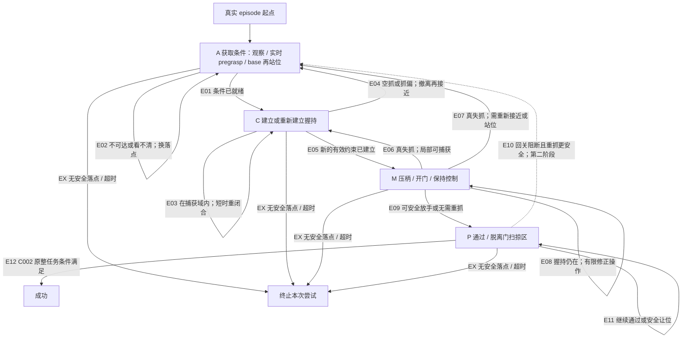

# RECOVERY_GRAPH — 恢复到物理条件，而不是恢复到整数标签

状态：**设计建议，未实现、未训练、未验收**。主底座为完整 v29 C002，B05 七族保留。来源编号见 [SOURCES.md](SOURCES.md)。本文件定义任务层语义；采样/蒸馏见 [TEACHER_STUDENT_PLAN.md](TEACHER_STUDENT_PLAN.md)，实现和验证见 [PILOT_AND_IMPLEMENTATION_PLAN.md](PILOT_AND_IMPLEMENTATION_PLAN.md)。

## 1. 结论与边界

推荐四个物理目标集合：**A 获取可抓取条件、C 建立握持约束、M 操作门、P 安全通过**，加成功 D 与终止尝试 X。A 内部按情况使用实时 pregrasp、base 重新站位、重新观察三个落点，不为它们各训练一套网络。不建立每种失败一个节点的大图，不把 sim API 错误/无效 tensor 纳入图。

图的第一用途是：约束训练目标、定义恢复事件、分层采样、解释失败，以及为 Teacher 提供当前目标阶段。**第一版仍是一套 recurrent 12D actor；Student 部署不运行依赖真值的图调度器。** 图的真值判据可以在训练/评估器中出现，但不能通过 actuator override、stage-dependent reset、目标命令或额外输入偷偷进入部署动作。[C03–C08]

旧 Stage0–5 保留为兼容接口和日志，不再同时承担“当前应该做什么”“本集已完成到哪里”“还剩多少时间”三个互相冲突的角色。固定退 Stage2 只覆盖非常窄的局部再闭合情形，不作为主线。条件落点的研究先例已有 RecoveryChaining，不能把这张图本身算成 novelty。[P03]

## 2. 图

E10 属于完整任务恢复图应讨论的边，但**第一轮机制 pilot 先做 E03–E07 的未授权释放前失抓**。历史上 Owner 将 post-release 回关放到 N02；本回包建议将它作为任务层恢复的后续阶段，是否改归 N01 待 Owner 采纳，不宣布已改分工。[H03]

## 3. 必须分开的物理量与事件

### 3.1 不用单个 both_contact 代表全部语义

`hold_valid_now` 表示当前握持成立；`held_before` 只表示曾经握持过；`constraint_epoch` 标识一次持续握持段；`release_intent_now` 表示当前动作目的允许释放；`release_ever_authorized` 是历史记录；`needs_handle_control_now` 表示继续任务目前是否需要再控制把手。这些量不能用一个不可逆历史 flag 替代。

Teacher/评估器可以组合：C002 指定接触体之间的双指接触、挤压方向与幅度、夹爪开合、G 与夹爪相对几何、相对运动、门响应。现有 5-control-tick squeeze/streak 是兼容起点，不另外宣称已具有力闭合证明。错误部位碰撞、夹爪碰到门板或只有一帧接触，不算重新建立把手约束。[C03]

Student 只有关节/动作/command 历史和 RGB；能学习“夹爪正在闭合但把手不随之运动”“把手相对夹爪滑出”“观察被遮挡”等证据，**不能直接读取上述真值**。缺证据时保持不确定并选择重新观察/较保守落点，不编造精确接触力。[C07]

### 3.2 事件类型

- **捕获失败**：从未建立有效握持；包括空抓、抓偏、接触位置错误。记录 `capture_failure`，不伪造一次“失抓”。
- **真失抓**：此前有效握持成立，在尚需该约束或任务仍被影响时约束中断；记录 `constraint_loss`。
- **抗扰保持**：扰动已实际作用，但约束未中断；记录 `retained`，不是恢复成功。
- **正常释放**：符合当前释放意图、通行可行性和命令历史的失去接触；记录 `planned_release`，不触发失抓失败分母。
- **释放后重新需要把手**：此前释放本身是正常的，随后回关使任务受阻；记录 `recontrol_needed`，不是追溯性地把正常释放改成失抓。
- **无须重抓的续行**：发生失抓，但继续穿过比返回把手更安全且能完成任务；记录 `bypass_recovery`，与 `regrasp_recovery` 分开。

以上分类不能靠“动作列 11 为正就是正常释放”完成：短时误开爪或注入的开爪也为正；必须结合意图/几何/历史。训练注入元数据仅用于因果归因，不作为 Student 触发信号。

## 4. 恢复落点：明确回答“退到哪里”

| 落点 | 选择所需的物理条件 | 实际应执行的行为 | 不能做的事 |
|---|---|---|---|
| **L0 原地再闭合，C 内** | 把手仍在夹爪捕获体积内；闭合时间内不会因相对速度滑出；朝向合适，base 可稳定保持 | 降低不必要的 base/腕部运动，维持当前可行 arm 目标，闭爪并短时验证新的约束 | 仅见 both_contact=false 就先大幅开爪；把历史接触 streak 接上去冒充新握持 |
| **L1 当前 base 下的实时 pregrasp，A** | 把手不在捕获域，但当前 base 下存在满足关节限制、碰撞间隙和接近方向的可达路径 | 从碰撞/夹持位置适度撤离，张开到抓取准备，跟随当前 G 的 pregrasp，再进入 C | 回到关门时的旧目标；在正在运动的把手上只按静态距离选目标 |
| **L2 base 重新站位后 pregrasp，A** | 当前 arm 不可达/姿态不利；门扫掠区外存在本低层可执行的更好站位 | arm 收到无碰撞过渡姿态，base 做有限平移/转向，重新检查实时 pregrasp | 直接设 Stage0 清空 arm 累计目标；假设低层能执行任意规划出来的 base 位姿 |
| **L3 重新找把手，A** | RGB 已丢失、观测过期或多个可行解释要求相反动作；直接抓取风险高 | 在安全区域停/小幅转体或调整 arm 视线，恢复可辨识视野；获得新证据后选 L1/L2 | 继续追踪一个无有效观测支持的精确 6D 目标；用仿真 G 给部署 controller 导航 |
| **L4 直接通过，P** | 门的剩余开口与运动趋势允许全身清空；回抓会增加风险或时间 | 继续通过、缩短暴露在扫掠区的时间，不强求再握住把手 | 把 root 已过门平面当成全身已安全；为了“恢复指标”强迫返回门边 |
| **LX 终止本次尝试，X** | 无安全落点、明显不可恢复姿态/碰撞、预算耗尽；或安全退避仍不能建立下一步条件 | 使用既有可部署停止/安全退避约定结束本次尝试，记失败原因 | 在线瞬移机器人、清零门速度、无限重试、删除困难样本 |

“重新站位”不等于重跑原始 Stage0。C002 原 Stage0→1 含默认 arm 姿态和特定站位条件；在线 L2 应使用**当前门姿态下的可达站位目标**，而不是要求已经半开的门恢复关门初始几何。[C03]

### 4.1 动态门下的选择

现有目标 consumer 已按当前刚体/G frame 计算，不能把问题错误归因成“G 从不更新”。真正需要补的是**目标的可达前提、到达期间的运动、base 站位及握持要求**。[C03]

Teacher 的候选落点评估使用：当前关节/机器人/门状态，当前 G，短时门运动趋势，关节限位、夹爪捕获范围与机器人—门扫掠间隙。第一版可以使用保守几何/有限候选检验，不要求建立完整轨迹规划器；几何通过仅是候选，不是已经证明力学上可恢复。

设当前候选需要响应与移动时间 `tau = sensor_age + policy_latency + actuation_latency + move_time`。在这段时间内检查候选 pregrasp/捕获窗口是否仍存在。Teacher 使用真实门运动进行训练期标注；Student 只能依据 RGB/proprio 历史估计趋势和不确定性。快速回关下“现在可达”不等于“等看到并行动时仍可达”。

推荐顺序不是机械的 L0→L1→L2→L3：先排除危险/无任务必要的重抓，再选最小安全动作。例如：

1. 轻微滑移、把手仍在两指间：L0，不退整个阶段。
2. 把手随门转走但 arm 仍可达：L1；不能只闭爪，也不必重走远距离接近。
3. 当前肘/腕极限、把手已绕到另一侧：L2；先让 arm 脱离危险接触，再移动 base。
4. 把手暂时不可见而门运动慢：L3；用一次有目的的视线恢复，而不是靠 oracle 精确追踪。
5. 门正在快速回关：若安全通过仍可行，L4；否则在扫掠区外退避/等待其停稳，再 L1/L2、必要时重新压柄。等待消耗同一个 episode 预算。
6. 机器人夹在门与门框间、两条路径都不安全：LX；不能为了闭环成功率继续危险探索。

## 5. 每条边的完整合同

本节各边均继承第 6 节连续状态合同 **K0**。正常前进只在首次突破高水位时获得一次进展收入；所有在线恢复边均不得调用 reset/snapshot loader。Teacher（T）信号和 Student（S）信号分别列出。表中执行是训练目标及期望 actor 行为，不是已存在的部署脚本。

### E01：A→C，条件就绪

- **触发/释放排除**：不是失抓触发；当前 live pregrasp、朝向、开合准备、base 可控性满足后开始捕获。正常释放后无需再抓时应去 P，不能误进 C。
- **T 信号**：当前目标变换、关节/速度、现有 pregrasp readiness、碰撞/可达检查。**S 信号**：RGB 把手—夹爪关系、q/qdot、最近动作/commands；无 stage 真值。
- **目标/动作**：在有效接近方向进入捕获体积，闭合夹爪；不是先把 stage 改成 2 然后等待“魔法恢复”。
- **成功/放弃**：进入 C 并实际接近；发生碰撞或不可达回到 A/L2；预算耗尽 X。
- **状态**：兼容目标 phase 1→2；清当前捕获尝试的有效接触 streak，不清物理历史/RNN；首次正常进展按 K0 记账。

### E02：A→A，更换获取条件的落点

- **触发/释放排除**：当前 target 不可达、base 站位不合适或视觉证据不足；没有必要控制门时不进行这种搜索。
- **T**：动态可达/扫掠和当前 G。**S**：可见性、目标相对运动/不确定性、arm 接近限位、执行命令后的实际 q 变化。
- **目标/动作**：在 L1/L2/L3 中选择一个可行落点，适度撤离、换站位或恢复视线；保持现有动作积分连续。
- **成功/放弃**：得到 E01 的条件；反复看不到/不可达且无改善时在预算内换一次有区别的候选，而非抖动；无安全候选 X。
- **状态**：初次正常接近可用 phase0；**所有在线再获取使用 phase1 + recovery goal，不退 phase0**。局部 residence timer 仅诊断重启，global budget 不刷新。

### E03：C→C，捕获域内再闭合

- **触发/释放排除**：闭合不充分、短暂滑脱或接触不足，但 live capture 仍成立；本应放手时不执行。
- **T**：夹爪/把手相对几何、相对速度、squeeze/contact。**S**：开合与动作响应、RGB 中把手仍在两指区域。
- **目标/动作**：保留当前可行 arm/base 目标、减少相对运动、再闭合，不先无条件张开到最大。
- **成功/放弃**：形成新有效 constraint 走 E05；目标逃出捕获域走 E04；闭爪后无把手证据不能持续奖励。
- **状态**：phase2 不变；新 constraint_epoch 的 streak 从零累计；全局时间、delta、两套 RNN 不变。

### E04：C→A，空抓/抓偏后再获取

- **触发/释放排除**：没有建立约束、错误部位接触，或闭合后 target 已不在捕获域；正常释放不属于这里。
- **T**：接触体/挤压方向/几何/运动不一致。**S**：夹爪闭到底、把手仍在外侧、最近动作与视觉不一致；不要求精确力估计。
- **目标/动作**：先沿安全撤离方向卸载/松开不正确接触，再到 L1；不可达则 L2，失去观测则 L3。
- **成功/放弃**：重新满足 pregrasp 后 E01；夹持卡死/安全边界/超时 X。
- **状态**：phase2→1，清当前 grasp qualification；保留已经发生的失败历史和进展账本，不补阶段时间。

### E05：C→M，新的有效约束建立

- **触发/释放排除**：本次 epoch 有新的 squeeze/control-tick 证据；非正常放手过程。
- **T**：C002 grasp completion + 实时几何/门响应相容。**S**：连续观察到夹爪—把手关系稳定，闭合响应与 arm 动作相容；采用历史而非单帧。
- **目标/动作**：若当前门重新闭合、物理 latch 需要处理，压柄后开门；若已解锁并打开、仍需控制门，直接继续 swing/保持，不机械重复压至旧角度。
- **成功/放弃**：继续获得门进展最终通过；再次失抓走 E06/E07，握持仍在但无进展走 E08。
- **状态**：phase2→3 或可行的 phase4（3/4 是目标/奖励上下文，不是发放新成功证书）；重新获得旧进度不再付奖金。曾解锁记录不代替当前物理 latch 状态。

### E06：M→C，真实失抓但局部可捕获

- **触发/释放排除**：此前 hold 成立，当前约束中断且不是 planned_release；先排除已可安全通过的 E09。
- **T**：新接触中断 + capture/相对速度。**S**：连续 q/RGB/动作响应变化；不读注入 flag。
- **目标/动作**：L0；控制 base/arm 减少相对运动，闭爪，重新资格验证。
- **成功/放弃**：E05 后仍需完成任务才算恢复后成功；捕获域丢失转 E04/A，不坚持错误的原地闭合。
- **状态**：有效目标 phase2；清 hold_valid_now 和当前 streak，保留 held_before、raw history、release 历史、高水位。其余 K0。

### E07：M→A，真实失抓且需要新接近/站位

- **触发/释放排除**：满足真实失抓，但 L0 不满足；非正常释放，且继续通过不是更安全解。
- **T**：当前门/G 位姿和速度、arm/base 可达与扫掠区。**S**：目标相对位移、关节极限、视觉不确定性和动作历史。
- **目标/动作**：优先 L1；需 base 时 L2；看不清时 L3。在回关中选预测仍可到达的落点，必要时先安全退避等待门停稳。
- **成功/放弃**：到达新 pregrasp→E01；若门已关上，后续必须真实重开；无安全路径/时间 X。
- **状态**：phase3/4→1，而不是 phase0；局部目标更新，握持 streak 清零；门 q/qdot 不改、base/root 不改、command accumulator 不改、global clock/RNN 不改。

### E08：M→M，握持仍在但操作受阻

- **触发/释放排除**：有限窗口内实际门响应不足，而非握持中断；普通重门慢运动不自动判失败；正常释放/惯性 swing 不误判为“卡住”。
- **T**：门/把手速度、latch 相关状态、force/扭转和限位。**S**：目标运动与动作响应、q/qdot、视觉历史；不能凭看不到门动精确判断锁态。
- **目标/动作**：在同一握持中做有限的压柄/姿态/站位修正；不把主动张爪当默认解决办法。超过可控范围则 A 的安全退避或 X。
- **成功/放弃**：恢复实际开门进展；无改善/到力学边界停止无效尝试。
- **状态**：M 内 phase3/4 随当前可执行操作选择；不得反复领取 handle-depression/creation 的旧收入；保留 constraint_epoch 与 RNN。

### E09：M→P，正常释放或失抓后无需重抓

- **触发/释放排除**：当前开口/运动与全身剩余通过路径允许停止把手控制。必须区分 `planned_release` 与 `constraint_loss_then_bypass` 两个标签。
- **T**：实时门几何、运动趋势、机器人扫掠/通行几何。**S**：RGB 门开口与趋势、机器人姿态/动作历史；部署无 root/door 真值判断器。
- **目标/动作**：安全放手或保持已经失去的接触状态，继续穿过并收整 arm；不能为了 K 指标强制回抓。
- **成功/放弃**：E12；回关后通行不再可行则 E10/EX。
- **状态**：stage4/5 按 C002 正常穿越上下文；保存释放意图与发生时刻，不把 release_ever 当永久“永不再抓”。失抓 bypass 不增加 regrasp 计数。

### E10：P→A，释放后回关重新需要把手（后续阶段）

- **触发/释放排除**：正常释放已经发生，但门将阻断尚未清空的身体/任务路径；回抓路线比继续通过更可行且安全。过去正常释放仍保持正常分类。
- **T**：门 q/qdot、全身剩余几何、可达候选、剩余时间。**S**：门回关趋势、身体/command 历史、视野与不确定性；不能用不可得的接触/门角阈值直接调度。
- **目标/动作**：先安全让位/撤离扫掠区，再 L1/L2/L3，重新抓把手；重新闭锁时必须重走压柄开门。第一版不扩展为掌、前臂、身体抵门。
- **成功/放弃**：重新建立控制后完成整任务；不允许只重握一下就宣布成功；无安全回抓路线时继续可行 P 或 X。
- **状态**：phase4/5→1；从“决定需要重新控制”开始打开共享 recovery-goal 奖励上下文，而不是等 both_contact=true 才取消 arm-return 冲突。原 release 记录、高水位、时间、RNN 保留。历史路由更改待 Owner。

### E11：P→P，继续通过或安全让位

- **触发/释放排除**：通行仍可行、短时让位可避免扫掠，或已经不再需要把手；本边不是恢复计数的自动来源。
- **T**：通行/扫掠几何与运动。**S**：RGB 趋势、姿态和最近运动响应。
- **目标/动作**：继续通过；必要时在安全区域有限等待/调整姿态，不盲目 backtrack。
- **成功/放弃**：E12；新阻断按 E10，无法安全继续按 EX。
- **状态**：phase4/5 不做奖励/计时重置；无抓握时不保留虚假的 hold_valid_now；RNN 持续。

### E12：P→D，整任务完成

- **触发**：仍采用 C002 原整任务条件（原 Stage5 包括 root 门坐标 x>1.5），不因恢复而降低成功门槛。[C03]
- **T/评估器**：可以真值计分。**S**：执行动作只用自身输入；成功计分器不参与动作控制。
- **动作/判据**：走完有效任务路径；额外报告全身门扫掠余量/接触代价，不悄悄替换原 C002 goal。
- **状态**：正常 episode done 后才清 Teacher/Student RNN、低层 history、积分器与账本；保留一份完整事件与 outcome 记录。

### EX：任何活动节点→X，结束本次尝试

- **触发**：总/可用时间耗尽、不可恢复跌倒/碰撞、没有安全候选；不是异常 API 返回。
- **T/评估器**：训练可用真值终止分类。**部署**：只允许现有真实可得的姿态、时间、传感器状态与停止协议触发安全停止，不能保留真值 reachability oracle。
- **动作/判据**：零/有限安全动作、必要退避由既有执行契约实现；本回包不设计新的硬件安全认证器，也不把 12D actor 假称拥有已有 abort 通道。
- **状态**：先记失败原因/是否接管，再做真实 episode reset；这次尝试算失败，不是“恢复成功后重开一集”。sim API/无效 tensor 则走独立 fail-fast 工程路径，不计入物理恢复训练样本。

## 6. K0：所有在线边的连续状态合同

| 状态 | 在线恢复时 | 真实 reset / 训练状态恢复时 |
|---|---|---|
| 门/机器人 root、q、qdot、接触动力学 | 原样连续演化，不瞬移、不清门速度、不重采样 B01/B04/B05 | 只有明确训练 reset 能重建；计为训练起点，不算在线恢复 |
| `task_phase` | 表示当前目标上下文，可退回 1/2/3/4；不是历史完成证书 | 按训练起点初始化，并标训练采样类型 |
| `progress_highwater`/完成里程碑 | 单调；重新到达旧阶段不重复发放收入 | 自然起点清零；失败状态训练恢复原 episode 高水位或明确预消费旧阶段信用 |
| `elapsed_global`/可用预算 | 每个控制 tick 增加；退边和重前进不赠送寿命 | 真 reset 才开始新尝试；恢复状态样本继承已耗时与剩余预算，不能默认完整 30 s |
| local residence/attempt timer | 可为诊断清零；不能作为刷新任务预算的通道 | 按状态样本/新 episode 分别处理 |
| reward/handle 高水位 | 保留；stage/transition/save-time 首次里程碑才支付；不设可刷的固定 regrasp 奖金 | 自然起点重置；失败样本不得重复领取过去成绩 |
| arm delta accumulator / 滤波与已发命令 | 保留；需要换目标时通过可实现的连续 delta 改变，不直接归零 | reset 到默认，或连同物理状态一致恢复 |
| contact/squeeze streak | 真实约束中断时仅清当前 qualification，新的 hold 从新 epoch 计数 | 恢复历史必须带时间/epoch；不能用旧接触填满新 streak |
| 原始 contact/obs/action history | 保存，标事件边界，不能把它清成“从未失败” | 必须与恢复的物理时间一致；无历史样本显式冷启动，不冒充在线续接 |
| `release_ever`、`held_before` | 保留历史；另维护当前 intention/needs-control，不用历史代当前条件 | 随原 episode 上下文恢复或新 episode 清零 |
| Teacher 与 Student 各自 `(h,c)` | 每步推进；恢复、换落点、控制权切换、rollout 切片不归零 | 同一真实 done mask reset；snapshot 分支需要各自匹配 prefix/状态，不复制 Teacher hidden 给 Student |
| 冻结腿策略/命令延迟 history | 保留，并使用实际被选动作派生的底层命令 | 和物理/control state 同步 reset/restore；不是高层 Student memory 替代品 |

### 6.1 时间账本最小方案

C002 阶段预算为 `[525,150,150,150,150,300]`，控制 dt=.02 s、episode 上限30 s，并有剩余预算结转。[C01,C02,E03] 建议把可用任务时间写成一次性信用：

推荐实现为**单调的 budget_stage/预算计时影子账本**：首次前进沿用 C002 原来的剩余时间结转逻辑；在线目标 phase 退回或再前进时，budget_stage 不退，预算计时继续消耗。这样不用修改 `[525,150,150,150,150,300]` 或 30 s 上限。

便于理解的信用表达式是 `available_ticks = B[0] + sum(B[j] for j in first_attained_milestones) + kappa`，其中 `kappa` 只补偿原实现“首次 advance tick 不递增阶段计时”的既有记账细节，不是新增恢复额度；正常单向路径的每次首次前进只处理一次。`elapsed_ticks` 每个真实控制 tick 增加，超时使用原严格比较/episode 上限约定。

**退回、重抓、回到旧阶段均不得再次结转或补偿 advance tick。** P0 用一个正常前向序列核对影子账本与原 C002 的逐 tick 超时语义；不把每次前进一个 tick、累计可有多个 tick 的差异藏在“完全无改动”之下，也不借 recovery 反复制造不计时的 tick。

对恢复状态训练样本，保存其原 `elapsed/available/highwater`；只缺这些字段的 snapshot 不进入首轮 Student 恢复训练。对时间不足但仍物理可恢复的事件，保留“时间不可恢复”分类，不把 episode 延长到无限。

### 6.2 奖励的必要例外

Stage4/5 的 arm 回默认、grasp distance/hold income、handle 回升偏好可能和重新接近/重新压柄冲突；**在新的“需要控制门并正在获取条件”上下文进入时就处理冲突**，不是等新握持成立再切。[C03,H03]

首轮只改与推荐边确有冲突的 gating，和时间/重复收入账本一起作为各比较臂共享的适配层；保留 C002 大部分名义奖励及门域。对恢复接近的额外 shaping，优先小尺度有界势差候选，而不是每次距离变近/重抓给固定奖金。势函数需包含模式/账本并处理终止和 timeout；不能仅引用 potential shaping 定理就声称整套任务无投机。[P11]

## 7. Stage0 隐式动作 oracle：必须处理的部署边界

现有 `_apply_delta_action_overrides` 在 stage0 清零 arm 累计目标。于是，即使 Student actor 没有 stage 输入，sim controller 仍可能替它在正确时机收回 arm；直接把在线 L2 标成 Stage0 还会造成目标跳变。[C03,C04]

推荐把新 Student 训练/独立评估统一置于 **stage-blind 执行适配器**：只按上一周期公开的目标/命令、当前 delta、既有 scale/限位更新目标；不依赖仿真 stage、contact、door 角来覆写动作。`zero_vel/zero_finger` 等可能依赖角色/阶段的选项在 resolved 配方中显式澄清并关闭或由同一可部署逻辑代替。

Teacher 标注也必须投影到相同动作语义：读出 Teacher 在当前状态下意图到达的有效 arm target，再转换为从当前 accumulator 出发可实现的 delta。初始 Stage0 已在默认姿态时，其有效 arm 标签为零；Student 若已有偏移，标签应是有限的回目标增量，而非把一个被 C002 gate 忽略的 raw action 当作监督，也不能在真实执行时瞬时清目标。若所需一拍跳变不满足限幅/速率，分步跟踪并标记这条适配差异。

这属于**完整 C002 任务/资产之上的显式部署接口修正**，不是悄悄改成 v28 或 v29−B05。其名义行为代价须在所有 Student 比较臂中共享并单独检查。没有通过这一点之前，只能说“带仿真辅助的 Student”，不能说已证明 oracle-free 部署。

## 8. 固定 Stage2、条件图、无显式图的取舍

| 方案 | 优势 | 限制 | 本回包定位 |
|---|---|---|---|
| 固定退 Stage2 | 实现最小，近距离原地重闭合足够时有用 | 半开/运动门、base 不可达、释放后已可通过时错误；目标/奖励/计时可能冲突 | 只作强局部对照；给它同样连续状态/时间/奖励修复，不能故意用坏实现当稻草人 |
| 条件物理落点 + 单 recurrent actor | 能清楚解释哪里恢复、为何回该处；支持按事件收集和记账 | 图的真值不能直接部署；过细 hard guards 会引入新脆弱性 | 推荐首轮设计框架，先少量边验证；不等于多技能网络栈 |
| 无显式恢复图的 recurrent baseline | 结构更简单，无额外离散状态切换 | 若奖励仍被不可逆旧 stage 锁住则比较不公平；需要足够失败数据和持续历史 | 必须保留；若相同课程/数据/可部署执行下不劣于图，就删去无收益图调度，保留事件计分与连续时间语义 |

恢复图有无价值应由可归因比较决定，而不是因为旧 novelty 文档已经给它命名就强行保留。
