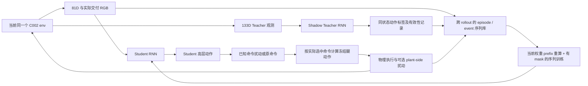

# TEACHER_STUDENT_PLAN — 让失败进入学习闭环，让 Student 亲自恢复

状态：**研究设计，未实现/未训练/未评估**。完整 C002+B05 为主底座；不使用 GPU1 的 v29−B05 替代。来源见 [SOURCES.md](SOURCES.md)。恢复边及连续状态合同见 [RECOVERY_GRAPH.md](RECOVERY_GRAPH.md)。

## 1. 推荐主线与能力传递的必要条件

推荐：**Teacher 的在线失败课程 → 固定一版经有限验证的恢复 Teacher → Student 亲自执行的受扰闭环 → 同状态、同实际历史的 shadow Teacher 标签 → 跨 rollout 的事件序列聚合与重采样 → 无 Teacher 接管的独立整任务评估。**

Teacher-only 的受扰示范用于启动和强对照，不是最终主线；失败 snapshot/Teacher branch 扩展训练起点是备选，不在没有时序数据时优先启用。

应把传递拆成五个可分别失败的条件，而不是一句“加 DAgger”：

`Teacher可恢复 × Student访问该分布 × 标签可靠且可实现 × 短片段被有效优化 × 感知与执行历史一致`。

这个乘积是设计检查表，不是已估计的概率公式。任何一项不成立，Teacher 很强也不能推出 Student 会恢复。DAgger 处理学习者状态分布；A2D/CritiQ/ReTRy 提醒专家与学习者的信息错配；这些不同问题不能互相替代。[P01,P06,P10]

## 2. 现状：能复用什么，缺什么

现有 A2 路径每步在当前 env 上查询 Teacher，Student 同时 forward；`ratio_teacher_rollout` 可决定部分 env 用 Teacher 动作，但默认 `enforce_teacher_rollout=true, ratio=1.0`，且替换是确定性 batch 前缀，没有自动退火。当前记录/训练只覆盖本 rollout；优化目标是 12D BC。Teacher hidden 未进入蒸馏 storage，Student hidden 与 Teacher hidden 是不同的状态。[C05,C06]

因此，不需要从零发明 Teacher query，也不能只把 ratio 从 1 改成 0 就宣布解决。至少还缺：实际动作来源日志、事件序列跨 rollout 保存、双 RNN/prefix 语义、OOD 标签处理、无真值动作辅助的执行路径、完整 v29 Student resolved 配方与独立评估。[C03–C08,E03,E04]

C002 最新已存里程碑还不是合格恢复 Teacher。可以先做端到端接口验证，但在没有 Teacher 整任务后缀表现前，不能把 Student 失败归因成蒸馏失败，也不把一次 update 当作能力证明。[E04]

## 3. Teacher：最小有效失败课程

### 3.1 第一轮只解决主要断点

先覆盖已经进入交互、建立过握持后发生的短时失抓，以及 Student/Teacher 自然出现的空抓/抓偏。保持 B01 固定逐门质量/closer/friction、B04 最大角、B05 七族、B07 和 v29 robot；不同时换锁闩、放宽动作、降低门域或换相机。

第一轮主注入采用现有机制可复用的**短开爪 command pulse**：只在当前真实握持已满足 C002 新的 5-control-tick qualification、尚需把手控制、尚非正常释放的交互窗口触发。触发窗口内随机选择时刻，而不是永久在进入 Stage3 的同一 tick 注入。首轮每 episode 最多一次计划注入是为了因果解释，不是部署只能恢复一次。

**关键动作事实：** gripper primitive 在 A2 adapter 中是 `>0 全开，否则全关`。把 +0.2 改为 +1.0 不是逐步加大物理开口；应以持续时间、实际夹爪张开比例、把手相对位移/速度、实际约束损失作为强度与效果。[C04]

起始校准可沿旧 6 tick 命令脉冲取 `3/6/12 tick = .06/.12/.24 s` 的短序列；**这是待校准探索值，不是 C002 已验证参数，也不是硬门槛**。依据只有现有 dt=.02 s、旧 6 tick 实现和新握持 5 tick 的时间尺度；旧 pilot 实际 loss 很少，恰好说明不能以触发命令计成功暴露。[C01,H04]

pulse 结束后不重置物理状态、不补时间、不替 Teacher 执行“纠正脚本”；恢复动作必须由正在训练的 Teacher 决定。恢复目标为完整任务的可执行后缀，不是只把接触灯重新点亮。

### 3.2 扰动类别、作用对象和边界

| 类别 | 对象/时机 | 持续与强度的定义 | 第一轮位置 |
|---|---|---|---|
| 自然失败 | 任意当前 C002 episode；区分捕获失败、失抓、回关受阻 | 不造扰动；记录真实动作和结果 | 始终保留，不用注入失败取代自然失败 |
| 已知 command 开爪脉冲 | 已稳定握持、仍需控制门时覆盖 issued gripper command | 短 tick 数；记录实际 q 张开比例和把手离开捕获域程度 | 主注入；明确属于已知命令扰动 |
| arm/base command 小偏差或延迟 | 接近/握持段；控制链中选定一个位置 | 幅度按实际 TCP/把手相对位移相对于当前捕获裕量衡量；持续短于任务预算 | 后续按错误类型增加一个，不一开始混所有噪声 |
| 外力/速度冲击模型 | 稳定握持后作用于明确机器人刚体或门，不能瞬移几何 | 先选择能制造可控相对位移的轻级；记录实际状态变化；随后覆盖捕获边界 | 次级验证/未见扰动；须有有效 backend 与读回 |
| 感知遮挡/延迟 | 只改变实际交给 Student 的 RGB/公开传感时序 | 依据真实 frame period/延迟；从短时丢帧/重复上一帧开始，单独实验 | Teacher 本身不读 RGB；这不是 Teacher 的视觉鲁棒性训练 |
| 真实失败状态 reset | 从已发生的失败状态重新开始训练 | 必须保存时间/控制状态；Student 还需完整历史 | 备选，不用作首轮核心能力证据 |

物理 perturbation 的校准单位优先采用：`d_rel / d_capture_margin`、实际门/腕相对速度、q 的已实现开合比例。可先探索约 0.25–0.75 个局部捕获裕量的轻微错位，再接近/跨过捕获边界；这些是量纲一致的建议范围，不是已知安全范围。不同 B05 形状、姿态和门动力学的裕量不同，不能用一组任意牛顿值保证七族等难度。

**源码提醒：** 当前 IsaacSim 的 `apply_rigid_body_force_at_pos_tensor` 是 `pass`；另有 `wsdpt_push_robot` 用 torso/right_palm 索引，不能不核对就用于 A2+PiPER。现有 `_push_robots` 包含速度冲击式实现，不是原生持续外力。后续选择哪条路径必须按 backend/body 名称落实并读回实际变化；不因函数名存在就把样本算作受扰。[C09] 速度冲击是明确声明的人工冲击模型，不是在线恢复 reset；绝不能在恢复时用速度/位姿重写替策略解决问题。

### 3.3 必须避免“脉冲结束后就闭合”的捷径

已知 command pulse 会改变 Student 的动作历史；Student 可能只学会“前面开了，现在关”，而不是感知真实失抓。对此不应把已知命令藏起来伪装现实，而应：

- 记录并保持部署一致的已发命令历史；不把 pulse 元数据额外喂入 actor。
- 在同一门域内保留自然失抓，并至少测试一种**命令仍为闭合、物理约束却丢失**的情形，例如实际滑移/合格的短冲击。
- 把 command-visible 与 plant-side/uncommanded failure 分开报告。只有命令脉冲测试通过时，结论限于这一扰动，不外推为通用失抓恢复。

对于隐藏的执行器故障，Student 可以看到的仍是其实际发出的 command、关节读数和 RGB；不能将仿真覆盖后的内部 actuator target 偷渡到 81D actions 字段。若硬件确实回报实际执行目标，该回报才能作为已知信号，且所有组使用同一协议。

### 3.4 有效失败与可恢复边界

逐个区分：计划注入→命令已覆盖/扰动物理调用有效→q/门/相对运动实际改变→有效失效→尝试恢复→重新建立约束→完成后缀。没发生实际失抓的样本是抗扰保持，不是恢复。

“可恢复”不靠一项 IK 判据直接封真值。几何、剩余时间、门运动、base 可控性用于筛出候选；随后用小规模 Teacher continuation 或重复该前缀的受扰 rollout 检查候选是否确实能接回任务。标记 `candidate-recoverable / boundary / infeasible / unknown`，而不是把所有 Teacher 失败都标成物理必死。

训练可以优先候选可恢复样本，以形成正信号；**分母不能删除边界/失败/unknown**。明显跌倒、不可逆穿透、任务预算耗尽不需要制造大量重复训练，但应保留其发生比例和失败原因。无效 tensor/API 调用另行 fail-fast，不当作机器人“遇险”的训练课程。

### 3.5 名义与恢复配比

起始建议：约 70% 名义 episode、30% 有条件计划注入 episode；所有 episode 都保留自然失败。这个比例只是避免立即被恢复课程吞没的起点，不要求以固定阈值推进。注入被分配但没到交互窗口的 episode 仍计入 assigned 分母，不能换成只汇报成功进入窗口的子集。

Teacher PPO 的数据仍来自当轮实际 rollout；不把旧 replay 片段直接当作 on-policy PPO 样本。现有 C002 staged reset 可保持为训练辅助，但必须标记 natural/staged 来源，且注入资格要求 reset 后新建立的真实握持，不能借旧 snapshot 的接触 streak 立即注入。

课程加难看三个量：实际失效数是否足够、候选可恢复样本是否有可信成功后缀、名义性能是否恶化。先增加能产生实效的脉冲时长/时机，再考虑另一种扰动，不靠一开始提高所有噪声来宣称鲁棒性。

### 3.6 Teacher 目标、奖励与时间

完整任务成功仍是终点；重新抓住只是中间里程碑。保持 episode 总时钟和已用阶段信用，反复回到 Stage2 不加寿命；保留 handle/阶段高水位；不给可反复领取的“失抓后重抓 +R”。

对当前阶段奖励做最小共享适配：恢复接近时不要同时重罚 arm 离默认位姿；需要重新压柄时不要同时只奖励 handle 回升；把 grasp/hold 奖励作用于当前正确上下文。旧通行姿态、安全/接触代价不因恢复全部关闭。[C03,H03]

必要的新 dense shaping 可采用小尺度有界势差，表示距离一个可执行接续条件的改善；模式切换、终止与 timeout 的势函数边界要一致。该建议并不证明完整任务保持原最优策略。[P11] 真正防主动失抓投机的是：没有可刷奖金/预算、失抓耗时有成本、无扰动正常任务表现同样计分，以及保留握持—失抓—重抓循环次数诊断。

### 3.7 Teacher 训练伪代码

以下是新增接口设计伪代码，不是声称当前仓库已有这些类。

```python
# C002 task/domain/robot retained; graph/time/reward compatibility shared by T_nom and T_fail.
for rollout in ppo_rollouts:
    for tick in rollout:
        x, public_obs = env.current_state_and_observation()
        event = event_monitor.update(x)          # training/evaluation-only truth
        goals.update_from_physical_conditions(x, event)
        # This updates compatible target phase, not robot/door pose, global time or RNN.
        o_teacher = env.teacher_obs_133()
        u_teacher = teacher.act(o_teacher)       # own continuous recurrent history
        u_command = command_adapter(u_teacher, env.controller_state)
        injection = curriculum.plan_if_eligible(event, x, episode_assignment)
        u_issued = injection.apply_known_command_fault(u_command)
        legs = frozen_a2_base(obs_for_actual_command(u_issued))
        next_obs, reward, done, info = env.step(compose(u_issued, legs))
        injection.observe_actual_effect(info)    # command != physical effect != loss
        ppo_storage.add_current_on_policy_transition(...)
        ledger.advance_one_tick_without_recovery_credit_refresh()
        if done:
            log_full_episode_and_recovery_funnel_before_reset(info)
            reset_done_envs_and_all_corresponding_online_histories(done)
    teacher = ppo_update(ppo_storage)             # not off-policy replay PPO
```

若以后从真实失败 bank 起点训练 Teacher，要么使用当前版本 Teacher 的匹配历史重建 hidden，要么明确作为新的冷启动训练任务，单独计分；不能恢复一个物理 snapshot 后沿用另一个 episode 的 hidden。

## 4. Student 三条路线比较与选择

| 路线 | 谁访问状态/执行动作 | 能解决什么 | 不能解决什么 | 决定 |
|---|---|---|---|---|
| R0 Teacher 主导的受扰轨迹 BC | Teacher 遭遇扰动并恢复；Student 看动作/图像序列 | 强 Teacher 少自然失败时，仍可强制生成纠正示范；最易启动 | 缺 Student 自己造成的状态；Teacher 成功不代表 Student 可实现 | 必要启动和强对照；不是最终主线 |
| R1 Student 闭环 + 当前状态 shadow Teacher + 聚合 | Student 在选定整个 episode 执行动作，受扰后仍自己恢复；Teacher 只标注 | 直接覆盖学习者失败分布；可保留短恢复事件/真实历史 | Teacher OOD 不可靠、信息不对称和记忆错误仍需处理 | **推荐主线** |
| R2 明确失败起点/Teacher branch 扩展 | 从真实采样状态重启训练；必要时 Teacher 分支提供后缀/可靠性信息 | 对罕见边界提高采样效率；可帮助诊断不可实现监督 | 不完整 snapshot 丢掉控制/感知/RNN历史；容易把 reset 救援当在线恢复 | 数据格式补齐后才启用的备选，不先构建大 bank |

R0 的对照必须包括受扰 Teacher，不只拿“全是干净成功轨迹”的弱对照来证明 R1。R1 与 event balancing 的收益要再拆开比较。

## 5. 实际数据流：谁执行、谁受扰、谁标注



Teacher-only bootstrap cohort 使用 Teacher **有效动作**替代 A；这只是训练采样路线。主 Student cohort 在失败后继续使用 Student 动作，不因为丢接触就立刻 Teacher 接管。扰动作用在实际被执行的轨迹上，不是另开 Teacher 仿真后拿它的失抓替 Student 的失抓。

### 5.1 控制权分配

取消“永远前 N 个 env 用 Teacher”的固定空间前缀，改为**按 episode 随机、按左右侧和 B05 家族分层的控制权分配**，并记录每一 tick 的 actual executor。不要逐 tick 抛硬币混动作，避免扰乱短恢复片段与控制权时序。

可以先少量 Teacher-only 受扰示范启动，再采用例如 Teacher cohort 占比 .5→.25→0 的人工阶段值；它们是配置候选，不是本回包声明已有自动 annealing。更重要的是：其余 Student cohort 从失败到恢复/失败终止这一段必须真正由 Student 执行。切换比例的依据是独立闭环错误类型，不是 BC loss 下降本身。

### 5.2 Student 尚不能到达交互窗口时的有界备选

可以让 Teacher **真实执行一段接近/握持前缀**，Student 同时处理这段实际 81D+RGB 历史；在扰动之前交给 Student，再施加扰动，并让 Student 亲自完成失败后的动作。这比缺少历史的物理 snapshot 更容易保证时序一致，也无需等 Student 已能完成整个正常任务才研究局部恢复。

该路线分别标记 `teacher_prefix=true`、`teacher_after_failure=false/true`。只有后者为 false 时才可能称“真实前缀接手后的局部自主恢复”；整个 episode 有 Teacher 前缀，**仍不是 Student 自然起点的独立整任务成功**。它是启动/诊断备选；最终 R1 与验收仍从自然起点完全由 Student 执行。

### 5.3 接管：主线不以失抓为接管条件

仿真中的 Student 主 cohort 不需要为了防摔而每次救回；到已有安全终止条件时可以直接终止并记录失败。这样最容易保证“Student 亲自恢复”没有被抢走。

必要的辅助 assisted cohort 可以用 Teacher 避免明显危险，但合同必须是：进入条件为明确安全风险/超界，不是刚发生失抓、T/S 不一致或 Teacher 想帮忙；Teacher 连续控制一个区间；仅在到达可安全交回的物理条件、暂态消退后撤销接管；两套 RNN 全程连续更新。接管次数/持续时间/撤销原因写入数据。

从一次 failure 到其完成结果之间，任意 Teacher 高层执行都使该恢复事件永久标记 `assisted=true`。不得接管后回交 Student 再把后半段成功算作“整段自主恢复”；也不得把 Teacher 达成的 pregrasp 当成 Student 达成的落点。

## 6. 同状态、同历史标注：时间顺序必须唯一

令 `hT_t`、`hS_t` 分别表示处理当前 `o_t` **之前**的 hidden：

`(aT_t, hT_{t+1}) = T(oT_t, hT_t)`

`(aS_t, hS_{t+1}) = S(oS_t, RGB_t, hS_t)`。

之后才选择/扰动并执行动作，产生 `o_{t+1}`。Teacher 无论本步是否执行，都只处理这个实际 env 的观测一次；它的历史不是假想“过去每步都执行了 Teacher 动作”的历史。过去动作字段必须来自实际已知命令与执行契约。

一个 collection round 内冻结 Teacher 参数、归一化状态和观察/目标语义。新增目标图的更新必须有明确生效 tick：在观测构建前更新，或明确下一 tick 生效；不在 Teacher 消费 `oT_t` 后再用新 phase 替换这条标签的上下文。保存实际模型输入、标签前态与执行上下文，不能把 step 后/auto-reset 后的状态配给 step 前标签。

Teacher 高层 RNN、Student 高层 RNN、冻结腿策略历史各自独立。**不得复制 Teacher hidden 给 Student；不得在恢复触发、接管、取消接管、8 tick rollout 切片处归零 hidden。** 真实 done mask 才是正常在线重置边界。[C05,C08]

### 6.1 动作标签也要同语义

Teacher raw arm action 可能在原 C002 Stage0 被 override 忽略；Student 部署不能依赖该 oracle gate。先将 Teacher 意图的有效 target 投影成相同 stage-blind adapter 下，从当前累计 target 出发的可实现 delta，再用于 12D BC。初始 target 已在默认位姿时，这通常是零 arm delta；Student 已偏离时应给有限纠正增量，而不是瞬间归零 accumulator。[C03,C04]

记录 `teacher_raw_action`、`teacher_effective_label`、`student_proposal`、`selected_command`、`issued_command` 和（仅训练诊断用）`plant_actual_target`。BC 用 desired label，不用扰动覆盖动作当正确答案。若 actuator fault 在闭合标签下强制开爪，记录不可执行区间；不强迫动作监督把故障当意图，更不能把覆盖后的正号开放命令当恢复技能标签。

对于 base 命令的已知扰动，必须先得到真正要发出的 high-level command，再计算相匹配的冻结 A2_Base 腿动作；不能把 Teacher 的腿动作拼到 Student 的另一组 base command 上。

## 7. 要存什么：最小但够用的跨 rollout 数据

### 7.1 每步/每 episode 字段

| 层 | 最少字段 | 用途 |
|---|---|---|
| episode 身份 | episode_id、env_id、tick、natural/staged/reset 类型、左右侧、B05 家族、固定 door 参数引用 | 分母、数据切分、去重复与当前 C002 域归因 |
| Student 输入 | 实际交付的 81D、RGB uint8、camera frame_id/timestamp/arrival_age、输入归一化版本 | 精确复现 Student 看到了什么；不填不存在的过去图像 |
| Teacher 输入 | 实际 133D 输入及 pre-normalization 可重建形式、归一化版本 | 冻结 Teacher 原标签验证；换 Teacher 时按相同观察定义重算 |
| 动作 | 上述 raw/effective/proposed/selected/issued/plant 字段；执行者与接管区间 | 不把脉冲当标签、不把 Teacher 救援算自主 |
| RNN/控制元数据 | policy/Teacher 版本、真实 reset mask；事件/序列起点的可选 `(h,c)` 副本；delta/低层 history 若要 branch | 在线检查、固定版本回放；不能以旧 hidden 代替任意新版本 prefix |
| 事件与真值标签 | failure 类型、hold epoch、注入计划/作用/效果、目标落点、当前/历史释放、reliability 标签 | 训练分层/辅助监督和评估；全部与 actor 输入隔离 |
| 结束与结果 | done、timeout/truncation、terminal observation、全任务结果、failure原因、assisted flags | 不把 auto-reset 的下一集观察连到上一集；连接恢复与最后任务结果 |

Actor 仍只读取 81D + RGB；把真值放到 replay 的独立字段不代表允许送入模型输入。策略归一化值若发生 clipping，不应仅保存裁剪后的数值再假装能反演；保留重建所需的 pre-normalization 观测和版本信息。

### 7.2 库不是整台机器的无限录像

首轮只在本地批准的小规模 Student collector 上建有限事件库，不复制生产 4096 env 的全部图像。每个正在采样的 episode 保留恢复 prefix 的可重建引用；RGB 按实际新 frame_id 去重，重复使用帧只存引用。入库单位是完整 episode 或能引用完整前缀/结果的事件序列，不是无上下文单帧。

库分名义 reservoir 与恢复事件 reservoir，容量由现有批准内存/磁盘决定；不在本次预研要求新预算。可以逐 episode 压缩原始帧、按事件采纳一部分完整 episode，并在训练读取时解码；不能为了省空间悄悄给某比较组降图像质量。事件/门实例/seed 级分 train/validation，邻近帧不得跨集合泄漏。

### 7.3 采样以事件而不是 episode 长度为主

起始建议：约一半 loss window 来自恢复事件，另一半来自名义轨迹；恢复窗口覆盖失败前 .5–1 s 的状态、失效、纠正开始以及后续动作。以事件均衡后再采时间，避免一个长 episode 支配所有梯度。

训练 unroll 可先取 64–128 control ticks（1.28–2.56 s），不足以涵盖一次恢复时继续取相邻序列，并保留整任务 outcome；它不是恢复时限。现有 8-tick rollout 是采集/优化切片，不等于 LSTM 天生只能记 .16 s；问题在跨片段保留、训练梯度覆盖和状态重建。[C06–C08]

分层按少量真实因素：捕获失败/失抓、局部/需换站位、Teacher可靠/未知、左右侧与家族。不要一开始建立几十维笛卡尔分桶，导致每桶都没数据。

## 8. burn-in、版本变化、reset 与离线重标注

### 8.1 首轮推荐：真实 episode 前缀重算

为了让小 pilot 的时序语义最清楚，训练事件 `[k:k+L)` 时，用**当前 Student 权重**从真实 episode reset 的零状态重放 `[0:k)` 输入，`no_grad` 得到 `hS_k`，再对 `[k:k+L)` 做有 mask 的 BPTT。重放的是已经记录的 RGB/81D，**不推进物理仿真**，也不生成想象图像。

这比直接拿旧权重 hidden 稍贵，但避免在第一次效果对照中引入未知的陈旧 hidden 误差。以后才用“保存边界 hidden + 短 burn-in”近似，并先在同一小样本上比较与全 prefix 的输出差异；不照搬未核验论文的固定 burn-in 数值。[P08]

### 8.2 online collector 权重更新后的 hidden

Student 更新权重后，仍在进行中的 env 不能沿用不加说明的旧权重 hidden，也不能零 hidden 配上半开的门。推荐在恢复采样前，用当前 episode 已真实经历的 prefix 重算 **新版本的 online hS**；不处理尚未送入 actor 的当前 observation，以免同一帧双计。Teacher 本轮冻结则保留其 live hT，冻结低层的物理/命令历史不动。

也可在有明确 episode-boundary 调度支持时只在真实 episode 结束切版本，但不能假设现有 batched env 可以暂停部分物理而不改变状态。本回包伪代码采用 prefix 重算方案。

### 8.3 Teacher 标签与分支

在线标签优先：当场记录 `T(oT_t,hT_t)`，无需事后猜测 Teacher hidden。若要用同一冻结 Teacher 重标注，可使用匹配的前态 hidden 快照；若换 Teacher 权重，必须从真实 reset 重放 Teacher 的 133D prefix，不能沿用旧 Teacher hidden。

Teacher branch 用于可靠性诊断时，还要恢复同一物理/controller 状态：root/q/qdot、门状态、逐门参数、delta accumulator、延迟/滤波队列、低层历史、相关 contact/release/时间账本，并正确刷新 derived state。仅有 root/q/v 不够。新分支生成自己的未来轨迹；**不得把 Teacher 分支的第二、三步动作贴到 Student 已走向另一状态的未来帧上**。

目前旧 recovery bank 没有上述完整 Teacher/Student history；本回包不假定可直接离线 relabel/burn-in。[C03,C05,C06] 如暂时无法可靠克隆，宁可重放同一已记录动作前缀并重新生成该状态的在线 Teacher 数据，或先不做分支，不以错误 hidden 得到“专家失败/成功”结论。

### 8.4 失败状态训练的备选合同

R2 可以做两种明确任务，二者必须分开：

- **同一 episode 的续接训练**：还原全部物理/控制状态、原剩余预算，并用已记录前缀重建两套 RNN。计为 staged continuation 训练，不计自然在线恢复成功。
- **冷启动失效场景训练**：明确开始新 episode、两套 hidden 为零，给一段真实感知/控制适应时间；它研究的是从失败外观开始的任务，不等价于真实执行中突然失抓。禁止在评估中用这种重启帮助 Student。

首轮 R1 不依赖 R2，避免把完整 state-clone 工程设为无限前置。

## 9. Teacher 在 Student 失败状态上不可靠怎么办

### 9.1 三类标签，不把 finite 当可靠

`trusted`：在已覆盖的相近物理/历史条件有可信 Teacher 后缀，动作可执行且不依赖明显不可辨识信号。

`unknown`：新落点、不同动作历史、未知门运动组合，尚没有可靠性证据。

`rejected`：动作语义错误、明显不可达/危险，或代表性 continuation 反复失败/被判定无法由 Student 当前信息实现。

有限性/维度错误属于 fail-fast；Teacher action finite、critic 高、网络 disagreement 小都不是 `trusted` 的充分条件。上述可靠性是估计和审查标签，不是新 oracle 的真理。

### 9.2 实际处理

先用已在 Teacher 课程中出现并经过少量 continuation 检查的恢复区域提供监督。Student 新遇到的失败始终入事件日志：unknown 的动作 BC 暂不强压，保留序列与真实任务结果；用少量代表性 Teacher continuation 进行分层审查，而不是每个 tick 开树搜索。可以保留轻量不确定性统计作为筛选线索，但不把它直接当“专家正确概率”。

Teacher 自己也不能从这些状态完成时，优先将这些真实 Student-origin failure 回流**下一版 Teacher 的训练课程**，保持版本切换清晰；不要在同一个 Student 方法对照中边训练 Teacher 边宣称收益来自 replay。未知/拒绝标签数量、比例与对应失败结果必须报告，不能删掉以后只算剩下的简单状态。

Teacher 能完成但依赖 Student 看不到的信息时，增加“停住/重新看/执行小幅可观测交互”的可实现 Teacher 行为，或在后续阶段引入 observability-aware Teacher 适配。A2D、CritiQ/ReTRy 是相应研究线索，不是本回包已实现算法。[P06,P10]

## 10. 无 stage/contact/门真值，Student 怎样选择恢复目标

第一版不新增部署传感器、不外接 force estimator、不增加第二套 oracle FSM。Student 的 recurrent 表征从 RGB 与 q/qdot/动作/command 历史学习：现在更像“获取条件”“捕获”“已握持控制门”“可以通过”中的哪种情况，并直接输出 12D 动作。

Teacher 的落点标签可以作为训练期辅助标签，但主模型不要把真实 mode 作为输入；辅助 mode 输出也只来自 Student 表征，不能在部署时换成真值。抓握置信、可见性、相对运动趋势比强迫精确回归不可观测接触力更合理。真值接触可用于监督其概率/不确定性，但不可因此称部署有接触传感器。

**部分可观测的硬限制：** 若两段 Student 可得历史几乎相同，Teacher 却分别要求“马上穿过去”和“立即退回抓门”，更多相同 BC 数据会产生冲突而非解决问题。应检查是否缺少可观测差异：图像过期、夹爪遮挡、门运动不可见、Teacher 提前使用真值。如果确实存在 aliasing，先让策略获取信息/延迟决策，或适配 Teacher；不能无限加大 LSTM 并期待它从无信息中恢复真值。[P06,P10]

建议把时间窗口分成：`physical_recoverable` 和 `recoverable_with_delivered_observation_history`。这是待检验研究假设，不是现有标签或已证明的边界。网络可能能学会局部重闭合，也可能在快速回关下因观测时延根本来不及；两种失败需要不同改法。

## 11. 算什么 loss；何时升级

### 11.1 第一版仍可用序列化逐时刻 BC

主损失使用 12D 有效 Teacher action label，按 base5 / arm6 / gripper1 语义归一化并施加有效样本 mask。序列训练中每个时刻的 BC 不是无记忆单帧模型；关键是 hidden 来自正确前缀，且短恢复事件有足够采样权重。

`L_BC = mean_over_events( mean_over_valid_ticks( sum_g w_g * ||muS_g - aT_eff_g||^2 / scale_g^2 ))`

第一轮相同组权重、网络、训练 token 数用于所有 Student 对照；不要一边换 loss 一边换数据分布后称证明了 DAgger。`trusted` 标签参与主 BC；unknown/rejected 的 action mask 为零，但它们的真实失败与数据量依然计入报告。

BC 本身是否足够是实验问题。它可能足够的条件是：可恢复/可观察状态得到覆盖，Teacher 标签可执行，Student 的恢复错误不再来自明显缺失的历史。它不是完整轨迹成功的保证。

### 11.2 按错误机制增加一个东西

- **接触/释放选择错误，而动作回归 loss 很低**：增加从 Student hidden 预测当前可控制关系/可见性/相对运动的轻量辅助头；或者对 gripper 开/闭符号增加分类约束，解决均值落在决策零点附近的问题。主 actor 仍 12D，不把分类真值当运行输入。
- **长恢复片段没有学到因果链**：延长/连接事件序列，对“到达实时 pregrasp→新约束→继续开门”的短目标轨迹加入有 mask 的辅助预测；目标未被观察时允许不确定，不强迫精确不可见 6D pose。Teacher branch 的未来标签只用于该 branch 自己的状态序列。
- **专家的信息优势不可模仿、动作标签仍冲突**：先做 observability-aware Teacher/选择性监督；必要时 Student 以自身闭环真实任务 reward 做少量 finetune，critic 可用训练真值、actor 不可用。保留 BC 正则与名义任务混合，并以相同预算单独对照。这是新阶段，不宣称当前继承 PPO 类就已完成 RL。[C06,P06,P10]

不建议第一步就加新 Transformer、多技能 actor、显式 force estimator、MPC 和大 replay bank。先确认分布与时序问题，再决定是否存在模型能力瓶颈。

## 12. 可执行层次的 Student 训练伪代码

以下是接口设计伪代码。`SequenceRepository / event_monitor / shared_adapter / export_state / replay_prefix` 均是拟新增或拟明确的接口，不是当前源码已有功能。真实实现须处理 batched done、terminal observation 与 tensor ownership。

```python
teacher.freeze_for_collection_round()
student.freeze_weights_during_collection_round()
cohort = stratified_episode_assignment(side, family, p_teacher_demo)

for t in collection_round:
    # Current observation has not yet been consumed by either high-level RNN.
    oS, rgb, oT, delivered_frame_meta = env.current_observations()
    hT_before = teacher.export_state().detached_clone()
    hS_before = student.export_state().detached_clone()

    aT_raw = teacher.step_once(oT)     # advances hT on REAL Student/Teacher history
    aS = student.step_once(oS, rgb)    # also advances when a Teacher demo executes
    aT_eff = label_adapter.to_feasible_increment(
        aT_raw, current_control_state=env.controller_state,
        teacher_target_context=env.training_only_target_context)
    label_status = reliability_registry.classify_current_context(...)

    # Main S cohort does NOT request takeover merely because contact is lost.
    owner = cohort.actual_owner(t)   # S or T; optional assisted cohort is explicit
    u_selected = select(owner, student=aS, teacher=aT_eff).clone()
    fault = injector.plan_for_this_actual_episode(...)
    u_issued = fault.apply_known_command_override(u_selected.clone())
    leg_actions = frozen_a2_base.step_for_actual_command(oS, u_issued)

    # All Student comparison arms use the same stage-blind action adapter.
    # A plant-side fault can alter the plant, but cannot overwrite public command history.
    next_obs, reward, done, info = env.step(
        compose_24d(u_issued, leg_actions), plant_fault=fault.plant_component)

    events = event_monitor.read_actual_pre_post_effects(info)
    sequence_repository.append(
        obs81=oS.clone(), rgb=rgb_or_frame_reference,
        teacher_obs=oT.clone(), frame_meta=delivered_frame_meta,
        aT_raw=aT_raw.clone(), label=aT_eff.clone(), proposed=aS.clone(),
        selected=u_selected, issued=u_issued, actual_executor=owner,
        events=events, label_status=label_status,
        hT_before=hT_before_if_boundary, hS_before=hS_before_if_boundary,
        reward=reward, done=done, terminal_obs=info.terminal_observation,
        policy_versions=versions, episode_metadata=metadata)

    # Preserve event outcome BEFORE auto-reset bookkeeping erases the terminal state.
    mark_assisted_events_permanently(owner, events)
    finalize_done_episodes_with_full_suffix_result(info, done)
    teacher.reset(done)
    student.reset(done)
    assert_env_low_level_and_controller_resets_match_true_done(done)  # env owns reset; do not reset twice
    # A rollout seam is not a done. Persist repository across rollout seams.

for batch in event_balanced_sequence_batches(sequence_repository):
    # prefix excludes the first loss-bearing observation to avoid processing it twice.
    hS_start = student.replay_prefix_from_true_reset(batch.prefix, grad=False)
    pred = student.forward_sequence(batch.window, initial_state=hS_start,
                                    valid_mask=batch.valid_mask,
                                    real_done_mask=batch.real_done_mask)
    bc_mask = batch.valid_mask & batch.trusted_label_mask & batch.loss_window_mask
    loss = normalized_event_bc(pred.mean12, batch.teacher_effective_label, bc_mask)
    # Optional auxiliary losses are OFF for the primary controlled comparison.
    optimizer.zero_grad()
    loss.backward()
    optimizer.step()

# Critical: collector may still have unfinished episodes after parameter updates.
for active_env in active_envs:
    student.install_state(active_env, student.replay_prefix_from_true_reset(
        sequence_repository.actual_prefix_before_next_obs(active_env), grad=False))
# Teacher stayed frozen: its live hT is unchanged. Physical state/low-level history stay intact.
```

### 12.1 断言只保留少数必要项

检查实际执行者与 stored issued command 一致；Teacher/Student 消费同一物理时刻各一次；actor 输入白名单只有 81D+RGB；done 与终端记录次序正确；一次在线恢复没有 reset/时间补贴；重放样本可以定位到真实前缀。它们是最小端到端验证，不要求先建立大规模防御测试工程。

## 13. 不把完美 Teacher 或最终相机设为无限前置

先利用当前已有 Stage3 接触窗口，验证“产生一次实际失效→Student 确实继续动作→正确标签/历史入库→完成一次序列 update→独立执行检查”的链路。这一阶段只证明功能，不证明恢复收益。

随后在同一 C002 全门域下训练/核对可接回后缀的 Teacher，再冻结 Teacher 做 Student 方法比较。相机先选当前可实际安装且能输出所需单路图像的候选，锁定 actor 分辨率、视角、帧时序；不要求先完成最终三相机/CAD，但也不能用临时 oracle 图像、无限帧率或额外视角证明既定预算下的能力。

当前旧默认单相机配置只是起点，不是已验证的 v29 optical recipe。先检查一段接近—握持—失抓的真实输入可见性/时序；若看不见关键相对运动，应在进入方法效果对照前固定一个可部署候选，并让所有比较组共享，不能在 Student 实验中随结果偷偷换相机。[C07,E01]
