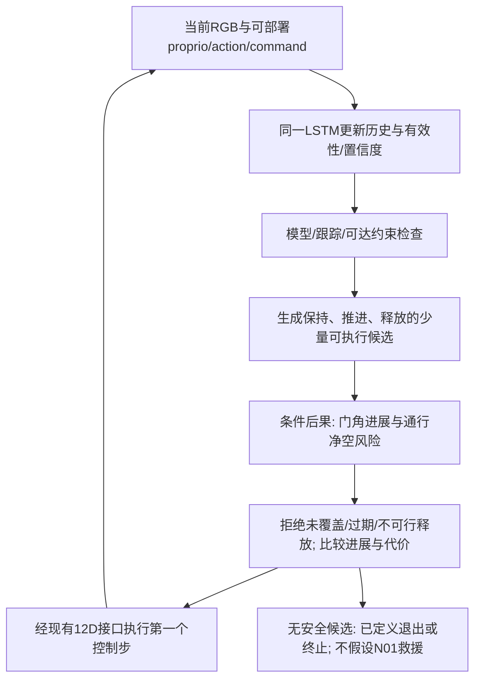

# 闭环控制：从后果信息到base／arm／握持／释放

状态：DESIGN，未部署/训练。保留C002、B05及12D高层动作，冻结A2_Base不因本方案自动改变。控制对象首先是当前push线；左右门通过门坐标变换处理，不能把pull送门过身经验直接视为同一可执行路径。[S4,S5]

## 1．物理定义与几何安全语义

θ为hinge正开向角。世界X取闭门面法向且机器人向门前进的方向，Y向机器人左、Z向上；左/右门的hinge正轴符号以source为准。门坐标切向 `t = (a_hinge × r_handle) / ||a_hinge × r_handle||`，力标签定义为机器人施于门的力，门对机器人反作用取负。面板平面模型中，该开门切向与对应门面法向重合或反号，不应当成两条独立增强证据。

将机器人非授权接触部分表示为已知link碰撞体或粗包络 `B_i(q,base)`；门扇/门框为 `D(θ)`。定义

`C_min(A,H) = min_{0≤u≤H, i in protected links} signed_distance(B_i(t+u;A), D(θ(t+u;A)))`。

protected links至少包含trunk、髋/腿、后部和非授权arm段；允许的指–handle接触从“危险身体距离”中剔除，但要单独检查滑移和过载。用root点距离替代整个集合不合格；用门角阈值替代整个集合也不合格。粗包络可先用URDF collision AABB/胶囊，不需首阶段建立重型精细碰撞工程，记录包络近似偏差。

`fully_clear`定义为全部protected包络已越过选择的通过截面，并且与门的合理回关扫掠集合/撤离路径保持余量；需要检查尾部、后腿和arm是否仍在危险区。单纯root_x>0不充分，也不能只因某一瞬间没交叠就结束。fully_clear提供不再需要控门的充分退出条件，不是所有提前释放的必要条件：身体已通过而arm尚与门相连时，可由“释放＋收臂路径”的预测确认安全，避免要求先收臂才能放手的循环依赖。身体完全离开后，正常门回关不再罚。

工程起值：距离余量可先取5cm、接触有效性迟滞约0.1–0.2s、候选持续0.2s、风险窗0.6–1.0s。它们只是启动调参量，需结合包络误差、控制/RGB总时延、门速和实际制动时间标定；不是本地硬验收门槛。若延迟已消耗安全窗，输出stale/unknown，不能复用旧安全批准。

## 2．少量动作方案，不引入新力命令接口

候选集合只保留：

**HOLD-REPOSITION**：gripper闭合，arm目标随所需handle轨迹维持，base平移/转向调整工作空间；默认roll/pitch趋近中性。目标是保持通行净空并完成身体通行，不奖励持续大力夹持或继续无意义开大。

**OPEN-WHILE-HOLDING**：在可靠接触下给出有界arm推进增量。先考虑中性和base重配置方案；只有这些不足且模型/响应支持姿态有利时，加入小幅roll/pitch方案。左右门用物理变换，不硬编码“都向同一侧roll”。

**CONTROLLED-SWING-RELEASE**：先建立有限且可控的开向速度，再选择释放和身体通过路径；同时预测release与hold的差别。不能把快速闭爪/放爪动作本身当controlled swing，也不能靠撞upper limit作为能量吸收的默认机制。

这是决策语义，不要求额外mode神经网络。实现可用actor产生少量候选12D短序列，由小后果head打分；或actor直接消费等价后果特征。对照policy使用相同候选/动作空间和行为reward，不能只给方法组可用的hold动作。

## 3．quiet hold、swing与有条件姿态

| 决策 | 进入条件 | 维持/退出条件 |
|---|---|---|
| Quiet hold | 接触可靠、arm在当前及短期base路径内可达；释放风险高于持握，或释放不确定度过大 | 低门速/低冲击且仍有通行进展；fully_clear后退出，或重新评估释放已具有足够安全窗时退出。若接近IK/PD/腿接触边界，先重新布置，不继续无限持握 |
| Swing/release | 实际释放姿态θ、θdot与候选身体路径在校准预测窗内有足够净空；剩余暴露时间有覆盖；grasp稳定到计划释放点 | 释放后持续观察回关，允许减缓/调整身体路径；需要恢复时只调用已验证的handle重抓，不假设N01存在 |
| 有条件roll/pitch | useful grasp可信；动作已实际执行；中性/小base重配置在给定目标下进展或可达性不足；倾斜候选在相关方向的PD/IK/支撑或后果上更好 | 收益消失/接触丢失/净空变差则平滑回中性或改路径；不因“门重”永久倾斜 |

`arm-led`指门上有用操作主要由arm端接触完成，不强制base不动。可在sim中记录指–handle正向工作与trunk/腿–门接触冲量；不把所有base机械功都等同于身体撞门。roll/pitch有外观变化不代表力增强，本次PD反例已否定这一捷径。

困难程度以任务需求/可用余量定义，例如达到所需门角的响应、给定动作可达性、跟踪误差、握持可靠性与剩余暴露时间，不用policy是否失败来循环定义。强closer也不必然需要倾斜；若静态抓握容量够、工作空间足够，quiet hold即可。

## 4．握持失效／不可达／门再次闭合

先停止增加操作承诺，判断身体处于门哪侧、可撤回路径与剩余净空；“停住不动”只有在门不会继续进入身体包络时才是安全选项。若当前仍有可靠一侧/局部接触，减少末端推进速度与base转动、维持可用空间。失抓后的再接近/重新抓柄是待实施行为，必须单独训练与验收。

若door已回到latch捕获区，需要重新下压解锁，不能以正θdot/拉高门角奖励绕过机构约束。与N01的接口建议是返回 `interaction_validity, threatened_clearance, last_safe_region, regrasp_request`；N01未实施前，不把request当成完成的恢复。

不引入手掌/前臂顶门板作为默认救援。持握范围受实际arm可达/夹持可靠性限制；完全通过后退出hold，避免门把机器人拖回。没有可行候选时按已批准的安全退出/终止策略处理，不能宣称靠本研究已解决所有困境。

## 5．必要的最小reward／stage支持

当前source：hold-income mask受Stage3/4及release gate控制；Stage4普通grasp距离为0、mild为scale1且gate后关闭；Stage4回臂−0.5且gate/非双指时生效；Stage5回臂−5无接触豁免；Stage4/5回柄scale3；roll/pitch−2作用0/1/4/5，Stage5 upright−8；旧controlled_fling实际scale0。[S6]

建议新增一个只作语义统一的 `need_door_assistance`。训练reward用sim当前几何与同一清晰的通行需求定义；不可把真实未来标签回灌到actor当前输入。它在Stage4/5都可再次成立，不靠重置stage或重复领取开门里程碑。

当仍需辅助时：允许未接触/单指的再接近阶段伸臂；相应减弱/屏蔽互相冲突的回臂与回柄倾向；恢复有用的接近/净空维持引导，保留过力、偏轴、碰撞、动作速率等代价。需要再解锁时才允许回柄目标暂时改变。fully_clear后恢复收臂/近中性与正常任务完成，不持续要求门保持打开。

将新收入依附于有效净进展/通行与危险接近的减少；静止扶门配合身体通过可以有价值，原地无限holding不能成为优于完成的无限收入。避免“每次重抓固定奖金”；不在首阶段声称某个势函数修改自动保持最优policy不变，因为stage/timeout/bootstrap合同尚需一致核对。

近中性偏好用实际身体roll/pitch和速率的软成本，在相关阶段同样可见；但为满足Owner目标增加该成本属于behavior/reward改动，不是感知提升。保留小倾斜的必要可行空间，不奖励倾斜角本身。与无辅助头组使用完全相同支持和权重。

## 6．实际源码接口与伪代码

候选arm目标需要经过累积动作而不是直接写关节位置。已存在的 `a2_hold_absolute_target_to_cumulative_action` 给出

`d_des=(q_des-q_default)/0.25; raw_arm=(d_des-d_prev)/0.3`。

实际仍须经过动作限幅、delta累计/clip15、hard DOF target clamp与相关override；不得直接teleport q。base高层5D按现有缩放/限幅发送到冻结A2_Base，最终用**实际**base姿态/速度和arm误差判断是否兑现。输出顺序base[0:5]、arm[5:11]、gripper[11]。[S5,S10]



```python
# Proposed interface; not an implemented C002 controller.
obs, stamp = read_student_signals()        # 81D + RGB, no stage/force/door oracle
h = recurrent_update(h, obs, reset=real_episode_done)
p_useful, belief_quality = state_head(h)   # current estimate, not future label
candidates = make_small_candidate_set(h, executed_action_history)
for A in candidates:
    A = through_existing_limits_and_accumulator(A)
    margins[A] = kinematic_PD_checks(q, gravity, A, assumed_load_interval)
    consequence[A] = outcome_head(h, A, continuation_id)  # future conditioned on A
    admissible[A] = predicted_clearance_ok(consequence[A], total_latency,
                                         remaining_exposure_time, belief_quality)
    # A release is NOT permitted just because a historic angle gate latched.
A_star = choose_progress_with_low_posture_cost(candidates, margins, admissible)
execute_first_12D_action(A_star)           # frozen lower controller composes leg action
# Reobserve on next control step; physical tracking, slip and visibility can invalidate plan.
```

部署置信度不够时，持握只是候选而非绝对安全兜底；必须同时满足reach与身体路径约束。RGB延迟较大时仍可每控制步更新proprio/RNN，视觉按新帧时间戳刷新，不伪造每20ms一张新图。端到端推理/相机/动作延迟需测，当前未测。
