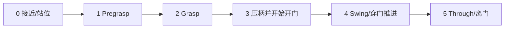

# 本地事实：C002、旧恢复路径与实际蒸馏边界

2026-09-20 HKT。这是源码/已保存证据的事实说明，不是推荐的N01方案。新研究不需要继承旧恢复图。具体源文件入口见 `SOURCE_INDEX.md`。

## 1. 版本与证据优先级

- 主底座：`v29-c002-baseline`，已接受的完整C002，**保留B05**。源快照为C001 final_input_snapshot的320份文件，加C002新增的Stage5 reward probe，共321份；C002没有再次改变生产source/config/assets。
- C001/C002原始候选JSON写着“pending acceptance / train_approved=false”，那是提交时历史状态。D056逐项验收与D060 C002接受/训练批准取代这些状态字段；不能据此误判当前实现仍未验收。
- Git tag还继承了原有DAgger、基础stage与camera依赖。额外选取的15份源码/config均由Main一次逐字节比较，当前内容与该tag一致；其中已经在321份中的不重复打包。见 `SUPPLEMENTAL_SOURCE_BINDING.json`。这补齐阅读入口，不表示C002跑过Student蒸馏。
- `base_v29_common.yaml`只需总v29开关就包含B05；C002没有后来handle-ablation分支才加入的独立 `a2_v29_b05_enabled` 字段。不能把缺少此字段解读成B05关闭。
- `v29-handle-ablation-c001`属于另一组v29−B05对照。本包不使用其生产文件、legacy参数表或命令，也不引用其早期运行作为N01收益证据。
- 旧baseline plan/总体安排中部分“待实施”标题是历史；读取其设计时必须同时看D056/D060及实际config/source。可执行事实优先于旧计划措辞。

## 2. C002的相关任务条件

| 项目 | 已绑定事实 | 对预研的含义 |
|---|---|---|
| 任务/机器人 | A2四足＋PiPER；当前是push，左右开门各半；MERGED v29机器人 H180/F45、base15°、既定arm初始姿态 | 不把pull、换机器人或最终Student光学优化混入第一版方法收益 |
| B01门域 | 30–80/80–120/120–160kg三档各1/3；有/无closer各半；固定逐门drive/friction | 失抓后门会按本门动力学继续演化；不要默认静止或统一回关速度 |
| B04 | 原生最大开角90–150°逐门固定 | 恢复目标要考虑真实可达门角及通行几何 |
| B05 | F0–F6七族，实际G/FixedJoint与对应consumer；不是旧圆杆对照 | 初始N01保留该域，不能用撤回B05来简化后再宣称完整C002收益 |
| B02 | 原实体latch/mimic和handle负载路径保留，B02改造后置 | 不把新软件锁态/handle负载改动悄悄加入N01 |
| 自然起点/高度 | 把手.90–1.20m；门法向1.2–4.0m、横向±.5m与受限yaw | 部分失败来自到达和可达性，不只有握持后的loss |
| 时间 | 控制dt=.02s；整集30s；stage预算[525,150,150,150,150,300]；剩余时间结转 | 恢复的计时/预算语义需明确；不能靠每次退边刷新任务寿命 |
| 学习接口 | Teacher actor133D、critic138D，LSTM；学习12D高层动作，冻结A2_Base给12D腿动作，组合24D后由env映射 | 恢复涉及动作目标、底层历史和高层记忆，不等于只改stage整数 |
| 训练/评估 | 当前Teacher训练使用staged reset；最终64自然首episode评估禁用staged reset与K，并用full loader | staged训练指标不能充当自然恢复或Student独立表现 |

完整参数从包内实际训练 `config.yaml` 和生产文件读取，本表不是另一份配置。相机实体/外形已经在v29资产中；现有DAgger默认相机/robot composition未被本包证明已成为v29 Student运行配方。

## 3. 当前前向stage机与旧恢复代码

现有前向路径为：

`StagedTaskBase`按各stage条件前进；基类本身不是一般的恢复图。Stage0→1检查把手相对站位、arm默认位置和base command停稳；1→2检查pregrasp距离/朝向/夹爪准备；2→3使用双指接触/挤压等定义的5个**control tick** streak，并叠加配置中的闭合门槛。3→4要求真实hinge阈值及握持条件；4→5涉及root越门、hinge阈值与handle回升；5完成条件为root到门外目标一侧。请读函数而不是把这些简写当完整逻辑。

C002源文件确实保留v27旧恢复实现，但其实际训练resolved config没有任何 `a2_v27_recovery_*` 或 `a2_v27_perturb_*` 字段。解析器在没有这些字段时返回 `None`，旧恢复路径不生效。源码“存在”不等于C002“启用”。

旧实现的主要事实（仅供参考）：

- 触发范围为Stage3/4，曾有有效握持，尚未root越门，并排除已置位的正常release gate；连续若干步缺少 `both_contact` 才记录loss。
- enabled时统一把stage改成GRASP（2），重置局部stage计时与几项contact streak；没有在这一在线退边直接把物理门/机器人瞬移到旧snapshot。
- 保存此前最高stage，并在特定范围屏蔽stage/transition/success_save_time重复收入；不等于完整证明无reward循环。
- 可在训练时采集/抽样recovery bank。它是另一个reset路径，不能当部署在线恢复能力。
- 旧扰动在已满足握持窗口后短时把高层gripper action列11设为open command；发出命令不保证真的失抓。

旧v27 pilot没有建立恢复收益：R1没有计划endpoint，R2实际loss暴露很少。数字与原记录仅放历史参考包，不能套用到C002。

## 4. 当前A2蒸馏到底怎样运行

| 维度 | 实际源码/config事实 | 尚未证明的内容 |
|---|---|---|
| 在线标注 | 每个policy_step读取当前env的privileged `teacher_obs`，调用teacher inference并计算student动作 | Teacher是否在Student的失败分布上仍能提供可靠纠正 |
| 环境实际动作 | A2 trainer支持按 `ratio_teacher_rollout` 将batch前 `int(N*ratio)` 个env高层动作替换为Teacher动作；其余使用Student动作 | 该确定性前缀是否适合本研究的左右侧/门域分配 |
| 默认配置 | `enforce_teacher_rollout=true`, `ratio_teacher_rollout=1.0`，说明注释要求在run之间手动调小；无自动annealing | 默认并没有让Student主导环境闭环；Student forward存在不等于Student的失败被访问 |
| 目标 | generic distill `_compute_loss`仅返回加权BC；A2 loss比较12D Student action mean与Teacher action target | 不能因为继承PPO类就宣称已给Student做RL恢复训练 |
| 数据 | 当前rollout的actor/vision observations、teacher action targets、dones、Student hidden；当前rollout内split/pad/minibatch | 没有跨batch聚合的DAgger replay库，也没有已实现的恢复片段保留/重加权机制 |
| Teacher记忆 | Teacher在在线rollout逐步inference，并在done时reset；rollout边界调用init/clear；recurrent clear会detach hidden | Teacher hidden没有写入蒸馏storage；当前数据结构不能直接重建离线重标注所需的完整Teacher循环状态 |
| Student记忆 | 保存Student rollout前hidden供相应序列训练；Student与Teacher各自维护hidden | 不能声称hidden已被复制或“能力自动转移”；失败snapshot/burn-in语义需设计 |

当前默认冷启动配置明确是Teacher执行环境高层动作；框架可以执行Student动作并在线查询Teacher。因此Owner的担忧应落到**实际执行分布、有效失败暴露、监督有效性与可观测性**，既不能概括成“代码没有DAgger”，也不能因为已有DAgger类名就认定问题解决。

## 5. Student不能直接看见Teacher的全部恢复判据

Teacher133D包含door相对位姿、门DOF、hand_force、stage、privileged door info、gripper-handle transform等；critic138D还含额外的任务进展/时间信息。

现有Student actor是81D proprio/action/command项＋RGB。81D不含显式stage、contact/hand-force或door角/位姿真值。门可能出现在RGB中，不等于这些scalar已经可用。冻结A2_Base的1620D（30×54）历史属于独立底层腿策略，不是Student actor新增的全任务历史输入。

这些是当前接口边界，不是禁止你推荐改变Student接口。若建议新增传感器/历史/辅助预测或显式恢复状态机，请说明真实部署来源、训练label、信息预算、必要性和最小接入成本。不能把sim contact sensor直接当硬件现成输入。

## 6. 现有证据能支持什么

C002实现验收已经完成；有限PPO、34案例B05参考接触、native physics和Stage1 snapshot证明有明确边界。它们不是成熟Teacher、任意失抓恢复、长期稳定或硬件成功的证明。

本包采用**最近已经审阅并存档的A组3000里程碑**，不为打包额外轮询正在运行的日志。实际事件为2026-09-20 04:04 HKT，Main D064在10:57 HKT审阅：左右侧历史max均为Stage3，Stage2 both-contact打印.4098，grasp-complete/to3打印.0001，Stage4/5和goal打印0。它们是staged-training日志，不是自然episode成功率；四位小数的0不是“从未发生”。尚未观察最终64自然评估。数值loss仍NOT_OBSERVED，有限checkpoint张量/奖励/entropy不能代替loss观测。

Phase2 memory记录过旧v10 Teacher的一次真实Student update；它只支持旧路径的有界运行事实，不证明v29+C002+B05蒸馏、最终视觉效果或恢复传递。当前尚无明确v29 Student resolved recipe/运行证据；不要套用默认DAgger robot配置便称已对齐C002。

本次不携带模型checkpoint/权重，不运行仿真或训练。资料包支持源码阅读与方案设计，并非可在云端直接复现的完整Isaac环境镜像。
